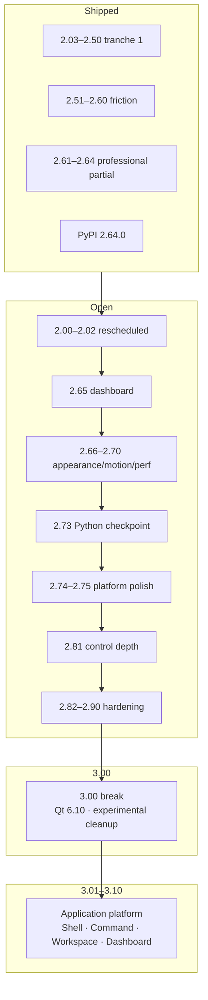

# QWinUI3 Roadmap

**Current:** **3.51** (master — ItemsView / ListDetailsView filter + virtualization defaults)
**Next up:** **3.52** silent runtime (DataTable virtualize) · **3.00** breaking close-out still open ([checkpoint-300](docs/checkpoint-300.md)) · [tranche 10 → 4.00](#efficiency--control-depth-tranche-10-334--400)
**Planned through:** **3.10** complete · **3.13–3.33** WinUI / polish · **3.34–3.90** efficiency + control depth · **3.91–3.99** buffer · **4.00** close-out · [micro-interaction backlog last](#micro-interaction--visual-polish--deferred-last)
**Checkpoints ahead:** **checkpoint-300** (3.00) · **checkpoint-390** (3.90) · **checkpoint-400** (4.00) · **checkpoint-310** (3.10) already green
**Qt:** 6.5+ (recommended 6.8 LTS) on master today — **2.00** raises floor to **6.8 LTS** · **3.00** to **6.10 LTS** · **4.00** to **6.12 LTS** (planned)
**Platforms:** **Windows + Linux** — no macOS first-class line.

**After 2.50**, new minors ship only for **[documented user friction](docs/planning/friction-log.md)** or a **committed tranche ID** below — not catalog completeness. Release history for **1.01…2.64** lives in git tags, [upgrade-notes.md](docs/upgrade-notes.md), and per-slice docs under `docs/`.

---

## Version format: `X.YY`

| Field | Meaning |
|-------|---------|
| **X** | Major line (`1` = 1.xx kit; `2` = 2.x line; `3` = post close-out) |
| **YY** | Two-digit minor (`00`, `01`, … `99`) — one focused slice each |

- **Tags / packages:** `v2.65`, archives `qwinui3-2.65-…`, PyPI `qwinui3==2.65.0`
- **CMake:** `QWINUI3_VERSION` in root `CMakeLists.txt` (maps to `major.minor.0` for CMake’s numeric VERSION)
- **No third digit** for product releases. Hotfixes either rebuild the same `X.YY` or bump `YY`.

---

## What you already have (baseline)

| Surface | Rough size |
|---------|------------|
| Public controls | ~225 |
| Gallery demo pages | ~200 |
| Style QML (Fluent chrome for Controls) | ~55 |
| Extras QML | ~150 |
| Modules | Theme · Style · Platform · Extras |
| Docs | MkDocs + generated component API |
| Ship | Apache-2.0 · CI Release (Win + Linux) · shared/gallery packaging · PyPI wheels · Qt compat shims |

**Implication:** Prefer **fix, recipe, document, deepen** over new public types. **2.65+** opens from friction evidence or the committed professional backlog below — not parity shopping.

---

## Friction gate — when a slice earns a tag

A **`2.xx` minor is allowed** when at least one row in [friction-log.md](docs/planning/friction-log.md) names a **repeatable pain** and the slice **directly removes** it.

| Pass | Fail |
|------|------|
| “Linux Wayland window looks wrong vs Windows DWM” → shell slice | “WinUI has FileTree, we should too” with no app blocked |
| “`find_package` fails for every new consumer” → packaging slice | “Add CalendarView because roadmap slot 2.31” |
| “Settings toggle doesn’t stick / title FPS invisible” → fix + docs | New control to pad catalog count |

**New controls:** only when friction says **existing types cannot compose the app flow** (document the failed recipe first).

**Evidence bar:** one paragraph **Pain → workaround today → slice outcome** per tag; link the friction-log row in the release note.

---

## How we version

| Kind | Meaning |
|------|------|
| **Same `X.YY` rebuild** | Urgent packaging/docs/CI fixes when needed |
| **Next `X.YY`** | **One focused slice**—small enough to finish, clear enough to name |
| **`2.00`** | Breaking line (Qt floor / freeze lift / documented remaps) — **still planned** |
| **`2.65…2.70`** | **Professional product wave** — appearance variants, motion, perf, capabilities, platform (see tranche 3) |
| **`2.71…2.72`** | **Python consumer** — PySide6 + PyPI (**shipped** at **2.64**) |
| **`2.74…2.75`** | **Platform polish** — single-instance, error boundary (**F7** / **F8**) |
| **`2.73`** | **Python consumer checkpoint** — formal audit + CI `pip install` smoke |
| **`3.00`** | **2.x close-out** — breaking major after **2.73**; Qt floor **6.10 LTS** |
| **`3.01+`** | **Friction-only** — same gate as **2.51+** |

**Rules of thumb**

- One `X.YY` ≈ one primary outcome, not five themes at once.
- **2.51+:** **no new row → no new tag.** Prefer fix + recipe over new public types.
- After each ship: bump `QWINUI3_VERSION`, update this file, **close or add friction-log rows**.
- **Platforms:** **Windows + Linux** — **macOS first-class is not planned**.

---

## Shipped summary (archived)

Detailed per-minor notes were removed from this file to keep the plan forward-looking. Use git tags (`v1.01` … `v2.64`), [upgrade-notes.md](docs/upgrade-notes.md), and slice docs (`docs/*-25*.md`, checkpoint pages, etc.) for history.

| Tranche | Versions | Checkpoint | Outcome |
|---------|----------|------------|---------|
| **1.xx** | **1.01 → 1.92** | checkpoint-190 | Docs, a11y, Linux shells, charts stable six, OSK/IME arc, perf waves, Gallery catalog |
| **2.x tranche 1** | **2.03 → 2.50** | checkpoint-250 | Conditional controls, dashboard recipes, perf/a11y waves, experimental sweep, docs IA v2 |
| **2.x friction** | **2.51 → 2.60** | checkpoint-260 | Stable clarity, first-app, Linux top-3, forms/nav/files/OSK/perf friction closes |
| **2.x professional (partial)** | **2.61 → 2.64** | — | RichEdit, SemanticZoom, NotificationCenter, collection perf + a11y sign-off |
| **Python / PyPI (early)** | **2.64 / 2.72 goals** | — | [`examples/python-gallery/`](../examples/python-gallery/), [packaging-python.md](docs/packaging-python.md), **`pip install qwinui3`** on PyPI (Win + manylinux) |

**Rescheduled (not yet tagged):** **2.00** breaking baseline · **2.01** OSK promote · **2.02** `find_package` productize — see below.

---

## Rescheduled — `2.00` … `2.02`

These slices were planned before the **2.03…2.64** tranche landed on the **1.xx / early 2.x floor**. They remain **open** until explicitly tagged.

### 2.00 — Breaking baseline (planned)

**Gate:** checkpoint-190 green; do not mix undocumented breaking remaps into patch minors.

| Area | 2.00 intent |
|------|-------------|
| **Qt floor** | Drop **Qt 6.5**. Floor **6.8 LTS** (forward 6.10+). Update [qt-version-compat.md](docs/qt-version-compat.md) + CI matrix. |
| **Theme** | Only remaps listed in the **1.90** inventory — **not** a Fluent 2 redesign. |
| **Shell** | Remove Gallery-era aliases; keep `StandardWindow` / `NavigationWindow` / `WindowHelper` as the contract. |
| **Experimental** | Types still experimental after **2.01** OSK slice either promote, move to experimental module, or **remove** with upgrade-notes row. |

**Out:** Fluent 2 fork · macOS first-class · Qt Virtual Keyboard · full Lottie/Figma pipeline.

Consumer sketch: [upgrade-notes.md](docs/upgrade-notes.md) **Upgrade 1.90 → 2.00 (draft)**.

### 2.01 — OSK / IME green soak + promote (planned)

**Goal:** Manual soak checklist **green** on Windows + Linux floating path; promote `OnScreenKeyboard` / `KeyboardEngine` / `ImeCandidateBar` subset to **stable**; [on-screen-keyboard.md](docs/on-screen-keyboard.md) + [stable-api.md](docs/stable-api.md) promote rows.

**Out:** Every community `.kmx`; dictation / cloud lexicon.

### 2.02 — Consumer find_package productize (planned)

**Goal:** Productize the **1.61** sketch — installed `QWinUI3Config.cmake` as the supported consumer path; closes **FL-003**; `verify_find_package.py` in default smoke; [packaging-consumer.md](docs/packaging-consumer.md) Path C as primary.

**Out:** Replacing `add_subdirectory` for in-tree kit dev.

---

## Professional product wave — tranche 3 (`2.65` … `2.70`)

**Committed backlog** for appearance variants, motion, performance, existing-control capabilities, and platform adaptation. One primary theme per minor; bundled deliverables below ship together in that tag.

| Slice | Primary theme | Bundled tracks | Status |
|-------|---------------|----------------|--------|
| **2.65** | Charts + Dashboard | Analytics wave A (**FL-009**) | **Shipped** |
| **2.66** | Appearance + grid + table perf | **A1** · **A2** · **C1** · **D1** | **Shipped** |
| **2.67** | List/card appearance + motion tokens | **A3** · **A4** · **B1** · **B2** · **C2** · **C4** · **D2** · **F1** | **Shipped** |
| **2.68** | Nav/tabs + connected motion + workflow | **A5** · **B3** · **B4** · **C3** · **C4** · **D3** · **D4** · **F2** · **F3** | **Shipped** |
| **2.69** | Collections + dialogs + calendar/RichEdit | **A6** · **B5** · **C5** · **D5** · **D6** · **F4** · **F5** | **Shipped** |
| **2.70** | Feedback chrome + loading + session + checkpoint | **A7** · **B6** · **C6** · **D7** · **D8** · **F6** · checkpoint-270 | **Shipped** |

**Also scheduled inside tranche 3 (when bandwidth allows):** experimental promote wave 2 (**2.67** carry-over) · analytics wave B (**2.69** conditional, **FL-014** / **FL-015**) · forms industry Gallery templates (folded into **D2** / [forms.md](docs/forms.md)).

### 2.65 — Charts + Dashboard product wave (shipped)

**Goal:** Close **FL-009** and ship **Wave A** analytics — **deepen stable six** + new dashboard hosts (not withdrawn `Hub`).

| Item | Detail |
|------|--------|
| **Stable six APIs** | **LineChart** crosshair/zoom; **BarChart** stacked/horizontal; **DonutChart** center + `legendPosition`; **KpiTile** `compareValue` / `sparklineHeight`; **ChartCard** footer/`exportRequested`; **RingGauge** `valueFormat` |
| **DashboardShell** | Layout host — KPI row + chart grid + **TwoPaneView** filter rail |
| **MetricCompareRow** / **ChartEmptyState** | Dashboard UX compose types |
| **Gallery + example** | **Dashboard** v2 · [`examples/dashboard`](examples/dashboard/) refresh |
| **Docs** | [charts-dashboard-arc.md](docs/planning/expansion/charts-dashboard-arc.md) · [charts.md](docs/charts.md) |

**Out:** WebGL engine; unconditional new stable chart names without friction row.

### 2.66 — Appearance foundations + DataTable pro grid (shipped)

| ID | Deliverable |
|----|-------------|
| **A1** | **Button 族外观体系** — `appearance: filled / subtle / outline / ghost` on **Button**, **AccentButton**, **HyperlinkButton** |
| **A2** | **输入框视觉档位** — **TextField** / **TextArea** / **ComboBox**: `filled` vs `outline`; **FormLayout** `fieldAppearance` / `readOnly` |
| **C1** | **DataTable 10k 行路径** — fixed `rowHeight` + `ListView` reuse; Gallery 10k load + `maxFilterResults` |
| **D1** | **DataTable 专业网格包** — `sortSpecs` multi-sort, `hiddenColumns` / `setColumnVisible`, `columnWidths` persistence |

**Docs:** [appearance-variants.md](docs/appearance-variants.md) · [forms.md](docs/forms.md) · [data-collections.md](docs/data-collections.md) · [performance.md](docs/performance.md)

**Out:** Million-row GPU grid; masked-input engine for every locale.

### 2.67 — List/card appearance + motion system (shipped)

| ID | Deliverable |
|----|-------------|
| **A3** | **ListTile 密度 + 布局变体** — `density: compact / normal / spacious`; leading icon / avatar / checkbox presets |
| **A4** | **Card 表面变体** — **SettingsCard** / **ChartCard** / **InfoBar**: `elevated / filled / outline / accent` |
| **B1** | **Motion token 体系** — `Theme.motion.durationFast/Normal/Slow` + easing; Style / Extras consume tokens |
| **B2** | **列表入场/退场** — **ItemsView** / **DataTable** / **ListDetailsView**: `itemEnter` / `itemExit` presets; honors `Theme.reducedMotion` |
| **C2** | **Chart 降采样** — 10k+ points auto decimation (`autoDecimate` / `decimateMode: bucket\|douglas`); crosshair stays responsive |
| **C4** | **Style binding 瘦身 wave 10** — **Slider** / **Switch** / **ComboBox** idle bindings gated; interaction motion unchanged |
| **D2** | **Form 工作流包** — async `beginValidate`/`endValidate`, `FormSection`, `formFieldId` / `setFieldVisible` |
| **F1** | **PlatformCapability API** — runtime query Mica / Acrylic / tray / WebView / blur / SNI; UI degrades honestly |

**Also:** experimental promote wave 2 — **Sparkline** permanent defer → **`KpiTile.trendValues`** ([stable-api.md](docs/stable-api.md) · [charts-dashboard-arc.md](docs/planning/expansion/charts-dashboard-arc.md)).

**Out:** Full site visual redesign; promoting every experimental type without soak.

### 2.68 — Navigation appearance + connected motion + workflow (shipped)

| ID | Deliverable |
|----|-------------|
| **A5** | **Navigation 外观预设** — **NavigationView** pane: `standard / minimal / branded` (logo band, footer separator, selection indicator) |
| **B3** | **主从 Connected 动画** — **ListDetailsView** list↔detail + **NavigationView** drill recipes; Gallery reusable templates |
| **B4** | **Chart 数据更新动画** — **LineChart** / **BarChart** / **DonutChart** series tween; auto-off for large datasets |
| **C3** | **Navigation 内存预算** — `pageCacheLimit` memory-aware sizing; LRU weights (recent / pinned pages) |
| **D3** | **Wizard 流程宿主** — multi-step wizard host: step bar, per-step validation gate, back/next |
| **D4** | **Command 路由 + 注册表** — global → window → page → focused component dispatch; **CommandPalette** auto-discovery |
| **F2** | **Compositor 配置扩展** — KDE / GNOME / Sway / Hyprland shadow / radius / clip presets on **1.92** client CSD |
| **F3** | **系统主题实时监听** — OS light/dark/accent/high-contrast changes → **ThemeSync** live refresh |

**Also:** residual **FL-003** / **FL-004** consumer lint + Gallery stable badges when **2.02** lands.

**Out:** Hosted artifact store; compositor-native round-corner protocols as default requirement.

### 2.69 — DataTable chrome + dialogs + calendar/RichEdit (shipped)

| ID | Deliverable |
|----|-------------|
| **A6** | **DataTable 行/表头样式** — zebra / hover / selection accent; sticky header styles; `rowStyle` delegate hook |
| **B5** | **Dialog/Flyout 动效统一** — **ContentDialog** scale+fade; directional **Flyout**; pairs with 1.85 focus return |
| **C5** | **TreeDataGrid 懒展开** — load children on expand; release subtree on collapse |
| **D5** | **CalendarView 范围 + blackout** — range selection modes; blackout dates; sync **DatePicker** / **CalendarDatePicker** |
| **D6** | **RichEdit 产品化加深** — tables / links / sanitized HTML paste subset; mail / announcement recipe |
| **F4** | **Linux 通知动作** — **NotificationBridge** action buttons matrix (Plasma / GNOME) |
| **F5** | **Wayland 对话框/z-order wave 3** — multi-window + modal chain soak green on pure Wayland |

**Also (conditional):** analytics wave B — **BulletChart** / **HistogramChart** / **BarChart** bin API (**FL-014** / **FL-015**).

**Out:** OS toast replacement; field buffer without open P0/P1 rows.

### 2.70 — Feedback chrome + loading motion + session + checkpoint (shipped)

| ID | Deliverable |
|----|-------------|
| **A7** | **Feedback severity 外观包** — **InfoBar** / **Toast** / **TeachingTip** unified severity palette + icon slots |
| **B6** | **Loading 态动效族** — **Button.loading**, **ProgressRing**, **Skeleton** / **Shimmer** handoff for async forms/tables |
| **C6** | **冷启动 wave 11** — first-frame defer checklist; optional icon/atlas warm-up; `--startup-log` target budget |
| **D7** | **NotificationCenter 产品化** — grouping policies, action buttons, persistent read state |
| **D8** | **Session restore 包** — window geometry + navigation page + table scroll/selection restore |
| **F6** | **Fractional DPI 文本锐化** — 125%/150% Wayland text/icon crispness; [high-dpi.md](docs/high-dpi.md) wave 4 |

**Checkpoint:** [checkpoint-270.md](docs/checkpoint-270.md) — audit **2.65…2.70**; update **3.00** prep in [upgrade-notes.md](docs/upgrade-notes.md).

**Out:** Treating **2.70** as final 2.x line; shipping **3.00** in the same tag.

---

## Capability pack tranche 6 (`2.71` … `2.80`)

| Slice | Theme | Status |
|-------|--------|--------|
| **2.71** | DataTable copy/export · MaskedTextField · PermissionGate | **Shipped** |
| **2.72** | WindowMessageBus · SessionTimeout | **Shipped** |
| **2.73** | Consumer checkpoint DX | **Shipped** |
| **2.74** | Single-instance (opt-in) · `qwinui3 run` | **Shipped** |
| **2.75** | ErrorBoundary | **Shipped** |
| **2.76** | find_package + `qwinui3 upgrade` | **Shipped** |
| **2.77** | RecentFiles | **Shipped** |
| **2.78** | OfflineBanner · OperationRetry | **Shipped** |
| **2.79** | SensitiveField · ConfirmWithReason | **Shipped** |
| **2.80** | Soft checkpoint-280 | **Shipped** — [checkpoint-280.md](docs/checkpoint-280.md) |

---

## Control depth tranche 7 (`2.81`)

**Gate:** Hot-path work that **does not change default appearance or interaction** — internal perf, derived-state efficiency, and small **additive** APIs apps already compose around in recipes.

| Slice | Theme | Status |
|-------|--------|--------|
| **2.81** | Internal perf + control API depth | **Shipped** |

### 2.81 — Hot-path perf + API depth (shipped)

| ID | Area | Detail |
|----|------|--------|
| **C2** | **Charts** | Canvas redraw coalescing (`ChartUtils.redrawCoalesceMs`) on Sparkline, Area, StackedBar, Heatmap, Scatter, Radar, Waterfall, HorizontalBar, Histogram; ComboChart hover dedupe |
| **C3** | **NotificationCenter** | Single-pass `_rebuildDerived()` (unread + grouped model); debounced Settings persist (200 ms); flush on `close()` |
| **C4** | **DataTable** | Selection tint as overlay — keyboard `select()` no longer re-tints every visible zebra row |
| **C5** | **NavigationView** | Selection pip `schedulePipMove()` coalesced (16 ms); drop redundant `currentKey` pip hooks |
| **D9** | **NotificationCenter** | `markUnread(i)`, `removeAt(i)`, `indexForId(id)`, `exportHistory()` / `importHistory(json)`, `count` |
| **D10** | **DataTable** | `scrollToRow(i, mode?)`, `ensureRowVisible(i)` — public scroll helpers beyond `select()` |
| **D11** | **Skeleton** | Optional `rowWidths[]` (0…1 per row) for list placeholder layouts; default 100% / 72% pattern unchanged |
| **D12** | **Wizard** | `stepTitle(i)`, `reset()` — programmatic step labels + flow restart without re-create |
| **D13** | **SessionTimeout** | Idle clock starts on first `poke()` / `reset()`, not at instantiation |

**Docs:** Regenerate [components.md](docs/components.md) + [python-api.md](docs/python-api.md) after API header updates.

**Out:** New public control types · micro-interaction / pointer wave (**L1–L5**) · version bump to **3.00**.

**Checkpoint:** Optional soft **checkpoint-281** when **C2–D13** green in Gallery smoke — does not block **3.00** prep.

---

## Product hardening tranche 8 (`2.82` … `2.90`)

**Gate:** Ship **measurable** wins on control **capability depth**, **runtime performance**, **cold start**, and **artifact size** — same **no default appearance/motion change** rule as **2.81** for perf-only work. Each slice still needs a **[friction-log](docs/planning/friction-log.md)** row or a committed ID below.

**Strategy doc:** [component-capabilities-expansion.md](docs/planning/expansion/component-capabilities-expansion.md) (remaining matrix rows) · [performance.md](docs/performance.md) (startup + chart budgets) · [packaging-consumer.md](docs/packaging-consumer.md) (presets).

| Slice | Theme | Status |
|-------|--------|--------|
| **2.82** | Collections & navigation APIs (**D14–D16**) | Shipped |
| **2.83** | Forms, dialogs, feedback APIs (**D17–D19**) | Shipped |
| **2.84** | Chart + grid runtime perf (**C6–C8**) | Shipped |
| **2.85** | Shell startup & deferred compile (**S1–S3**) | Shipped |
| **2.86** | Shared zip presets & size budgets (**K1–K4**) | Shipped |
| **2.87** | Search, commands, platform APIs (**D20–D22**) | Shipped |
| **2.88** | Shell title bar + nav/theme perf (**W1**, **C9–C10**) | Shipped |
| **2.89** | Python cold start + PyPI wheel slim (**S4–S5**, **K5–K6**) | Shipped |
| **2.90** | **checkpoint-290** — sign-off matrix | Shipped — [checkpoint-290.md](docs/checkpoint-290.md) |

### 2.90 — Product hardening checkpoint (shipped)

One focused **audit tag** after incremental **2.82–2.89** land. **Does not** include **3.00** breaking changes (Qt floor, experimental cleanup, alias removal).

**Sign-off:** [checkpoint-290.md](docs/checkpoint-290.md) — green **2026-08-27**.

#### Control capability depth (**D14–D22**)

Additive APIs and compose-friendly behaviors on **existing** types — no new public controls unless friction proves compose failure.

| ID | Control / area | Deliverable |
|----|----------------|-------------|
| **D14** | **DataTable** | Column pin / reorder persist (`Settings` key); optional row **group header** row model hook |
| **D15** | **ListDetailsView** | Master **multi-select**; detail-pane **toolbar** slot (leading actions) |
| **D16** | **NavigationView** | Pane **search match highlight**; **footer badge count** on nav items |
| **D17** | **TreeDataGrid** | Column **resize** + `freezeFirstColumn` persist across sessions |
| **D18** | **FormLayout** | Async validation state surface; **`scrollToFirstError()`** on submit |
| **D19** | **ContentDialog** | **Queue priority**; **Enter → default button** when safe |
| **D20** | **CommandPalette** | **Recent commands** ring (`Settings` persist, capped N) |
| **D21** | **AutoSuggestBox** | Configurable **`debounceMs`**; **match highlight range** in suggestion text |
| **D22** | **ToastHost** | **Priority queue** + **dedupe by id** (same toast id replaces in-flight) |

**Docs:** Regenerate [components.md](docs/components.md) + [python-api.md](docs/python-api.md) after header/API changes; Gallery recipe per control (not a version checklist).

#### Runtime performance (**C6–C11**)

Internal hot paths only — default pixels and interaction unchanged.

| ID | Area | Deliverable |
|----|------|-------------|
| **C6** | **Charts (remaining)** | Extend `ChartUtils` redraw coalesce to Donut, Lollipop, Gauge, Funnel, Sankey, Treemap, BoxPlot, Candlestick — same ~**16 ms** coalesce as **C2** |
| **C7** | **TreeDataGrid** | Virtualized **row height cache**; defer column measure until visible |
| **C8** | **DataTable** | Sort comparator cache per refresh; **batch** `model` reset coalesce (single layout pass) |
| **C9** | **NavigationView** | **Incremental** `navModel` patch for single-item title/badge/icon changes vs full rebuild |
| **C10** | **Theme / density** | Single-pass token push coalesce when `ThemeOverrides` + density change in same frame |
| **C11** | **ItemsView / ItemsRepeater** | Section sticky header without full relayout on scroll tick |

#### Shell title bar & window chrome (**W1** — **2.88**)

Additive shell APIs on **existing** hosts — no new top-level window type unless compose fails.

| ID | Area | Deliverable |
|----|------|-------------|
| **W1** | **ShellWindow / StandardTitleChrome** | **`captionRightHeader`** on shells (Platform slot before captions); **`TitleBarToolbar`** helper; **`refreshTitleBarHitTest()`** / window helpers on **ShellWindow** + **StandardWindow**; NC hit-test tree walk for title-bar children; [title-bar-cookbook.md](docs/title-bar-cookbook.md) |

**Proof:** Gallery `--smoke` green; optional `--show-fps` spot-check on NavigationView + DataTable demo pages (advisory, not CI gate).

#### Startup speed (**S1–S5**)

Reduce work before first interactive frame — shell, Gallery, and Python entry.

| ID | Area | Deliverable |
|----|------|-------------|
| **S1** | **Gallery shell** | Defer **ControlCatalog** full parse until first nav open; lazy **`pageModule`** registry (no compile-all at `Main.qml` load) |
| **S2** | **QML compile** | Document + optional CI **qmlcachegen** for `shell` / `dashboard` presets where toolchain allows |
| **S3** | **Platform bootstrap** | Defer non-critical probes (**WebView2**, media backends) until first control use |
| **S4** | **Python `qwinui3 run`** | Lazy-import heavy platform submodules until window create |
| **S5** | **Budget & CI** | `--startup-log` reference budget: **interactive shell &lt; 1.5 s** on CI Win Release (machine-relative); document regression compare in [performance.md](docs/performance.md) |

**Out:** Blocking **3.00** on sub-second startup everywhere; macOS cold-start line.

#### Packaging size (**K1–K6**)

Smaller **default** artifacts for apps that do not need full Extras + Gallery.

| ID | Area | Deliverable |
|----|------|-------------|
| **K1** | **`package_release_libs.py`** | New preset **`dashboard`**: theme + style + platform + stable six chart types + KPI/StatCard subset (no full Extras) |
| **K2** | **Presets** | New preset **`charts-lite`**: minimal chart QML subset for embed dashboards |
| **K3** | **PyPI wheel** | Audit payload: strip debug symbols from bundled native libs; exclude Gallery QML from library wheel where safe |
| **K4** | **Docs / CI note** | Size **budget table** in [packaging-consumer.md](docs/packaging-consumer.md) — zip MB per preset, wheel MB Win/Linux (relative targets, not hard fail until **2.90**) |
| **K5** | **PyPI extras (optional)** | Evaluate `qwinui3[full]` vs default slim install — ship only if friction row justifies split |
| **K6** | **Release artifacts** | Document **`libs` vs `gallery` zip** size targets; CI artifact README line per preset |

**Baseline (measure at 2.90 audit):** record `all` / `shell` / `core` / `dashboard` zip sizes and PyPI wheel sizes in [checkpoint-290.md](docs/checkpoint-290.md).

#### checkpoint-290 exit criteria

- [x] **D14–D22** shipped or explicitly deferred with friction-log link + target slice
- [x] **C6–C10** green in Gallery smoke; no **S5** startup regression vs **2.81** baseline on CI Win Release
- [x] **K1–K4** presets documented; size table filled in checkpoint doc
- [x] [performance.md](docs/performance.md) updated (startup budgets + chart coalesce inventory)
- [x] No **3.00** breaking changes bundled into **2.90**

**Out of tranche 8:** **L1–L5** micro-interaction / pointer wave · new public control types · **3.00** Qt floor / experimental cleanup · Gallery version completion checklists.

**Then:** **3.00** close-out per [checkpoint-300](#300--2x-line-close-out-breaking-major) — requires **checkpoint-290** + prior consumer/platform checkpoints.

---

### 2.71 — Data + form + permission pack (shipped)

| Item | Detail |
|------|--------|
| **DataTable** | `copySelection()` / `exportCsv()` CSV clipboard |
| **MaskedTextField** | `#` digit / `A` letter / `*` alnum masks |
| **PermissionGate** | `mode: hide\|disable` by role |

---

## Platform polish tranche 5 (`2.74` … `2.75`)

Python / PyPI (**2.71** / **2.72** goals) **shipped at 2.64**. Platform slices **F7** / **F8** use **2.74** / **2.75** to avoid clashing with the Python tranche version numbers.

| Slice | Theme | Maps | Status |
|-------|--------|------|--------|
| **2.74** | Single-instance + protocol activation | **F7** | **Shipped** |
| **2.75** | Global error boundary + crash recovery | **F8** | **Shipped** |

### 2.74 — Single-instance + protocol activation (**shipped** · **F7**)

**Goal:** **Opt-in** second-launch focuses existing instance and forwards CLI args / file-open URLs — standard tool/analytics desktop pattern. **Default remains multi-instance** (Gallery + consumer exes may run side-by-side; WebView2 uses per-pid user data).

**Deliverables:** `SingleInstance` + `WindowHelper.tryBecomeSingleInstancePrimary` (**off by default**); activation + argument pipe recipe; Gallery + [`examples/first-app`](../examples/first-app/) callout; `qwinui3 run`.

**Out:** Forcing single-instance on all kit apps; multi-instance coordination SaaS; macOS-first line.

### 2.75 — Global error boundary (**shipped** · **F8**)

**Goal:** Uncaught QML errors show recovery UI instead of blank shell; optional restart with **D8** session restore hook.

**Deliverables:** `ErrorBoundary` + Gallery **Pitfalls** recovery sample; pairs with **F8** + **D8**.

**Out:** Full crash telemetry SaaS; auto-submit minidumps.

---

## Python consumer tranche 4 (`2.71` … `2.73`)

| Slice | Theme | Status |
|-------|--------|--------|
| **2.71** | PySide6 consumer integration | **Shipped (2.64)** — Gallery + [packaging-python.md](docs/packaging-python.md) |
| **2.72** | PyPI packaging + publish | **Shipped (2.64.0)** — [pypi.yml](.github/workflows/pypi.yml), `pip install qwinui3` |
| **2.73** | **Consumer checkpoint + fast integration (C++ & Python)** | Planned |

**Note:** Platform **F7** / **F8** ship as **2.74** / **2.75** (Python/PyPI already consumed **2.71** / **2.72** at **2.64**). Order: checkpoint-270 → **2.73** → **2.74** → **2.75** → **3.00** prep.

### 2.73 — Consumer checkpoint + fast integration (planned)

**Goal:** checkpoint-273 — **all consumer paths** reach “init → build/run → window” with minimal doc hopping — **C++ and Python equally**, not PyPI-only.

| Track | Paths covered | CI proof |
|-------|---------------|----------|
| **C++** | **A** in-tree `add_subdirectory` · **B** shared Release zip · **C** `find_package(QWinUI3)` · **D** vcpkg / Conan overlay | `consumer-matrix.yml` + `qwinui3 init` output builds |
| **Python** | **E** `pip install qwinui3` + PySide6/PyQt6 | `pip install` + `qwinui3 run` smoke |

**DX deliverables (same tag):** **DX1–DX6** — `init` / `doctor --fix` / [getting-started.md](docs/getting-started.md) / `run` / import lint for **every** path above.

**Out:** Declaring Python the only supported consumer; shipping **3.00** in the same tag.

---

## Full 2.x arc → 3.00 (summary)

| Tranche | Versions | Gate | Checkpoint |
|---------|----------|------|------------|
| **Rescheduled** | **2.00 → 2.02** | Breaking + OSK promote + find_package | — |
| **3 — product wave** | **2.65 → 2.70** | Appearance · motion · perf · capabilities · platform | checkpoint-270 |
| **4 — consumer DX + Python** | **2.71 → 2.73** (PyPI **shipped** **2.64**) | Fast integration **C++ A–D + Python E** | checkpoint-273 |
| **5 — platform polish** | **2.74 → 2.75** | Single-instance + error boundary | — |
| **7 — control depth** | **2.81** | Hot-path perf + additive APIs (no default UX change) | checkpoint-281 (optional) |
| **8 — product hardening** | **2.82 → 2.90** | Capabilities · runtime perf · startup · package size · **W1** | checkpoint-290 |
| **6 — 2.x close-out** | **3.00** | **checkpoint-290** + checkpoint-300 green | checkpoint-300 |
| **9 — application platform** | **3.01 → 3.10** | Shippable desktop app shell · command · workspace · vertical kits | checkpoint-310 |
| **10 — efficiency + depth** | **3.34 → 3.90** | Kit cold start · memory · silent runtime · control depth · package slim | checkpoint-390 |
| **11 — 3.x close-out** | **4.00** | Qt floor · alias cleanup · **4.xx** freeze | checkpoint-400 |

**After 3.00:** minors **`3.01+`** follow the same **[friction-log](docs/planning/friction-log.md)** gate as **2.51+**, or a committed ID in [tranche 10](#efficiency--control-depth-tranche-10-334--400) — prefer **deepen + recipe + compose** over new public types.

**Expansion docs:** [roadmap-strategy.md](docs/planning/roadmap-strategy.md) · [charts-dashboard-arc.md](docs/planning/expansion/charts-dashboard-arc.md) · [component-capabilities-expansion.md](docs/planning/expansion/component-capabilities-expansion.md) · [icons-dashboard-expansion.md](docs/planning/expansion/icons-dashboard-expansion.md)

---

## 3.00 — 2.x line close-out (breaking major)

**Status:** **Planned** — ships **after** **2.73** and checkpoint-300. **Not** a feature dump — closes the **2.x** compatibility story.

**Prerequisites:** checkpoint-270 · checkpoint-273 · **checkpoint-290** · experimental sweep **2.45** / **2.67** · consumer packaging **2.02** green · **2.74** / **2.75** platform polish · **2.81** control depth.

| Area | 3.00 deliverable |
|------|------------------|
| **Qt** | Floor **6.10 LTS**; drop **6.8** compat shims |
| **Theme** | Remove remaining 2.x token/shell aliases deferred from **2.00** |
| **Experimental** | **Permanent defer** inventory removed from default QML imports or namespaced |
| **Stable contract** | [compatibility-3xx.md](docs/compatibility-3xx.md) — **3.xx** “will not break” freeze |
| **CMake / PyPI** | **`find_package(QWinUI3)`** primary path; PyPI semver **3.00** |
| **Docs** | [upgrade-notes.md](docs/upgrade-notes.md) **Upgrade 2.73 → 3.00** |

**Out:** macOS first-class · Fluent 2 fork · **`Hub` / `HubSection`** (withdrawn) · WebGL chart engines · Qt Virtual Keyboard.

**Then:** [Application platform tranche 9](#application-platform-tranche-9-301--310) (**3.01…3.10**) — requires **checkpoint-300** green.

---

## Application platform tranche 9 (`3.01` … `3.10`)

**Gate:** Shift from **control kit** to **shippable desktop application platform** — one focused **product capability** per minor, demonstrable in Gallery or an `examples/` vertical app. Same friction gate as **2.51+**; new public types only when compose on existing shells fails.

**Strategy:** Shell & window → command & shortcuts → workspace layout → navigation pro → dashboard live → vertical templates → multi-window → platform extras → checkpoint.

**Docs target:** [window-shells.md](docs/window-shells.md) · [title-bar-cookbook.md](docs/title-bar-cookbook.md) · [commands.md](docs/commands.md) · [charts-dashboard-arc.md](docs/planning/expansion/charts-dashboard-arc.md) · new **`docs/app-platform-3xx.md`** (recipes index, landing **3.01**).

| Slice | Theme | IDs | Status |
|-------|--------|-----|--------|
| **3.01** | **Shell 2.0** | **W2–W4** | Shipped |
| **3.02** | **Command system** | **R1–R3** | Shipped |
| **3.03** | **Workspace layout** | **W5–W6** | Shipped |
| **3.04** | **Navigation pro** | **N1–N3** | Shipped |
| **3.05** | **Dashboard live** | **G1–G2** | Shipped |
| **3.06** | **Charts wave B** | **G3** | Shipped |
| **3.07** | **Vertical app kits** | **V1–V3** | Shipped |
| **3.08** | **Multi-window & panels** | **W7–W8** | Shipped |
| **3.09** | **Platform desktop extras** | **P1–P3** | Shipped |
| **3.10** | **checkpoint-310** — app platform sign-off | Audit matrix | Shipped — [checkpoint-310.md](docs/checkpoint-310.md) |

### 3.01 — Shell 2.0 (shipped)

**Goal:** Declarative title-bar commands and session continuity on stable **3.xx** surface — builds on **2.88 W1**.

| ID | Deliverable |
|----|-------------|
| **W2** | **`TitleBarCommand`** model (id, icon, label, shortcut, enabled, visible) + bind to **`leftHeader` / `captionRightHeader`** slots |
| **W3** | **`StandardWindow`** + **`NavigationWindow`** share **CommandPalette** wiring (Ctrl+K / Meta+K) |
| **W4** | **`SessionRestore`** — persist + restore window geometry, **NavigationView** key/footer, pane open; QSettings key per `geometryPersistenceKey` |

**Gallery:** Main uses command model for title-bar actions; Settings documents dev vs retail diagnostics.

**Out:** Full VS Code–style custom title bar replacement; system menu takeover.

### 3.02 — Command system (shipped)

**Goal:** One registry drives palette, shortcuts, title bar, and context menus.

| ID | Deliverable |
|----|-------------|
| **R1** | **`CommandRegistry`** — scoped dispatch **global → window → page → focused item** |
| **R2** | **Shortcut conflict detection** + Settings readout when two commands bind the same chord |
| **R3** | **Context enable/disable** — commands auto-disable from selection / page / `canExecute` |

**Maps:** Professional backlog **Command routing** · **Command registry** · **Shortcut conflict** · **Context-aware enable**.

**Out:** User-editable shortcut rebinding (**3.11+** unless friction row); undo stack.

### 3.03 — Workspace layout (shipped)

**Goal:** IDE/ops-style split content without full docking framework.

| ID | Deliverable |
|----|-------------|
| **W5** | **`SplitWorkspace`** — 2–3 resizable panes + min width + keyboard focus order |
| **W6** | **`LayoutPreset`** — named layouts (e.g. “Editor”, “Monitor”) persisted in QSettings |

**Maps:** **Workspace layout save & restore** (lightweight subset of **3.xx** dock backlog).

**Out:** Tabbed dock host · cross-monitor layout sync (**3.08** partial only).

### 3.04 — Navigation pro (shipped)

**Goal:** Product-grade navigation beyond control demos.

| ID | Deliverable |
|----|-------------|
| **N1** | **Pinned / favorite pages** in **NavigationView** pane (user-pinnable keys) |
| **N2** | **Jump list** — alphabetical / categorical index flyout for large `navModel` |
| **N3** | **Drilldown stack** — summary → detail → sub-detail with **BreadcrumbBar** + **Back** integration |

**Maps:** Backlog **Pinned pages** · **Jump list** · **Data drilldown navigation** · defers **Page preloading** unless friction.

**Out:** Infinite nav tree virtualization (stay on **NavigationView** perf path).

See [navigation.md](docs/navigation.md) · [app-platform-3xx.md](docs/app-platform-3xx.md).

### 3.05 — Dashboard live (shipped)

**Goal:** Real-time KPI / ops dashboards without ad-hoc timers in every app.

| ID | Deliverable |
|----|-------------|
| **G1** | **`LiveMetricStrip`** — throttled ring buffer, compare-period semantics (**FL-014**) |
| **G2** | Gallery **Ops console** page + [`examples/dashboard`](../examples/dashboard/) v2 (live tick) |

**Maps:** [charts-dashboard-arc.md](docs/planning/expansion/charts-dashboard-arc.md) Wave C entry · **FL-014** closed.

**Out:** GPU chart engine · sub-second tick for hundreds of series.

See [charts.md](docs/charts.md) · [app-platform-3xx.md](docs/app-platform-3xx.md) · [components/LiveMetricStrip.md](docs/components/LiveMetricStrip.md).

### 3.06 — Charts wave B (shipped)

**Goal:** Distribution / histogram apps without hand-rolled bin models.

| ID | Deliverable |
|----|-------------|
| **G3** | **BarChart** `samples` + `binCount` (+ `setBinsFromSamples` / `applyBins`) — **HistogramChart** stays experimental (**FL-015**) |

**Maps:** [charts-dashboard-arc.md](docs/planning/expansion/charts-dashboard-arc.md) Wave B · **FL-015** closed via compose (no new stable chart type).

**Out:** Unconditional new stable chart type without friction row.

See [charts.md](docs/charts.md) · [components/BarChart.md](docs/components/BarChart.md).

### 3.07 — Vertical app kits (shipped)

**Goal:** Copy-ready **applications**, not only control pages.

| ID | Deliverable |
|----|-------------|
| **V1** | **`examples/admin-settings`** — SettingsCard + FormLayout + validation recipe |
| **V2** | **`examples/master-detail-crm`** — **ListDetailsView** + **DataTable** + command bar |
| **V3** | **`examples/ops-console`** — **SplitWorkspace** + **LiveMetricStrip** + filterable grid |

**DX:** Manual copy path in [`examples/README.md`](examples/README.md); `qwinui3 init --template` remains optional.

**Out:** Industry-specific control types; Gallery version checklists.

### 3.08 — Multi-window & panels (shipped)

**Goal:** Coordinated secondary windows and first step toward dock backlog.

| ID | Deliverable |
|----|-------------|
| **W7** | **WindowMessageBus** `appearance` channel — theme, accent, layoutDirection sync ([`examples/multi-window`](examples/multi-window/)) |
| **W8** | **PanelFloatHost** — detach a pane to owned **ToolShellWindow**; restore into host |

**Maps:** **Inter-window communication** · **Panel float** (minimal) · defers **Dockable panels** full framework.

**Out:** Multi-instance shared state SaaS; Excel-scale grid in float panel.

### 3.09 — Platform desktop extras (shipped)

**Goal:** Native desktop affordances on the stable **3.xx** contract.

| ID | Deliverable |
|----|-------------|
| **P1** | **MenuStatusWindow** / title-bar **MenuBar** documented + Linux soak notes ([window-shells.md](docs/window-shells.md)) |
| **P2** | **RecentFiles** + `WindowHelper.addToRecentDocuments` (Jump List where OS allows) |
| **P3** | **`WindowHelper.registerFileAssociation`** / `unregisterFileAssociation` ([file-association.md](docs/file-association.md)) |

**Out:** Auto-update SaaS · macOS menu bar.

### 3.10 — Application platform checkpoint (shipped)

One audit tag after **3.01–3.09**. **Does not** include **L1–L5** micro-interaction wave.

**Exit criteria:** see [checkpoint-310.md](docs/checkpoint-310.md) (green **2026-08-27**).

**Out of tranche 9:** **L1–L5** pointer/icon polish · full **dockable panel** framework · **undo/redo** framework · schema-driven forms · audit log UI.

**Then:** [Efficiency & control depth tranche 10](#efficiency--control-depth-tranche-10-334--400) (**3.34…4.00**). Formal **3.00** breaking close-out remains scheduled ([checkpoint-300](docs/checkpoint-300.md)) and may interleave before or after early **3.34+** slices as long as budgets stay green. **[Micro-interaction backlog](#micro-interaction--visual-polish--deferred-last)** stays **last**.

---

## Efficiency & control depth tranche 10 (`3.34` … `4.00`)

**Goal:** Make the **existing** kit start faster, use less memory, and expose **more opt-in capability** on hot controls — **without** changing default look, feel, or **page/nav switch timing**.

### Hard rules (every slice)

| Rule | Meaning |
|------|---------|
| **No default UX change** | Appearance, interaction, and motion **durations** stay as today unless a slice is explicitly opt-in |
| **Switch latency frozen** | NavigationView / page stack / Gallery page switch **p50 ≤ baseline** on the same Release machine (may improve; **must not regress**) |
| **Additive APIs only** | New properties/methods default off or match today’s behavior |
| **No new public types by default** | New types only when friction proves compose failure (document failed recipe first) |
| **Measure** | Each tag records startup ms, working-set / RSS delta, and switch budget in [performance.md](docs/performance.md) / release note |

**Strategy:** cold start → memory → silent runtime → control depth → platform/package → checkpoint → buffer → **4.00**.

**ID note:** Memory-track IDs are **H10–H17** (heap/RSS) so they do not collide with Command **R1–R3** or deferred pointer recipes **R10–R17** / **M1–M28**.

**Docs:** [performance.md](docs/performance.md) · [component-capabilities-expansion.md](docs/planning/expansion/component-capabilities-expansion.md) · [packaging-consumer.md](docs/packaging-consumer.md) · [checkpoint-390.md](docs/checkpoint-390.md) · [checkpoint-400.md](docs/checkpoint-400.md)

| Slice | Theme | IDs | Status |
|-------|--------|-----|--------|
| **3.34** | Cold start — Bootstrap / env | **S10–S11** | Shipped |
| **3.35** | Cold start — QML type registration | **S12** | Shipped |
| **3.36** | Cold start — module / import graph | **S13** | Shipped |
| **3.37** | Cold start — Gallery catalog lazy | **S14** | Shipped |
| **3.38** | Cold start — optional hosts deferred | **S15** | Shipped |
| **3.39** | Cold start — smoke + budget CI | **S16** | Shipped |
| **3.40** | Cold start wave sign-off | **S17** | Shipped |
| **3.41** | Memory — FluentIcons / glyph atlas | **H10** | Shipped |
| **3.42** | Memory — Theme / singleton trim | **H11** | Shipped |
| **3.43** | Memory — List/Tree delegate reuse | **H12** | Shipped |
| **3.44** | Memory — DataTable / model roles | **H13** | Shipped |
| **3.45** | Memory — Chart series buffers | **H14** | Shipped |
| **3.46** | Memory — Gallery page unload | **H15** | Shipped |
| **3.47** | Memory — image / acrylic caches | **H16** | Shipped |
| **3.48** | Memory wave sign-off | **H17** | Shipped |
| **3.49** | Silent runtime — paint coalesce | **C20** | Shipped |
| **3.50** | Silent runtime — binding churn | **C21** | Shipped |
| **3.51** | Silent runtime — ListView / ItemsView | **C22** | Shipped |
| **3.52** | Silent runtime — DataTable virtualize | **C23** | Planned |
| **3.53** | Silent runtime — NavigationView pane | **C24** | Planned |
| **3.54** | Silent runtime — chart redraw | **C25** | Planned |
| **3.55** | Silent runtime wave sign-off | **C26** | Planned |
| **3.56** | Depth — NavigationView | **D30–D32** | Planned |
| **3.57** | Depth — DataTable / TreeDataGrid | **D33–D35** | Planned |
| **3.58** | Depth — Form / Settings cards | **D36–D37** | Planned |
| **3.59** | Depth — Dialogs / flyouts | **D38–D39** | Planned |
| **3.60** | Depth — CommandBar / palette | **D40–D41** | Planned |
| **3.61** | Depth — TabView / Pivot | **D42** | Planned |
| **3.62** | Depth — Charts stable six | **D43–D44** | Planned |
| **3.63** | Depth — InfoBar / Toast / TeachingTip | **D45** | Planned |
| **3.64** | Depth — NumberBox / DateTime pickers | **D46** | Planned |
| **3.65** | Depth — AutoSuggest / Search | **D47** | Planned |
| **3.66** | Depth — SplitWorkspace / TwoPane | **D48** | Planned |
| **3.67** | Depth — FileTree / FilePicker | **D49** | Planned |
| **3.68** | Depth — Media / WebView2 host | **D50** | Planned |
| **3.69** | Depth — Window / TitleBar chrome | **D51** | Planned |
| **3.70** | Depth — Accessibility hooks | **D52** | Planned |
| **3.71** | Depth — RTL / i18n edge cases | **D53** | Planned |
| **3.72** | Depth wave sign-off | **D54** | Planned |
| **3.73** | Platform — WebView2 lazy probe | **P10** | Planned |
| **3.74** | Platform — WindowHelper defer | **P11** | Planned |
| **3.75** | Platform — Linux portal lazy | **P12** | Planned |
| **3.76** | Package — `core` / `shell` presets | **K10** | Planned |
| **3.77** | Package — charts optional link | **K11** | Planned |
| **3.78** | Package — Gallery vs kit split | **K12** | Planned |
| **3.79** | Package — PyPI wheel slim | **K13** | Planned |
| **3.80** | Package — size budget table | **K14** | Planned |
| **3.81** | Docs — efficiency recipes | **K15** | Planned |
| **3.82** | Platform + package sign-off | **K16** | Planned |
| **3.83–3.89** | Reserved — friction closes on S/M/C/D/K | — | Buffer |
| **3.90** | **checkpoint-390** efficiency sign-off | Audit | Planned |
| **3.91–3.99** | Friction buffer + **4.00** prep | — | Buffer |
| **4.00** | **checkpoint-400** — 3.x close-out | Breaking | Planned |

### Cold start (`3.34` … `3.40`) — **S10–S17**

| ID | Slice | Deliverable |
|----|-------|-------------|
| **S10** | **3.34** | **Bootstrap** — document + enforce minimal `configureEnvironment` / `configureApplication` path; no optional host probes before first frame | Shipped |
| **S11** | **3.34** | Defer Style / Theme side work that is not needed for first window paint (icon catalog rows, mono font resolve) | Shipped |
| **S12** | **3.35** | QML type registration: register hot modules first; defer charts / OSK / WebView2 types until first import | Shipped |
| **S13** | **3.36** | Import graph: Gallery / examples default to `shell` import set; document `QWinUI3.Extras.Charts` optional | Shipped |
| **S14** | **3.37** | Gallery **ControlCatalog** fully lazy (no full model build on Main load) | Shipped |
| **S15** | **3.38** | Optional hosts (WebView2 runtime probe, Keyman/OSK engine, FrameStats) start **on demand** | Shipped |
| **S16** | **3.39** | `--startup-log` budgets in CI Release: interactive shell **&lt; baseline − 15%** or absolute table in performance.md | Shipped |
| **S17** | **3.40** | Cold-start wave sign-off — fill [checkpoint-390](docs/checkpoint-390.md) startup section | Shipped |

**Out:** Changing first-frame visual chrome · forcing all consumers onto a new Bootstrap API without dual path.

### Memory (`3.41` … `3.48`) — **M10–M17**

| ID | Slice | Deliverable |
|----|-------|-------------|
| **H10** | **3.41** | FluentIcons / glyph path — shared font instance + PreferNoHinting; avoid per-control font copies | Shipped |
| **H11** | **3.42** | Theme singleton — trim unused token tables from default load; density packs on demand | Shipped |
| **H12** | **3.43** | ListView / TreeView / NavigationView pane — `reuseItems` / cacheBuffer recipes + defaults that cut RSS without slower scroll | Shipped |
| **H13** | **3.44** | DataTable — lean roles, skip unused column caches until shown | Shipped |
| **H14** | **3.45** | Charts — ring-buffer caps documented + opt-in downsampling (defaults unchanged visually) | Shipped |
| **H15** | **3.46** | Gallery — unload off-screen page trees; keep switch time ≤ baseline | Shipped |
| **H16** | **3.47** | Acrylic / image / shadow caches — size limits + eviction | Shipped |
| **H17** | **3.48** | Memory wave sign-off — working-set table in checkpoint-390 | Shipped |

**Out:** Lowering visual quality of default acrylic · removing shadows globally.

### Silent runtime (`3.49` … `3.55`) — **C20–C26**

Same class as **2.81 / 2.82–2.90** runtime work: **faster or equal**, never slower switches.

| ID | Slice | Deliverable |
|----|-------|-------------|
| **C20** | **3.49** | Remaining paint coalesce on heavy Extras (tables, charts, nav) | Shipped |
| **C21** | **3.50** | Binding churn audit — replace hot `Qt.binding` / full-model rebuilds with incremental updates | Shipped |
| **C22** | **3.51** | ItemsView / ListDetailsView — virtualization + filter debounce defaults tuned | Shipped |
| **C23** | **3.52** | DataTable / TreeDataGrid — row height cache + skip unchanged rebuild |
| **C24** | **3.53** | NavigationView — incremental `navModel` / pip schedule already hardened; finish remaining pane rebuild costs |
| **C25** | **3.54** | Chart redraw coalesce inventory complete for stable six |
| **C26** | **3.55** | Runtime wave sign-off — **switch p50 non-regression** mandatory |

**Out:** Shortening page transition animations to “feel faster” · removing transitions.

### Control depth (`3.56` … `3.72`) — **D30–D54**

Deepen **existing** controls. Each slice: additive API + Gallery recipe + component doc; **default path identical**.

| ID | Slice | Focus (examples) |
|----|-------|------------------|
| **D30–D32** | **3.56** | NavigationView — pane search highlight persist, pin API polish, a11y live region hooks |
| **D33–D35** | **3.57** | DataTable / TreeDataGrid — group persist, column layout API, filter skip |
| **D36–D37** | **3.58** | FormLayout / SettingsCard — scrollToError, validation batching |
| **D38–D39** | **3.59** | ContentDialog / MenuFlyout — queue / focus restore polish |
| **D40–D41** | **3.60** | CommandBar / CommandPalette — overflow + recents caps |
| **D42** | **3.61** | TabView / Pivot — tear-out guards, selection API |
| **D43–D44** | **3.62** | Stable charts — tooltips, export hooks, bin helpers (no new chart type) |
| **D45** | **3.63** | InfoBar / Toast / TeachingTip — priority / dedupe / focus return |
| **D46** | **3.64** | NumberBox / DatePicker / TimePicker — validation + FormLayout parity |
| **D47** | **3.65** | AutoSuggestBox / SearchBox — debounce / minLength recipes |
| **D48** | **3.66** | SplitWorkspace / TwoPaneView — preset persistence polish |
| **D49** | **3.67** | FileTree / FilePicker — filter + trust hooks |
| **D50** | **3.68** | MediaPlayerElement / WebView2Host — lazy activate, nav state |
| **D51** | **3.69** | StandardWindow / TitleBar — hit-test / command slot polish |
| **D52** | **3.70** | Accessibility — live regions / focus return on remaining high-traffic controls |
| **D53** | **3.71** | RTL / mirrored padding audit close-out on Style leftovers |
| **D54** | **3.72** | Depth wave sign-off — capability matrix in checkpoint-390 |

**Out:** New stable chart engine · schema-form designer · dock framework.

### Platform & package (`3.73` … `3.82`) — **P10–P12 · K10–K16**

| ID | Slice | Deliverable |
|----|-------|-------------|
| **P10** | **3.73** | WebView2 — no Runtime probe until first `WebView2Host` |
| **P11** | **3.74** | WindowHelper — defer DWM / backdrop probes until `install()` |
| **P12** | **3.75** | Linux — portal / SNI init on first use |
| **K10** | **3.76** | CMake presets `core` / `shell` (no charts / no WebView2) |
| **K11** | **3.77** | Charts as optional link target |
| **K12** | **3.78** | Gallery artifact vs kit zip split documented |
| **K13** | **3.79** | PyPI default wheel slim; extras for charts/webview |
| **K14** | **3.80** | Size budget table (kit zip / wheel) in packaging docs |
| **K15** | **3.81** | Consumer recipe: “fastest first window” checklist |
| **K16** | **3.82** | Platform + package sign-off |

### 3.83 … 3.89 — Friction buffer

Only **friction-log** rows that close gaps in **S / M / C / D / K** without violating hard rules. No catalog shopping.

### 3.90 — Efficiency checkpoint

**Tag:** `v3.90` · **Doc:** [checkpoint-390.md](docs/checkpoint-390.md)

| Gate | Pass |
|------|------|
| Startup | Interactive shell budget met on CI Win Release |
| Memory | Working-set / RSS table filled; Gallery idle RSS ↓ vs **3.33** baseline |
| Switch | Navigation / page switch p50 **≤** baseline |
| Depth | **D30–D54** shipped or deferred with friction link |
| Package | **K10–K14** presets + size table published |
| UX | No default appearance/motion change without upgrade-notes row |

**Out of 3.90:** **4.00** breaking changes · **L1–L5** micro-interaction wave.

### 3.91 … 3.99 — Buffer + 4.00 prep

- Close remaining friction rows from checkpoint-390
- Draft [upgrade-notes.md](docs/upgrade-notes.md) **Upgrade 3.90 → 4.00**
- Freeze experimental inventory for removal/namespace
- Fill [checkpoint-400.md](docs/checkpoint-400.md) checklist

### 4.00 — 3.x line close-out (breaking major)

**Status:** **Planned** — after **checkpoint-390** green. **Not** a feature dump.

| Area | 4.00 deliverable |
|------|------------------|
| **Qt** | Floor **6.12 LTS** (drop pre-6.12 shims required after **3.00**’s 6.10 floor) |
| **Modules** | Remove aliases deferred through **3.xx**; optional modules stay opt-in |
| **Experimental** | Permanent-defer types removed from default imports or moved behind `QWinUI3.Experimental` |
| **Stable contract** | [compatibility-4xx.md](docs/compatibility-4xx.md) — **4.xx** “will not break” freeze |
| **CMake / PyPI** | Semver **4.00**; document `core`/`shell`/`full` presets as the supported install shapes |
| **Docs** | Upgrade **3.90 → 4.00**; efficiency budgets remain the default consumer guidance |

**Out:** macOS first-class · Fluent 2 fork · WebGL charts · changing default page-transition timings.

**Then:** **4.01+** friction-only (same gate as **2.51+**), or **[micro-interaction backlog](#micro-interaction--visual-polish--deferred-last)** if still deferred.

---

## Product wave index (A–F · I · M · R · W · G · V · N · S · H · C · D · K · P)

Master map of committed deliverables. **Micro-interaction detail IDs** (**I1–I18**, **M1–M28**) are deferred — see [end of this file](#micro-interaction--visual-polish--deferred-last). Tranche detail: [tranche 3](#professional-product-wave--tranche-3-265--270) · [tranche 8](#product-hardening-tranche-8-282--290) · [tranche 9](#application-platform-tranche-9-301--310).

| ID | Slice | Theme | Track |
|----|-------|-------|-------|
| **I1–I4** | **L1 (deferred)** | Icon optical align · disabled · selected color · chevron rotate | Icon micro |
| **I5–I12** | **L2 (deferred)** | Loading icon · badge pulse · KPI presets · AnimatedIcon · RTL | Icon micro |
| **I13–I15** | **L3 (deferred)** | Nav pill · tab close · slider/switch glyphs | Icon micro |
| **I16** | **L4 (deferred)** | DataTable sort glyph | Icon micro |
| **I17–I18** | **L5 (deferred)** | Toast/InfoBar icons · icon sign-off | Icon micro |
| **M1–M8** | **L1 (deferred)** | Button/input/checkbox/focus/cursor press baseline | Pointer |
| **M9–M12** | **L2 (deferred)** | ListTile · cards · icon buttons · SplitButton | Pointer |
| **M13–M18** | **L3 (deferred)** | Nav · tabs · sliders · breadcrumbs | Pointer |
| **M19–M24** | **L4 (deferred)** | DataTable/tree · dialogs · flyouts · swipe | Pointer |
| **M25–M28** | **L5 (deferred)** | InfoBar/Toast · progress · skeleton · sign-off | Pointer |
| **A1** | **2.66** | Button 族外观体系 | Appearance |
| **A2** | **2.66** | 输入框视觉档位 | Appearance |
| **A3** | **2.67** | ListTile 密度 + 布局变体 | Appearance |
| **A4** | **2.67** | Card 表面变体 | Appearance |
| **A5** | **2.68** | Navigation 外观预设 | Appearance |
| **A6** | **2.69** | DataTable 行/表头样式 | Appearance |
| **A7** | **2.70** | Feedback severity 外观包 | Appearance |
| **B1** | **2.67** | Motion token 体系 | Motion |
| **B2** | **2.67** | 列表入场/退场 | Motion |
| **B3** | **2.68** | 主从 Connected 动画 | Motion |
| **B4** | **2.68** | Chart 数据更新动画 | Motion |
| **B5** | **2.69** | Dialog/Flyout 动效统一 | Motion |
| **B6** | **2.70** | Loading 态动效族 | Motion |
| **C1** | **2.66** | DataTable 10k 行路径 | Performance |
| **C2** | **2.67** | Chart 降采样 | Performance |
| **C3** | **2.68** | Navigation 内存预算 | Performance |
| **C4** | **2.67** / **2.68** | Style binding 瘦身 wave 10 | Performance |
| **C5** | **2.69** | TreeDataGrid 懒展开 | Performance |
| **C6** | **2.70** | 冷启动 wave 11 | Performance |
| **D1** | **2.66** | DataTable 专业网格包 | Capability |
| **D2** | **2.67** | Form 工作流包 | Capability |
| **D3** | **2.68** | Wizard 流程宿主 | Capability |
| **D4** | **2.68** | Command 路由 + 注册表 | Capability |
| **D5** | **2.69** | CalendarView 范围 + blackout | Capability |
| **D6** | **2.69** | RichEdit 产品化加深 | Capability |
| **D7** | **2.70** | NotificationCenter 产品化 | Capability |
| **D8** | **2.70** | Session restore 包 | Capability |
| **F1** | **2.67** | PlatformCapability API | Platform |
| **F2** | **2.68** | Compositor 配置扩展 | Platform |
| **F3** | **2.68** | 系统主题实时监听 | Platform |
| **F4** | **2.69** | Linux 通知动作 | Platform |
| **F5** | **2.69** | Wayland 对话框/z-order wave 3 | Platform |
| **F6** | **2.70** | Fractional DPI 文本锐化 | Platform |
| **F7** | **2.74** | Single-instance + 协议激活 | Platform |
| **F8** | **2.75** | Global error boundary | Platform |
| **W1** | **2.88** | Title-bar slots + NC hit-test | Shell |
| **W2–W4** | **3.01** | TitleBarCommand · CommandPalette parity · SessionRestore | Shell |
| **R1–R3** | **3.02** | CommandRegistry · shortcut conflict · context enable | Command |
| **W5–W6** | **3.03** | SplitWorkspace · LayoutPreset | Workspace |
| **N1–N3** | **3.04** | Pinned nav · Jump list · Drilldown stack | Navigation |
| **G1–G2** | **3.05** | LiveMetricStrip · ops dashboard example | Dashboard |
| **G3** | **3.06** | BarChart bins / HistogramChart conditional | Charts |
| **V1–V3** | **3.07** | Vertical app kits (admin · CRM · ops) | Vertical |
| **W7–W8** | **3.08** | WindowMessageBus sync · Panel float | Multi-window |
| **P1–P3** | **3.09** | Native menu · recent files · file association | Platform |

---

## Capability expansion — professional features roadmap

Framework-level capabilities aligned with slices above. Version slots match [product wave index](#product-wave-index-af) unless noted.

### Data capabilities

| Capability | Description | Target |
|------------|-------------|--------|
| **Column pinning** | Freeze columns left/right during horizontal scroll | **2.66** |
| **Multi-column sort** | Sort by 2+ columns with priority indicators | **2.66** |
| **Column visibility toggle** | Runtime show/hide columns via chooser panel | **2.66** |
| **Column drag reorder** | Drag column headers to rearrange order | **2.67** |
| **Column width persistence** | Save/restore column widths across sessions | **2.67** |
| **Row grouping & collapse** | Group rows by column value with collapsible headers | **2.68** |
| **Summary / subtotal row** | Aggregate row at group footer or table footer | **2.68** |
| **Filter expression builder** | Composable AND/OR filter rules per column with UI | **2.69** |
| **Inline editing mode** | Click-to-edit cells with commit/cancel and validation | **2.70** |
| **Batch edit mode** | Multi-select rows → apply value to a column | **2.70** |
| **Cell copy / export** | Copy selection to clipboard; export to CSV/JSON | **2.71** |
| **Variable row height virtualization** | Virtual scrolling with heterogeneous row heights | **2.72** |
| **Row drag reorder** | Drag rows to reorder within the model | **2.72** |
| **Paged loading** | Server-side pagination with page controls | **2.69** |
| **Incremental loading / infinite scroll** | Append pages on scroll-to-bottom | **2.69** |
| **Unified state switching** | Empty / loading / error / offline state host | **2.66** |
| **Data import preview + field mapping** | CSV/JSON import with column mapping UI | **3.11+** |
| **Data conflict detection & merge** | Concurrent edit detection + merge resolution | **3.11+** |
| **LiveMetricStrip / rolling KPI** | LoB dashboards — live compare-period rows | **3.05** · **FL-014** |
| **Histogram / bin API** | Distribution views — bin semantics on BarChart or HistogramChart | **3.06** · **FL-015** conditional |

### Form capabilities

| Capability | Description | Target |
|------------|-------------|--------|
| **Async field validation** | Remote validate (debounced); spinner + result | **2.67** |
| **Field dependency / conditional visibility** | Show/hide/enable based on other field values | **2.67** |
| **Dirty state detection** | Track whether any field changed from initial | **2.68** |
| **Leave protection (unsaved prompt)** | Block navigation / close when dirty | **2.68** |
| **Review before submit** | Summary view before final commit | **2.69** |
| **Readonly / approval mode toggle** | One-property editable vs readonly switch | **2.69** |
| **Field-level permission control** | Per-field visible/editable/hidden by role | **2.70** |
| **Draft auto-save** | Periodically persist form state; restore on reopen | **2.70** |
| **Input mask** | Masked text input (phone, ID, date patterns) | **2.71** |
| **Collapsible form sections** | Grouped fields with expand/collapse headers | **2.67** |
| **Schema-driven form rendering** | Render form from JSON/JS schema | **3.xx** |
| **Form comparison (old vs new)** | Side-by-side or inline diff of field values | **3.xx** |

### Navigation & workflow capabilities

| Capability | Description | Target |
|------------|-------------|--------|
| **Multi-step wizard flow** | Step-by-step flow with validation gates | **2.68** |
| **Navigation history panel** | Browsable back-stack with jump-to-any-page | **2.69** |
| **Recent items tracking** | Auto-track recently visited pages / records | **2.69** |
| **Pinned / favorite pages** | User-pinnable pages in navigation pane | **3.04** |
| **Jump list** | Quick alphabetical / categorical jump index | **3.04** |
| **Page cache strategy configuration** | Per-page cache policy beyond global `pageCacheLimit` | **2.68** |
| **Data drilldown navigation** | Summary → detail → sub-detail with breadcrumb trail | **3.04** |
| **Approval flow visualization** | Visual pipeline of approval stages | **3.11+** |
| **Page preloading** | Prefetch adjacent / likely-next pages | **3.11+** |

### Window & workspace capabilities

| Capability | Description | Target |
|------------|-------------|--------|
| **Single-instance guard + activation** | Prevent duplicate launch; focus existing instance | **2.68** |
| **Session restore** | Reopen previous windows / pages / scroll positions | **3.01** |
| **Inter-window data communication** | Typed message bus between ShellWindow instances | **2.72** · **3.08** broadcast |
| **Dockable panels** | Drag panels to dock positions (left/right/bottom/float) | **3.11+** |
| **Panel float / minimize / restore** | Detach panel to floating window | **3.08** |
| **Workspace layout save & restore** | Persist panel arrangement + sizes; named layouts | **3.03** |
| **Multi-window layout sync** | Coordinate window positions across monitors | **3.11+** |
| **Multi-instance coordination** | Multiple instances share state / avoid conflicts | **3.11+** |

### Async & state management capabilities

| Capability | Description | Target |
|------------|-------------|--------|
| **Unified page state machine** | Declarative loading / success / empty / error / offline host | **2.66** |
| **Skeleton / shimmer placeholder** | Content-shaped loading placeholders | **2.66** |
| **Deferred / lazy loading** | Load page content only when first navigated | **2.67** |
| **Operation retry** | Automatic / manual retry with backoff | **2.69** |
| **Background refresh indicator** | Subtle badge when data is refreshing | **2.69** |
| **Background task queue** | Queue, track, cancel background operations | **2.70** |
| **Long task progress tracking** | Named tasks with elapsed time, ETA, cancel | **2.70** |
| **Offline detection + auto-reconnect** | Connectivity loss banner + auto-retry | **2.71** |
| **Optimistic update + rollback** | Apply change immediately; rollback on reject | **3.xx** |
| **Sync conflict prompt & resolution** | Stale data on save; conflict resolution choices | **3.xx** |

### Command & shortcut capabilities

| Capability | Description | Target |
|------------|-------------|--------|
| **Command routing system** | Scoped dispatch: global → window → page → focused component | **3.02** |
| **Command registry + discoverability** | Central registry; CommandPalette auto-discovers | **3.02** |
| **Shortcut conflict detection** | Warn when two commands bind same key chord | **3.02** |
| **Context-aware command enable/disable** | Auto-enable/disable based on selection / page / state | **3.02** |
| **Custom shortcut binding** | User-configurable key bindings with persist | **2.71** · **3.11+** deepen |
| **Undo / redo framework** | Pluggable command-based undo stack | **3.11+** |

### Security & permission capabilities

| Capability | Description | Target |
|------------|-------------|--------|
| **Permission gate** | Declaratively show/hide/disable UI by role | **2.71** |
| **Tiered destructive action confirmation** | Low / medium / high risk → different confirmation UX | **2.71** |
| **Sensitive data masking** | Mask field values with reveal toggle | **2.71** |
| **Confirm with reason** | Require reason before sensitive action | **2.72** |
| **Session timeout handling** | Idle timer → warning → lock / logout | **2.72** |
| **Data classification badge** | Visual tag for data sensitivity level | **2.72** |
| **Audit log display** | Timeline of who-did-what with detail expand | **3.xx** |
| **Change history tracking** | Per-record field change history with diff | **3.xx** |

### Platform & system capabilities

| Capability | Description | Target |
|------------|-------------|--------|
| **Platform capability probe** | Runtime query: Mica / tray / notification / WebView / blur | **2.67** |
| **Cross-platform visual degradation strategy** | Automatic fallback chain per platform | **2.67** |
| **System theme change listener** | React to OS dark/light/accent/contrast in real time | **2.68** |
| **Recent files manager** | Track and surface recently opened files | **3.09** |
| **Global error boundary / crash recovery** | Catch unhandled QML errors; recovery UI | **2.72** |
| **Update checker + version migration prompt** | Check for new version; run migration on upgrade | **3.11+** |
| **File association helper** | Register app as handler for file types | **3.09** |
| **Native menu bridge** | Surface Qt menu model as native system menu | **3.09** |

### Theme & design system capabilities

| Capability | Description | Target |
|------------|-------------|--------|
| **Business semantic color tokens** | Domain tokens beyond success/warning/error | **2.68** |
| **Chart color token system** | Coordinated palette for chart series | **2.68** |
| **Motion token system** | Named duration / easing tokens for animations | **2.69** |
| **Information density mode** | Global compact / normal / spacious beyond `uiScale` | **2.70** |
| **High-contrast strategy enhancement** | Token remapping for forced-colors | **2.71** |
| **Theme pack mechanism** | Loadable / switchable theme bundles | **3.xx** |
| **Branding kit** | One-file brand config that themes the whole app | **3.xx** |

---

## Developer experience — fast integration (proposed)

**Status:** **Not yet scheduled** — primary goal: **C++ or Python consumer bootstraps a working app without hunting README / packaging-consumer / examples / stable-api**. Applies to **all** [packaging-consumer.md](docs/packaging-consumer.md) paths (**A–E**), not only PyPI.

**Success criteria (same bar for every path):**

| Path | Today (too many files) | Target |
|------|------------------------|--------|
| **A** in-tree CMake | qt-creator + packaging-consumer Path A + first-app | `qwinui3 init --cpp --packaging subtree` → `qwinui3 run` |
| **B** shared zip kit | packaging-consumer Path B + windeploy/linuxdeploy notes | `qwinui3 init --cpp --packaging zip --kit …` → `qwinui3 run` |
| **C** find_package | Path C + find-package-consumer example | `qwinui3 init --cpp --packaging cmake-config` → configure/build/run |
| **D** vcpkg / Conan | packaging-vcpkg-conan + overlay triplet | `qwinui3 init --cpp --packaging vcpkg` or `conan` |
| **E** pip / PySide6 | packaging-python + python-gallery | `pip install qwinui3` → `qwinui3 init --python` → `qwinui3 run` |

**Pain today:** C++ teams hit **Path picker + qt-creator + example README + stable-api**; Python teams hit a **parallel** doc trail — same confusion, different files.

| ID | Slice | Theme | Outcome |
|----|-------|-------|---------|
| **DX1** | **2.73** | **`qwinui3 init`** | Interactive or flags: **`--cpp` / `--python`** × **`--packaging`** (subtree · zip · cmake-config · vcpkg · conan · pip) × **`--shell`** (first-app · gallery-shell · dashboard · blank) → full project tree + build files + QML + **generated README** (build/run only, no external links required) |
| **DX2** | **2.73** | **`qwinui3 doctor --fix`** | Kit dir, Qt prefix, **`QML_IMPORT_PATH`**, platform plugins, RHI, binding (Python); **C++**: missing `.dll`/`.so` hints; **actionable fix** lines — not a report you must cross-reference |
| **DX3** | **2.73** | **Single start doc** | [getting-started.md](docs/getting-started.md) — **one page**, path **A–E** as equal tabs/sections, ≤3 decisions each; README + docs index link **here only** until first run |
| **DX4** | **2.73** | **Shell + packaging lists in CLI** | `qwinui3 init --list-shells` · `--list-packaging` — replaces `examples/README` + packaging-consumer path picker for discovery |
| **DX5** | **2.74** | **`qwinui3 run` / `qwinui3 build`** | **C++**: detect/build via CMake preset or cached configure, set env, launch exe. **Python**: set `QML_IMPORT_PATH` from wheel/kit, launch with chosen binding. Dev loop without manual deploy for daily work |
| **DX6** | **2.74** | **Import guard in init** | Generated QML stable-only; `lint_qml_imports.py` at end of `init` (C++ and Python trees) |
| **DX7** | **2.74** | **`qwinui3 upgrade`** | Print upgrade checklist from [upgrade-notes.md](docs/upgrade-notes.md) for `--from` → current; grep project for renamed tokens |
| **DX8** | **2.75** | **Path parity in CI** | Extend [consumer-matrix.yml](.github/workflows/consumer-matrix.yml): each **A–E** path runs `init` output or equivalent smoke — fast integration stays green |
| **DX9** | **2.75** | **IDE open helpers** | `qwinui3 init --ide qtcreator|vscode` — writes open-in-IDE hints + recommended CMake preset (**C++**); Python gets `.vscode`/launch.json |
| **DX10** | **3.00** prep | **Optional `qwinui3.toml`** | One manifest: `language`, `packaging`, `kit`, `shell`, `imports` — `doctor` validates; works for **C++ zip and pip** alike |

**Recommended minimum (full-stack fast port):** **DX1 + DX2 + DX3 + DX4 + DX5 + DX6** — covers **C++ Paths A–D and Python Path E**.

**Explicitly out:** maintainer-only repo cleanup; Python-only shortcuts that skip CMake consumer proof.

**Execution order (when approved):**

1. **DX3** — getting-started with **A–E parity** (doc-only, can land early).
2. **DX1 + DX2 + DX4** — init/doctor/list; templates under `templates/consumer/{cpp,python}/…`.
3. **DX5 + DX6** — `build`/`run` for C++ and Python init outputs.
4. **DX7–DX10** — upgrade command, CI parity, IDE helpers, manifest (**2.74…2.75** / **3.00** prep).

Reply with **DX** IDs to schedule (default: **DX1–DX6**).

---

## Parking lot

Unscheduled; pick up only inside a named minor (or never).

- **macOS first-class — withdrawn**
- **Fluent 2 Style fork — withdrawn** (WinUI 3 Style only)
- **`Hub` / `HubSection` controls — withdrawn** (use **ChartCard** / dashboard layouts)
- Figma / design-token pipeline · full Fluent visual redesign
- Screenshot diffs for **every** Gallery page
- Community translation portal / every-locale coverage
- Full Lottie runtime as hard dependency · new chart engines / WebGL
- Qt Virtual Keyboard (GPL/commercial — **never**)
- Cloud settings roaming · Linux / Wayland system-wide inject
- Custom ink / handwriting canvas · dictation / cloud IME lexicon

**Conditional new controls** need a [friction-log.md](docs/planning/friction-log.md) row before ship.

---

## Micro-interaction & visual polish — deferred (last)

> **Priority:** **last** — after **2.65…2.70** product slices and platform/Python polish. Do **not** start this wave while Dashboard / appearance / capability minors are open. Partial Style/Extras pointer work already on master is fine to keep; new motion polish waits.

**Goal:** WinUI-grade **feel** — every clickable surface has predictable hover / press / focus / disabled feedback; icons align and animate at pixel level. Builds on **1.49** glyph micro-motion and **2.17** Style tokens.

**Principles**

| Rule | Detail |
|------|--------|
| **Motion tokens** | All new durations/easing use **B1** `Theme.motion.*` — no one-off `Behavior` ms values |
| **Reduced motion** | `Theme.reducedMotion` → instant state change, no scale/ripple/slide |
| **Pointer parity** | Mouse hover + touch press share the same visual state machine; touch floors from [touch-pointer.md](docs/touch-pointer.md) |
| **No gimmicks** | Subtle depth (scale ≤1.06, opacity, 1px stroke) — not Material ripples unless opt-in |
| **Gallery proof** | Each row gets a **Style spot-check** or control page toggle to compare on/off |

**Docs target:** [icons.md](docs/icons.md) micro-motion v2 · new [pointer-feedback.md](docs/pointer-feedback.md) · [animations.md](docs/animations.md) cross-links.

### Suggested schedule (only after product wave)

| Wave | Detail theme | IDs | Was tentatively |
|------|--------------|-----|-----------------|
| **L1** | Primitives + inputs pointer baseline | **M1–M8**, **I1–I4** | was 2.66 |
| **L2** | Icons v2 + lists/cards + motion tokens | **I5–I12**, **M9–M12** | was 2.67 |
| **L3** | Navigation + tabs + sliders/toggles tune | **M13–M18**, **I13–I15** | was 2.68 |
| **L4** | Collections + dialogs/flyouts press | **M19–M24**, **I16** | was 2.69 |
| **L5** | Feedback surfaces + loading + sign-off | **M25–M28**, **I17–I18** | was 2.70 |

---

### I — Icon micro-details (`FontIcon` · `IconicButton` · chrome glyphs)

**Baseline shipped:** **1.49** `microMotionEnabled` / `hoverScale` / `pressScale` on **FontIcon** + **IconButton** family.

| ID | Detail | Target | Deliverable |
|----|--------|--------|-------------|
| **I1** | **Optical centering per size band** | **L1** | `iconOffsetX/Y` presets for 10 / 14 / 16 / 18 px contexts (caption vs nav vs app bar) |
| **I2** | **Disabled glyph fade curve** | **L1** | Unified opacity + `Theme.textDisabled` on all icon hosts; not per-control hex |
| **I3** | **Accent / selected icon color transition** | **L1** | Nav item + Tab + ToggleButton: `iconColor` `Behavior` gated on selected/hover (**B1** duration) |
| **I4** | **Chevron rotation on expand** | **L1** | TreeView / SettingsExpander / NavigationView flyout chevron 0°→90° with reducedMotion snap |
| **I5** | **Loading spinner on icon button** | **L2** | **IconButton** / **AppBarButton**: optional `loading` swaps glyph → **ProgressRing** 16px inset |
| **I6** | **Badge pulse (subtle)** | **L2** | **InfoBadge** on bell / nav footer: one-shot scale when count increases; off when reducedMotion |
| **I7** | **Dashboard / KPI symbol presets** | **L2** | **ChartCard.symbol** + **KpiTile** leading icon size/color tokens ([icons-dashboard-expansion.md](docs/planning/expansion/icons-dashboard-expansion.md)) |
| **I8** | **AnimatedIcon cross-fade** | **L2** | **AnimatedIcon** glyph swap opacity 120ms instead of hard swap; honors reducedMotion |
| **I9** | **RTL mirror rules** | **L2** | Back / forward / chevron / sort arrows mirror under `LayoutMirroring`; document exceptions |
| **I10** | **Symbol weight on pressed chrome** | **L2** | Caption **Chrome*** buttons: glyph `opacity` dip on press (match Win11 title bar) |
| **I11** | **ComboBox / TextField leading icon slot** | **L2** | Leading **FontIcon** vertical align to cap height; clear-button icon hit pad 32×32 |
| **I12** | **Multi-color icon forbidden lint** | **L2** | Gallery **Iconography** callout: one foreground token per glyph unless severity palette |
| **I13** | **NavigationView icon pill** | **L3** | Selected nav item: icon sits in rounded pill background animate in (**A5** preset) |
| **I14** | **TabView icon + close button** | **L3** | Tab close **FontIcon** hover bg circle; pinned tab icon lock glyph |
| **I15** | **Slider / Switch thumb icons** | **L3** | Optional tick glyph on **Slider** steps; **Switch** check glyph fade on check |
| **I16** | **DataTable header sort glyph** | **L4** | Sort arrow direction rotate + active column accent (**A6** row/header style) |
| **I17** | **Toast / InfoBar severity icons** | **L5** | Fixed 16px severity set + **A7** palette; dismiss **FontIcon** hover |
| **I18** | **Icon micro sign-off** | **L5** | Gallery **Iconography** page: matrix all sizes × states × reducedMotion |

---

### M — Pointer, press & click feedback (Style + Extras)

| ID | Control / surface | Detail | Target |
|----|-------------------|--------|--------|
| **M1** | **Button** family | **A1** appearances + unified press depth: `scale` 0.98 + fill darken step; **AccentButton** separate pressed accent ramp | **L1** |
| **M2** | **HyperlinkButton** | Underline on hover only; pressed opacity 0.8; focus rect outside glyph bounds | **L1** |
| **M3** | **TextField** / **TextArea** | **A2** filled/outline; focus ring animate width; error shake 4px once on commit fail (reducedMotion: border flash only) | **L1** |
| **M4** | **ComboBox** | Popup open: chevron flip; item hover `Theme.bgControlHover`; selected tick fade-in | **L1** |
| **M5** | **CheckBox** / **RadioButton** | Check/dot scale-in 0→1 on check; hover box border accent preview | **L1** |
| **M6** | **SpinBox** | Repeat buttons independent hover/press; hold-to-repeat accel curve documented | **L1** |
| **M7** | **FocusStroke** | Focus ring inset/outset per control type; HC mode 2px double ([accessibility.md](docs/accessibility.md)) | **L1** |
| **M8** | **Cursor shapes** | Hand on clickable labels; I-beam on editable; resize cursors on splitters — Gallery matrix | **L1** |
| **M9** | **ListTile** | **A3** density; whole-row press highlight + leading checkbox ripple bounds; swipe hint at rest | **L2** |
| **R10** | **SettingsCard** / **ChartCard** | **A4** surfaces; card hover elevate 1dp (`MultiEffect` deferred); header click expands SettingsCard | **L2** |
| **R11** | **IconButton** / **RoundButton** | Circular press mask; min 40×40 touch target; **`loading`** defers press animation | **L2** |
| **R12** | **SplitButton** | Primary half vs chevron half **independent** pressed states; menu chevron rotate on open | **L2** |
| **R13** | **NavigationView** items | **A5** presets; compact pane press feedback; footer item separate hover band | **L3** |
| **R14** | **TabView** | Tab strip reorder ghost opacity; active indicator slide (**B1** easing) | **L3** |
| **R15** | **Pivot** | Header underline slide between tabs; keyboard focus pill | **L3** |
| **R16** | **Slider** / **RangeSlider** | Thumb scale 1→1.12 on hover/press; track fill animate on value change (coalesced) | **L3** |
| **R17** | **ToggleSwitch** | Thumb travel ease-out; off/on track color cross-fade; drag beyond bounds snap | **L3** |
| **M18** | **BreadcrumbBar** | Overflow flyout item press; ellipses hover underline | **L3** |
| **M19** | **DataTable** | **A6** zebra/hover/selection; cell press for inline edit mode (**D1**); column header hover sort affordance | **L4** |
| **M20** | **TreeView** / **TreeDataGrid** | Expand triangle hit pad; row hover sync with **ListTile** recipe | **L4** |
| **M21** | **ContentDialog** | **B5** scale+fade; default button pulse on open (once); Enter on default triggers pressed visual | **L4** |
| **M22** | **Flyout** / **MenuFlyout** | Directional slide 8px; menu item checkmark slide-in; submenu delay 300ms | **L4** |
| **M23** | **TeachingTip** | Target ring pulse 2× on show; light dismiss tap outside fade | **L4** |
| **M24** | **SwipeControl** | Threshold crossed haptic-like snap (visual only); reveal action icon slide | **L4** |
| **M25** | **InfoBar** / **Toast** | **A7** severity chrome; action button press; Toast slide-in from edge (**B6** queue) | **L5** |
| **M26** | **ProgressBar** / **ProgressRing** | Indeterminate sweep smoothness; determinate bump on completion flash | **L5** |
| **M27** | **Skeleton** / **Shimmer** | **B6** handoff from loading buttons; shimmer angle + duration tokens | **L5** |
| **M28** | **Pointer feedback sign-off** | Gallery **Style spot-check** + **Touch & pointer** page: all **M1–M27** checklist green | **L5** |

---

### Cross-cutting (ties to existing tracks)

| Track | Detail rows | Notes |
|-------|-------------|-------|
| **Appearance A1–A7** | **M1–M4**, **M9–M10**, **R13**, **M19**, **M25** | Visual variant + press recipe ship together |
| **Motion B1–B6** | All **I3**, **I8**, **M14–M17**, **M21–M22**, **M25–M27** | Single token source |
| **Performance C4** | **R16**, **M19** | Idle `Behavior` gated — motion unchanged when interacting |
| **Accessibility** | **M7**, **M8**, **I9**, **I18**, **M28** | Focus visible ≥ WCAG; reducedMotion honored everywhere |

**Out:** Sound/haptic APIs · Lottie icons · full WinUI **AnimatedIcon** visual tree clone · per-app custom ripple shaders.

---

---

## Related

| Doc | Role |
|-----|------|
| [README.md](../README.md) | Overview |
| [docs/stable-api.md](docs/stable-api.md) | Stable vs experimental |
| [friction-log.md](docs/planning/friction-log.md) | User pain queue — gate for **2.51+** |
| [roadmap-strategy.md](docs/planning/roadmap-strategy.md) | Post-2.43 phases, expansion tracks |
| [charts-dashboard-arc.md](docs/planning/expansion/charts-dashboard-arc.md) | Charts/dashboard arc (**2.65…3.10**) |
| [component-capabilities-expansion.md](docs/planning/expansion/component-capabilities-expansion.md) | Existing control capability matrix |
| [packaging-python.md](docs/packaging-python.md) | PySide6 + PyPI consumer guide |
| [packaging-consumer.md](docs/packaging-consumer.md) | Consumer zip / CMake paths |
| [upgrade-notes.md](docs/upgrade-notes.md) | Consumer upgrades |
| [docs/roadmap.md](docs/roadmap.md) | Site copy of this plan |
| [checkpoint-310.md](docs/checkpoint-310.md) | App platform audit (**3.10**) |
