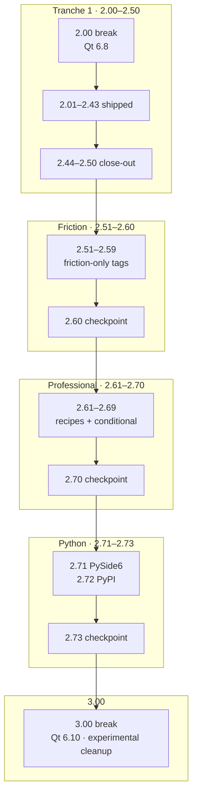

# QWinUI3 Roadmap

**Current:** **2.64** (master; collection perf + a11y sign-off)
**Next up:** **2.65** — Charts + Dashboard product wave (professional surfaces tranche 3)
**Planned through:** **3.00** (… → **2.00** break → **2.01…2.50** tranche 1 → **2.51…2.60** friction-only → **2.61…2.70** professional surfaces → **2.71…2.73** Python / PyPI → **3.00** 2.x close-out)
**1.xx close-out:** [checkpoint-190.md](docs/checkpoint-190.md). **1.86…1.89** performance arc **signed off** (**animations stay**). OSK/packaging promote **2.01**. **2.50** = tranche-1 audit; **2.60** = friction tranche close-out; **2.70** = professional-surfaces audit; **2.73** = Python consumer checkpoint; **3.00** = 2.x breaking close-out ([checkpoint-300.md](docs/checkpoint-300.md)).  
**Qt:** 6.5+ (recommended 6.8 LTS) through **1.92** — [qt-version-compat.md](docs/qt-version-compat.md). **2.00** raises the floor to **6.8 LTS**. **3.00** raises the floor to **6.10 LTS**. **Platforms:** **Windows + Linux** — no macOS first-class line.

This plan starts from **what 1.00 already was**, walks **1.xx** through **1.90 close-out** and **1.91…1.92**, then **2.00** and follow-ups. **After 2.50**, new minors ship only for **[documented user friction](docs/planning/friction-log.md)** — not catalog completeness.

---

## Version format: `X.YY`

| Field | Meaning |
|-------|---------|
| **X** | Major line (`1` = current kit; `2` = future breaking line) |
| **YY** | Two-digit minor (`00`, `01`, … `99`) — one focused slice each |

Examples: `1.00` → `1.01` → … → `1.10` → `1.11`.

- **Tags / packages:** `v1.01`, archives `qwinui3-1.01-…`
- **CMake:** `QWINUI3_VERSION` in root `CMakeLists.txt` (maps to `major.minor.0` for CMake’s numeric VERSION)
- **No third digit** for product releases. Hotfixes either rebuild the same `X.YY` or bump `YY`.

---

## What you already have (1.00 baseline)

Do not plan as if the kit is empty. Rough inventory today:

| Surface | Rough size |
|---------|------------|
| Public controls | ~208 |
| Gallery demo pages | ~150+ |
| Style QML (Fluent chrome for Controls) | ~55 |
| Extras QML | ~150 |
| Modules | Theme · Style · Platform · Extras |
| Docs | MkDocs + generated component API |
| Ship | Apache-2.0 · CI Release (Win + Linux) · shared/gallery packaging · Qt compat shims |

**Implication:** Through **1.90**, work was mostly **finish, fix, document, and deepen**. **2.01…2.50** are a **committed tranche-1** backlog (may still be **rescheduled** at checkpoints if friction evidence is weak). **2.51+** opens **only** from rows in [friction-log.md](docs/planning/friction-log.md) — real “this is broken / hard to use” reports from kit consumers, not parity shopping.

---

## Friction gate — when a slice earns a tag

A **`2.xx` minor is allowed** when at least one row in [friction-log.md](docs/planning/friction-log.md) names a **repeatable pain** (Gallery soak, GitHub issue, example-app author, or field app) and the slice **directly removes** that pain.

| Pass | Fail |
|------|------|
| “Linux Wayland window looks wrong vs Windows DWM” → shell slice | “WinUI has FileTree, we should too” with no app blocked |
| “`find_package` fails for every new consumer” → packaging slice | “Add CalendarView because roadmap slot 2.31” |
| “Settings toggle doesn’t stick / title FPS invisible” → fix + docs | New control to pad catalog count |
| “NavigationView Back vs pane confuses our users” → recipe + API clarify | Perf wave with no reported sluggish path |

**New controls:** only when friction says **existing types cannot compose the app flow** (document the failed recipe first). Otherwise **withdraw** the slice at the next checkpoint — same rule as withdrawn macOS / Fluent 2 / Hub.

**Evidence bar:** one paragraph **Pain → workaround today → slice outcome** per tag; link the friction-log row in the release note.

---

## How we version

| Kind | Meaning |
|------|---------|
| **Same `X.YY` rebuild** | Urgent packaging/docs/CI fixes when needed |
| **Next `X.YY`** | **One focused slice**—small enough to finish, clear enough to name |
| **`2.00`** | Breaking line (Qt floor / freeze lift / documented remaps). **After 1.90 only.** |
| **`2.01…2.50`** | Tranche 1 — planned backlog; **conditional control slices** need friction or checkpoint green-light |
| **`2.51…2.60`** | **Friction-only** — each tag maps to [friction-log.md](docs/planning/friction-log.md); no slot-filling |
| **`2.61…2.70`** | **Professional surfaces** — recipes, collection perf/a11y, experimental promote; **conditional** new types need friction rows |
| **`2.71…2.73`** | **Python consumer** — PySide6 integration + PyPI wheels; depends on **2.02** packaging |
| **`3.00`** | **2.x close-out** — breaking major after **2.73**; Qt floor **6.10 LTS**; experimental cleanup; [checkpoint-300.md](docs/checkpoint-300.md) |
| **`3.01+`** | **Friction-only** — same gate as **2.51+**; no catalog shopping |

**Rules of thumb**

- One `X.YY` ≈ one primary outcome, not five themes at once.
- Avoid empty releases—but do not wait for “epic” bundles either.
- **1.xx:** new controls only when they serve that minor’s slice; otherwise park them.
- **2.01…2.50:** table order is **not** permission to ship; checkpoints **2.20 / 2.30 / 2.50** may **drop or swap** slices without friction proof.
- **2.51+:** **no new row → no new tag.** Prefer fix + recipe over new public types.
- After each ship: bump `QWINUI3_VERSION`, update this file, **close or add friction-log rows**.
- **2.00** is one breaking slice, not a dump of the parking lot. Follow-ups are `2.01+`.
- **3.00** closes the **2.x** line — one breaking slice after **2.73**; follow-ups are `3.01+` (friction-gated).
- **Platforms:** **Windows + Linux** — **macOS first-class is not planned**.

---

## Shipped — `1.01` … `1.68`

### 1.01 — Docs & “what’s stable” (shipped)

**Shipped:** [stable-api.md](docs/stable-api.md) (stable vs experimental map), docs/Creator/packaging pointers, component docs lint clean; product version `1.01`.

### 1.02 — Accessibility (high-traffic path) (shipped)

**Shipped:** Settings toggle rows as one CheckBox focus target; NavigationView item/footer/Back names; InfoBar/Toast severity + Close keyboard; [accessibility.md](docs/accessibility.md) + Gallery Accessibility checklist; product version `1.02`.

### 1.03 — Linux shells (practical) (shipped)

**Shipped:** [platform-linux-wayland.md](docs/platform-linux-wayland.md) matrix; `WindowHelper.resolveBackdrop`; shells paint `effectiveBackdrop`; Gallery `run-gallery.sh`; product version `1.03`.

### 1.04 — Window chrome polish (Windows-first) (shipped)

**Shipped:** StandardWindow reapply / DPI hit-test; DWM on `WM_DPICHANGED`; `openDialog(owner)`; [window-chrome.md](docs/window-chrome.md); product version `1.04`.

### 1.05 — WebView2 (Windows) productize (shipped)

**Shipped:** Runtime probe + EmptyState; user-data lifecycle; focus / scroll / DPI; [webview2.md](docs/webview2.md); product version `1.05`. *(Still experimental in stable-api until a later soak slice.)*

### 1.06 — CI smoke (lightweight) (shipped)

**Shipped:** [`.github/workflows/smoke.yml`](.github/workflows/smoke.yml); `qwinui3_gallery --smoke`; [ci-smoke.md](docs/ci-smoke.md); Windows QPA coerce; product version `1.06`.

### 1.07 — DataTable / master–detail (shipped)

**Shipped:** Stable selection; keyboard; ListDetails Back/Esc; [data-collections.md](docs/data-collections.md); product version `1.07`.

### 1.08 — Forms & settings consistency (shipped)

**Shipped:** FormLayout clear/collect parity; field `errorMessage` chrome; SettingsExpander host; [forms.md](docs/forms.md); product version `1.08`.

### 1.09 — Branding & Theme overrides (shipped)

**Shipped:** [theme-overrides.md](docs/theme-overrides.md); Gallery Theme overrides; Settings custom accent; product version `1.09`.

### 1.10 — System bridge consistency (shipped)

**Shipped:** FilePicker HWND ownership; TrayIcon severity; [system-integration.md](docs/system-integration.md); promote FilePicker / TrayIcon / NotificationBridge; product version `1.10`.

### 1.11 — Charts & gauges API consistency (shipped)

**Shipped:** `interactive`/`isInteractive` and `unit`/`valueUnit` aliases; Pie/Donut `values` convenience; [charts.md](docs/charts.md); Gallery Charts hub callout; charts remain experimental; product version `1.11`.

### 1.12 — Consumer packaging & CMake docs (shipped)

**Shipped:** [packaging-consumer.md](docs/packaging-consumer.md) (Release zip / package script / `add_subdirectory`, Win+Linux runtime, minimal consumer CMake); links from README, qt-creator, examples; product version `1.12`.

### 1.13 — i18n / RTL baseline for samples (shipped)

**Shipped:** [i18n-rtl.md](docs/i18n-rtl.md); Gallery **i18n / RTL** page + Settings RTL toggle; `LayoutMirroring` on Gallery / nav-settings; `AlignLeading` on Headered* left headers; seed `translations/`; product version `1.13`.

### 1.14 — Qt 6.5 / 6.8 / 6.10 compat CI (shipped)

**Shipped:** [`.github/workflows/qt-compat.yml`](.github/workflows/qt-compat.yml) Linux Gallery Release matrix (6.5.3 / 6.8.3 / 6.10.0); [qt-version-compat.md](docs/qt-version-compat.md) CI section; smoke stays on 6.8; product version `1.14`.

### 1.15 — Command surfaces deepen (shipped)

**Shipped:** [commands.md](docs/commands.md); CommandPalette list-item Accessible names; Gallery keyboard callouts (CommandPalette / CommandBar / MenuFlyout / MenuBar); MenuBar `Action.shortcut` demo; product version `1.15`.

### 1.16 — Dialogs & flyouts consistency (shipped)

**Shipped:** [dialogs-flyouts.md](docs/dialogs-flyouts.md); ContentDialog Esc → `requestClose` / Closing cancel; Gallery **Dialogs & flyouts** chooser + page callouts; ContentDialog remains stable; product version `1.16`.

### 1.17 — Shell extras productize (shipped)

**Shipped:** [shell-extras.md](docs/shell-extras.md); promote taskbar progress/overlay, `requestUserAttention`, `revealFileInFolder`, idle inhibit (Win/Linux matrix); Gallery System integration callouts; Snap/power/recent remain experimental; product version `1.17`.

### 1.18 — WebView2 soak → stable (shipped)

**Shipped:** Soak checklist green in [webview2.md](docs/webview2.md); promote `WebView2Host` to stable; Retry force-recreate + async generation guard; Gallery callouts; product version `1.18`.

### 1.19 — Accessibility wave 2 (shipped)

**Shipped:** Wave-2 Done checklist in [accessibility.md](docs/accessibility.md); `accessibleName` on DataTable / ItemsView / ListDetailsView / FormLayout; row names + Drawer/TeachingTip polish; Gallery Accessibility page; product version `1.19`.

### 1.20 — Gallery catalog UX & smoke coverage (shipped)

**Shipped:** Curated `recentlyShipped()` + component search; page favorite star on `PageHeader`; `--smoke` loads critical pages; `smoke_catalog.py` integrity; [ci-smoke.md](docs/ci-smoke.md) coverage set; product version `1.20`.

### 1.21 — Media optional Multimedia (shipped)

**Shipped:** [media.md](docs/media.md); `MediaPlayerElement` stub when Multimedia missing (`available === false`); keyboard Space/Enter + mute; Gallery page always present; remain experimental; product version `1.21`.

### 1.22 — Animations & transitions recipe (shipped)

**Shipped:** [animations.md](docs/animations.md); Gallery **Animations** hub + reducedMotion toggles on ConnectedAnimation / Entrance / Theme transitions demos; remain experimental; product version `1.22`.

### 1.23 — Charts promote wave 2 (shipped)

**Shipped:** Promote stable subset `LineChart` / `BarChart` / `DonutChart` / `RingGauge` / `KpiTile` / `ChartCard`; [charts.md](docs/charts.md) + [stable-api.md](docs/stable-api.md); dashboard example uses only stable names; Gallery Charts hub callout; product version `1.23`.

### 1.24 — Linux persistent tray (StatusNotifierItem) (shipped)

**Shipped:** Linux `TrayIcon` registers `org.kde.StatusNotifierItem` when a session `StatusNotifierWatcher` is present (KDE Plasma reference); `supportsPersistentTray` / `persistentTrayActive` / `iconName`; ContextMenu → `trayActivated(2)` for app-owned menus; Win vs Linux matrix in [system-integration.md](docs/system-integration.md) + [platform-linux-wayland.md](docs/platform-linux-wayland.md); Gallery System Integration notes; product version `1.24`.

### 1.25 — Performance handbook (shipped)

**Shipped:** [performance.md](docs/performance.md) — virtualization, model roles, chart point budgets, Gallery heavy-page tips; `ItemsRepeater` enables `ListView.reuseItems`; DataTable Gallery callout; links from README / stable-api / docs index; product version `1.25`.

### 1.26 — Example app templates (shipped)

**Shipped:** [`examples/master-detail`](../examples/master-detail/) (`ListDetailsView` LoB tickets) and [`examples/form-settings`](../examples/form-settings/) (`FormLayout` + SettingsCard prefs); README / examples README / stable-api / forms / data-collections / window-chrome “start from” tables updated; product version `1.26`. Smoke CI keeps examples off for speed (default local `QWINUI3_BUILD_EXAMPLES=ON`).

### 1.27 — Navigation & TabView deepen (shipped)

**Shipped:** [navigation.md](docs/navigation.md) — pane modes, footer, Back stack, compact/overlay, TabView vs NavigationView; Gallery NavigationView / TabView callouts + `leftMinimal`/`auto`; Accessible names on demo path; [`examples/nav-settings`](../examples/nav-settings/) aligned (`paneDisplayMode: auto`, TitleBar Back ↔ `navigateBack`); product version `1.27`.

### 1.28 — Input & pickers consistency (shipped)

**Shipped:** [pickers.md](docs/pickers.md) inventory; DatePicker / CalendarDatePicker / TimePicker gain `description` / `errorMessage` / `hasError` for FormLayout; forms.md pairing notes; Gallery Form validation + picker page cross-links; product version `1.28`.

### 1.29 — Icons & FluentIcons cookbook (shipped)

**Shipped:** [icons.md](docs/icons.md) — FluentIcons API, size ramp, Theme colors, a11y; `FontIcon` no longer names with raw PUA glyph; `CaptionButton` defaults for Chrome* glyphs; Gallery Iconography callout + tile names; product version `1.29`.

### 1.30 — Density, typography & responsive shells (shipped)

**Shipped:** [density.md](docs/density.md) — density/uiScale token table, fixed type scale, NavigationView `auto` / ListDetailsView narrow recipe; Theme overrides Gallery live metrics + uiScale; Settings density note; theme-overrides + navigation cross-links; product version `1.30`.

### 1.31 — Graphics & backend notes (shipped)

**Shipped:** [graphics-backend.md](docs/graphics-backend.md) — per-OS ship table, alpha/backdrop caveats, Settings / `--rhi` / `QSG_RHI_BACKEND` restart story, consumer `Compat::Rhi::apply`; Gallery Settings callout; README pointer; Windows default stays OpenGL; product version `1.31`.

### 1.32 — Window shells matrix refresh (shipped)

**Shipped:** [window-shells.md](docs/window-shells.md) / [window-chrome.md](docs/window-chrome.md) Win+Linux soak matrix; `geometryPersistenceKey` + multi-monitor clamp recipe in [window-helper.md](docs/window-helper.md); Bootstrap note in Linux docs; Gallery Window shells page + catalog aligned; product version `1.32`.

### 1.33 — Tree & hierarchical data (shipped)

**Shipped:** [tree-data.md](docs/tree-data.md) — TreeView vs ItemsView sections, keyboard ←/→, selection + MenuFlyout recipe; Fluent `TreeViewDelegate` Accessible name/description (expand + level); Gallery TreeView recipe end-to-end + basics page; data-collections cross-link; product version `1.33`.

### 1.34 — Feedback surfaces wave 2 (shipped)

**Shipped:** [feedback.md](docs/feedback.md) — when-to-use matrix, severity, ToastHost pending queue vs InfoBarHost maxVisible, TeachingTip focus return to target, progress vs toast; Gallery callouts (InfoBar / Host / ToastHost / TeachingTip / ProgressBar / InfoTeaching recipe); dialogs-flyouts cross-link; product version `1.34`.

### 1.35 — Creator kit polish (shipped)

**Shipped:** [qt-creator.md](docs/qt-creator.md) — Gallery + example open paths, Win/Linux kit checklists, no `.pro` callout; `CMakePresets.json` `examples` / `example-*` build presets; examples README + nav-settings Creator pointers; packaging-consumer / README cross-links; product version `1.35`.

### 1.36 — Docs site IA (shipped)

**Shipped:** [recipes.md](docs/recipes.md) hub; MkDocs nav regrouped under Recipes (Getting started / shells / data / feedback / platform / quality); slim docs home + README Documentation table (≤2 clicks to recipes); `webview2-future.md` kept as legacy redirect; stable-api cross-link; product version `1.36`.

### 1.37 — Experimental promote sweep (shipped)

**Shipped:** Explicit promote batch (commands, Flyout/Drawer, TabView, ShellWindow/Blank/MenuStatus, pickers, progress, FontIcon/InfoBadge, ItemsRepeater) + defer/won’t-promote list in [stable-api.md](docs/stable-api.md); Gallery catalog + chooser/page badges; recipes hub pointer; product version `1.37`.

### 1.38 — Linux Wayland edge cases (shipped)

**Shipped:** [platform-linux-wayland.md](docs/platform-linux-wayland.md) field failure matrix (SSD, Solid backdrop, portal parent_window, SNI/GNOME tray, XWayland traps, idle/taskbar no-ops); Gallery System integration Linux callout + live SSD/portal/SNI readout; system-integration / window-chrome / ci-smoke / recipes cross-links; product version `1.38`.

### 1.39 — Gallery perf & startup (shipped)

**Shipped:** NavigationView `pageCacheLimit` / LRU / `clearPageCache` / `initialPageTransition`; Gallery Home MultiEffect defer; `--startup-log` + timed `--smoke`; [performance.md](docs/performance.md) cold-start budget; Settings page-cache card; smoke critical list sync; product version `1.39`.

### 1.40 — Compatibility freeze prep (shipped)

**Shipped:** [compatibility-1xx.md](docs/compatibility-1xx.md) will-not-break contract (Theme tokens, shell APIs, stable controls) + gate checklist for 1.41+; [upgrade-notes.md](docs/upgrade-notes.md) consumer template + recent minors; stable-api / recipes / MkDocs / README / Gallery Pitfalls pointers; product version `1.40`.

### 1.41 — Drag-drop & clipboard recipes (shipped)

**Shipped:** [drag-drop.md](docs/drag-drop.md) — FileDropZone + FilePicker browse + CopyButton / WindowHelper clipboard (Win/Linux notes); Gallery FileDropZone / CopyButton pages; stable-api / system-integration / recipes / MkDocs links; product version `1.41`.

### 1.42 — TwoPaneView & adaptive layout (shipped)

**Shipped:** [adaptive-layout.md](docs/adaptive-layout.md) breakpoint cheat sheet (Nav 1008 / TwoPane+ListDetails 720); Gallery TwoPaneView / ListDetailsView polish; density / navigation / data-collections cross-links; `TwoPaneView` on stable-api; product version `1.42`.

### 1.43 — Color, contrast & theme diagnostics (shipped)

**Shipped:** [color-contrast.md](docs/color-contrast.md) AA guidance; `Theme.relativeLuminance` / `contrastRatio` / `contrastPassesAA` / `accentContrastRatio`; Gallery Theme overrides live AA table; Accessibility / theme-overrides cross-links; product version `1.43`.

### 1.44 — Keyboard-first app cookbook (shipped)

**Shipped:** [keyboard.md](docs/keyboard.md) end-to-end chords → CommandPalette → dialogs → lists → focus; Gallery Accessibility keyboard tour + CommandPalette pointers; commands / accessibility / recipes / MkDocs links; product version `1.44`.

### 1.45 — Localization packs deepen (shipped)

**Shipped:** Expanded [i18n-rtl.md](docs/i18n-rtl.md) lupdate/lrelease / `--lang` / RTL regression checklist; `zh_CN` seed catalog; `scripts/check_gallery_translations.py` in smoke; Gallery i18n page + translations README; product version `1.45`.

### 1.46 — Shared library redistribute polish (shipped)

**Shipped:** Extended [packaging-consumer.md](docs/packaging-consumer.md) shared vs static matrix, windeploy/linuxdeploy, strip-restricted modules; `scripts/check_shared_package.py` in smoke; MSVC `CMAKE_WINDOWS_EXPORT_ALL_SYMBOLS` for shared; package QML collect keeps Theme/Platform siblings; product version `1.46`.

### 1.47 — Snap layouts & windowing extras (shipped)

**Shipped:** Refreshed [shell-extras.md](docs/shell-extras.md) Snap Layouts toggle UX, taskbar / attention / reveal recipes, honest Linux n/a matrix; Gallery System integration demos (Snap · taskbar · flash continuous); window-helper / system-integration cross-links; product version `1.47`.

### 1.48 — Modal stack & ContentDialogQueue deepen (shipped)

**Shipped:** Extended [dialogs-flyouts.md](docs/dialogs-flyouts.md) FIFO / owner Overlay / Esc recipes; fixed `replaceCurrent` not pumping pending; Gallery ContentDialog A→B→C stress + Dialogs & flyouts pointers; product version `1.48`.

### 1.49 — Icon micro-animations (shipped)

**Shipped:** `FontIcon` / `IconicButton` hover lift + press squash (`microMotionEnabled`, `hoverScale`, `pressScale`); aligned `IconButton` / `AppBarButton` / `AppBarToggleButton`; honors `Theme.reducedMotion`; Gallery Iconography + IconButton + AppBarButton demos; [icons.md](docs/icons.md) + [animations.md](docs/animations.md) pointer; product version `1.49`.

### 1.50 — Extractable Gallery shell template (shipped)

**Shipped:** [`examples/gallery-shell`](../examples/gallery-shell/) — `NavigationWindow` + `pageModule` + Settings footer + Bootstrap + `geometryPersistenceKey`; `NavigationWindow` gains `pageModule` / `hostContent` / `navigateBack`; keep-vs-delete README; docs/README/Gallery Example templates; product version `1.50`.

### 1.51 — 1.xx maturity checkpoint (shipped)

**Shipped:** [maturity-1xx.md](docs/maturity-1xx.md) verdict (stay on 1.xx; harden-first); revisited [compatibility-1xx.md](docs/compatibility-1xx.md); stable-api starters + changelog through 1.51; Gallery Pitfalls maturity checklist; recipe hub + README links; `scripts/check_docs_links.py` (0 broken recipe/roadmap links); product version `1.51`.

### 1.52 — Field polish buffer (shipped)

**Shipped:** No open GitHub field P0s after 1.51 — used the buffer for CI/docs harden: `check_docs_links.py` in `smoke_gallery.py`; critical smoke pages + `FontIconPage` / `PitfallsPage` / `ExamplesTemplatesPage`; `smoke_catalog` syncs QML `smokeCriticalComponents()`; packaging-consumer must mention `gallery-shell`; [ci-smoke.md](docs/ci-smoke.md) updated; product version `1.52`.

### 1.53 — Thin AnimatedIcon path (shipped)

**Shipped:** Experimental `AnimatedIcon` (glyph state swap, not Lottie) with `checked` / `iconState`+`iconStates`, reduced-motion snap; Gallery **AnimatedIcon** demos (play/pause · expand · favorite); [icons.md](docs/icons.md) + [animations.md](docs/animations.md) + stable-api experimental note; product version `1.53`.

### 1.54 — Extra locale pack (shipped)

**Shipped:** Gallery seed `ja_JP` (same demo subset as `zh_CN`); `check_gallery_translations.py` requires three seeds; Gallery i18n page Language ComboBox + `--lang` copy; [i18n-rtl.md](docs/i18n-rtl.md) + translations README; product version `1.54`.

### 1.55 — TeachingTip & onboarding coach marks (shipped)

**Shipped:** Gallery **Onboarding coach** (3-step sequenced `TeachingTip`, focus handoff, don’t-show-again via `QtCore.Settings`); [feedback.md](docs/feedback.md) recipe + when-to-use vs Toast/InfoBar/ContentDialog; keyboard / dialogs cross-links; product version `1.55`.

### 1.56 — Multi-window & secondary shells (shipped)

**Shipped:** Multi-window recipe (distinct `geometryPersistenceKey`s, shared Theme, `DialogShellWindow.openDialog` / transient parent); [`examples/multi-window`](../examples/multi-window/); Gallery **Multi-window** page; [window-shells.md](docs/window-shells.md) / [window-helper.md](docs/window-helper.md) / [window-chrome.md](docs/window-chrome.md) Win+Linux notes; product version `1.56`.

### 1.57 — Touch, pen & pointer recipes (shipped)

**Shipped:** [touch-pointer.md](docs/touch-pointer.md) cookbook (target floors, scroll vs drag, stylus hover notes); Gallery **Touch & pointer** page + callouts on Button / Slider / NavigationView / FileDropZone / SwipeControl; density / accessibility / drag-drop cross-links; product version `1.57`.

### 1.58 — High-DPI & multi-monitor matrix (wave 2) (shipped)

**Shipped:** [high-dpi.md](docs/high-dpi.md) Win+Linux matrix; geometry restore `setScreen` after clamp (mixed-DPI DPR); Gallery **High-DPI & monitors** readout + `GalleryMain` clear; window-chrome / window-helper / graphics-backend cross-links; product version `1.58`.

### 1.59 — In-app search & AutoSuggest recipes (shipped)

**Shipped:** [search.md](docs/search.md) cookbook (AutoSuggestBox / SearchBox / filter-above vs CommandPalette); Gallery **Search recipes** (catalog AutoSuggest jump + filtered ItemsView); AutoSuggest / SearchBox / commands / data-collections cross-links; product version `1.59`.

### 1.60 — Mid-horizon checkpoint (shipped)

**Shipped:** [checkpoint-160.md](docs/checkpoint-160.md) mid-horizon audit (stable-api / defer list / doc links OK; parking lot clarified); “still 1.xx” note in README/ROADMAP; smoke critical pages + `SearchRecipesPage` / `HighDpiPage`; `scripts/check_docs_links.py`; 1.61+ order confirmed (CMake `find_package` sketch next); product version `1.60`.

### 1.61 — CMake package / find_package sketch (shipped)

**Shipped:** `cmake/package/QWinUI3Config*.cmake.in` installed into shared zips as `lib/cmake/QWinUI3/`; `include/QWinUI3/Bootstrap.h`; [packaging-consumer.md](docs/packaging-consumer.md) Path C; `examples/find-package-consumer/`; `scripts/verify_find_package.py`; honest not-vcpkg/Conan banner; product version `1.61`.

### 1.62 — Gallery visual smoke (subset) (shipped)

**Shipped:** Gallery `--visual-smoke` grabs Home + Button + ContentDialog + Pitfalls + ExamplesTemplates to PNG/sha256; `scripts/smoke_visual.py` (opt-in, not default smoke); [ci-smoke.md](docs/ci-smoke.md) docs; optional workflow_dispatch; product version `1.62`.

### 1.63 — Print, share & export recipes (shipped)

**Shipped:** [print-share.md](docs/print-share.md) cookbook (grabToImage → FilePicker.saveFile → reveal; optional app-side QPrinter/PrintSupport); Gallery **Print / share / export**; system-integration / drag-drop / shell-extras / recipes / MkDocs cross-links; product version `1.63`.

### 1.64 — Security & trust boundaries (shipped)

**Shipped:** [security-trust.md](docs/security-trust.md) cookbook (WebView2 user-data + app-side allowlists, FileDropZone filters, FilePicker ownership — not a sandbox product); Gallery **Security & trust** + Pitfalls / WebView2 / FileDropZone callouts; webview2 / drag-drop / system-integration / recipes / MkDocs links; product version `1.64`.

### 1.65 — Settings persistence & roaming recipes (shipped)

**Shipped:** [settings-persistence.md](docs/settings-persistence.md) cookbook (`Settings` / QSettings, portable Ini, honest “roaming”, `schemaVersion`); Gallery **Settings persistence**; `examples/form-settings` + `gallery-shell` prefs; forms / window-helper / recipes / MkDocs links; product version `1.65`.

### 1.66 — Charts & dashboard polish (wave 3) (shipped)

**Shipped:** [charts.md](docs/charts.md) defer table for remaining siblings/gauges (stable six unchanged); Gallery **Charts** / **Dashboard** hubs match docs; `examples/dashboard` uses all six stable types; stable-api / recipes / Pitfalls; product version `1.66`.

### 1.67 — Media soak or honest defer (shipped)

**Shipped:** [media.md](docs/media.md) soak checklist + **defer** for remaining 1.xx (`MediaPlayerElement` stays experimental — optional Multimedia, codecs/backends, app-owned deploy); Gallery **MediaPlayerElement** decision callout + pause-when-hidden; stable-api / recipes / Pitfalls / compatibility; product version `1.67`.

### 1.68 — Linux portal & file-dialog harden (shipped)

**Shipped:** FilePicker portal timeout no longer falls back to zenity (P0 double-dialog); `nameFilters` / save `current_name`; reveal FileManager1 → OpenURI → folder; `WindowHelper.portalParentWindow()`; [platform-linux-wayland.md](docs/platform-linux-wayland.md) / [system-integration.md](docs/system-integration.md) matrix refresh; Gallery **System integration** live parent readout; product version `1.68`.

### 1.69 — Theme prefs for any app (shipped)

**Shipped:** `Theme.snapshot` / `apply` / `recipeText`; `ThemeSync` on `StandardWindow` / `ShellWindow`; drop-in `ThemeAppearanceSettings` + `ThemePrefs`; Gallery Settings uses the kit group (copy recipe); `examples/gallery-shell` same cards; [theme-overrides.md](docs/theme-overrides.md); product version `1.69`.

### 1.70 — Win11 on-screen keyboard (MIT engine path, our UI) (shipped)

**Shipped:** Experimental `OnScreenKeyboard` + `KeyboardEngine` inject (en-US letters / Shift-Caps / symbols, Win11 dock). Builtin backend this minor (`engine.backend === "builtin"`); Keyman Core `.kmx` remains **1.71+**. Gallery **On-screen keyboard** footer dock; [on-screen-keyboard.md](docs/on-screen-keyboard.md); not Qt Virtual Keyboard; product version `1.70`.

### 1.71 — Extra keyboard layouts (not IME yet) (shipped)

**Shipped:** SIL Keyman Core (**MIT**) linked statically (`KMN_NO_ICU`, Qt NFC/NFD shim). Community `.kmx` en-US / de / fr / es / ru / ar. Globe + Gallery ComboBox. `engine.backend === "keyman"` when Core sources are present (`scripts/fetch_keyman_core.py`). Chrome stays ours. Not Qt Virtual Keyboard. Product version `1.71`.

### 1.72 — Chinese IME (pinyin + candidates) (shipped)

**Shipped:** zh-Hans pinyin preedit + `ImeCandidateBar` (our chrome). Lexicon from mozillazg pinyin-data / phrase-pinyin-data (MIT) — not Keyman IMX, not GPL libpinyin. Gallery 中文 mode. Honest in-app IME. Product version `1.72`.

### 1.73 — Full in-app IME (shipped)

**Shipped:** ja-JP Hepburn romaji→kana (hiragana/katakana candidates) + ko-KR 2-beolsik hangul compositor (Unicode syllables, not a lexicon). Shared `ImeCandidateBar`. Emoji layer (no engine). Keyman Core still layouts only — ja/ko are not `.kmx` IMX. Gallery language matrix. Still experimental. Product version `1.73`.

### 1.74 — OSK / IME soak (shipped)

**Shipped:** Gallery language-matrix soak checklist; `ImeCandidateBar` a11y (composition / candidates / page buttons + Space/1–9 notes); romaji trailing-`n` finalize + small-kana map; BYO `.kmx` recipe in `keyboards/README.md`. **Stay experimental** — soak is written for manual Gallery verification, not promote-green. Product version `1.74`.

### 1.75 — Extra Keyman layout packs (shipped)

**Shipped:** Named MIT `.kmx` subset: en-GB (`basic_kbduk`), it-IT, pt-PT, pl-PL, sv-SE, tr-TR (`basic_kbdtuq`). Globe / ComboBox; `scripts/fetch_keyman_keyboards.py` re-fetches the subset; `keyboards/README.md` lists shipped vs BYO. Still layouts only — not every community keyboard, not CJK IMX. Product version `1.75`.

### 1.76 — IME deepen (MIT-only) (shipped)

**Shipped:** zh — regenerated MIT pinyin tables (phrases up to 6 chars) + **prefix phrase** candidates (`niha` → 你好) with correct consume length. ko — Backspace peels compound vowels (ㅘ/ㅢ…) and finals; Space commits syllable + word break; Shift (not Caps) doubles. ja — extra romaji (thi/dhi/ts*/wh*); **kanji skipped** — no MIT reading lexicon (JMdict/KANJIDIC are CC-BY-SA). Still experimental; not promote-green. Product version `1.76`.

### 1.77 — App hardware keyboard input (shipped)

**Shipped:** KeyboardEngine.hardwareInput (default on) routes physical keys in this process through the same engine as the OSK dock — pinyin / romaji / hangul / Keyman (incl. AltGr). 1–9 pick candidates; Esc cancels; PageUp/PageDown page the bar; Ctrl/Meta shortcuts pass through. **Not** OS-wide: no SendInput into other apps. Toggle in Gallery. Product version 1.77.

---

## Horizon — closed at `1.78` (field continues)

Still **1.xx**. **1.70…1.77** shipped OSK → IME → packs → deepen → app hardware input. Long-horizon checkpoint **shipped** as **1.78**. **1.79** Wayland field harden shipped. Plan: [docs/on-screen-keyboard.md](docs/on-screen-keyboard.md).

| Slice | Keyboard theme |
|-------|----------------|
| **1.70 shipped** | Win11 OSK (en-US builtin) |
| **1.71 shipped** | Keyman Core + de/fr/es/ru/ar |
| **1.72 shipped** | zh-Hans pinyin + candidate bar |
| **1.73 shipped** | ja romaji/kana + ko hangul + emoji |
| **1.74 shipped** | Soak / harden (still experimental) |
| **1.75 shipped** | Extra documented Keyman `.kmx` (named subset) |
| **1.76 shipped** | IME deepen, MIT-only (ja kanji gap documented) |
| **1.77 shipped** | App-scoped hardware input (not OS-wide) |
| **1.78 shipped** | Long-horizon 1.xx checkpoint |
| **1.79 shipped** | Linux / Wayland field harden |
| **1.80 shipped** | Win11 OSK layout chrome |
| **1.81 shipped** | Win11 OSK behavior (vs Win10) |
| **1.82 shipped** | Floating OSK + Windows system-wide (`SendInput`) |
| **1.83 shipped** | Floating OSK / SendInput field harden |
| **1.84 shipped** | Consumer floating-OSK recipe |
| **1.85 shipped** | Accessibility wave 3 |

### 1.78 — Long-horizon 1.xx checkpoint (shipped)

**Shipped:** [checkpoint-178.md](docs/checkpoint-178.md) long-horizon audit (docs links OK; ~196 Gallery pages; 214 public / 225 component docs). **Posture:** prefer field harden / pause vs new surfaces; open `1.79+` only for field-driven P0s or park. **OSK/IME:** stayed experimental through 1.74 / 1.76 / 1.77 — **not** promoted. Freeze (1.40) still active. Still not 2.00. Product version `1.78`.

### 1.79 — Linux / Wayland field harden (shipped)

**Shipped:** Stronger portal `parent_window` on pure Wayland (`portalWindowIdentifier` when GuiPrivate available; realize window before export; native-resource fallback); Bootstrap honors `WAYLAND_SOCKET`; experimental OSK CapsLock tracking on Linux; [platform-linux-wayland.md](docs/platform-linux-wayland.md) + Gallery System integration soak refresh. OSK/IME still experimental. Product version `1.79`.

### 1.80 — Win11 OSK layout chrome (shipped)

**Shipped:** `OnScreenKeyboard` matches Windows 11 default touch layout (Esc/Tab/dual Shift, `&123` · Ctrl · Win · Alt · lang chip · Space · mic · arrows, top-row number hints, settings/grab/close + emoji/paste tools). `KeyboardEngine.navigateKey` / `pasteClipboard`. Layout packs unchanged. Still experimental. Product version `1.80`.

### 1.81 — Win11 OSK behavior vs Win10 (shipped)

**Shipped:** Long-press digit hints + punctuation alt flyout; `keyboardSize` Small/Default/Large; clipboard paste strip; emoji category chips; rounder keys + press scale (not Win10 classic flat full keyboard). `clipboardText()` peek. Still experimental. Product version `1.81`.

### 1.82 — Floating OSK + Windows system-wide (shipped)

**Shipped:** `OnScreenKeyboardWindow` (always-on-top, grab-drag, `WS_EX_NOACTIVATE`); `KeyboardEngine.systemWide` Windows `SendInput`; compose stays on the candidate bar. Floating host **defaults `systemWide` on** (Windows); dock stays off. SIL Keyman Core **vendored** in `third_party/keyman` (clone includes sources). Gallery `--visual-smoke` removed (CI `--smoke` kept). Linux: floating only (`supportsSystemWide === false`). Still experimental. Product version `1.82`.

---

## After `1.82` — planned through `2.00`

Finish **1.xx** as named slices (**1.83…1.90**), then a **breaking 2.00**. Do not treat 1.70…1.82 as permission to start 2.00 code. Prefer **one theme per minor**.

| Slice | Theme | Status |
|-------|--------|--------|
| **1.83** | Floating OSK / SendInput field harden | **Shipped** |
| **1.84** | Consumer floating-OSK recipe | **Shipped** |
| **1.85** | Accessibility wave 3 | **Shipped** |
| **1.86** | Performance wave 1 — shell & window runtime | **Shipped** |
| **1.87** | Performance wave 2 — navigation & page stack | **Shipped** |
| **1.88** | Performance wave 3 — lists & data collections | **Shipped** |
| **1.89** | Performance wave 4 — style, charts & Gallery heavy pages | **Shipped** |
| **1.90** | 1.xx close-out + perf sign-off + 2.00 prep | **Shipped** |
| **2.00** | Breaking baseline | **Next** (after 1.90) |

### 1.83 — Floating OSK field harden (shipped)

**Shipped:** `WindowHelper.setNoActivate` also eats `WM_MOUSEACTIVATE` (`MA_NOACTIVATE`) and click `WM_ACTIVATE` so the first tap / settings / candidate bar do not steal the target app. Floating host skips `raise()`. Long-press `Popup` stays `Popup.Item` on Qt 6.8+ (no extra HWND). Gallery soak checkboxes + honest UIPI / UWP / games limits. IME preedit stays on the OSK bar; commits / Backspace / Enter / arrows still `SendInput`. Still experimental. Product version `1.83`.

### 1.84 — Consumer floating-OSK recipe (shipped)

**Shipped:** [`examples/floating-osk`](../examples/floating-osk/) — `OnScreenKeyboardWindow` + `openFloating()`; `systemWide` pinned to Windows. Docs: Keyman Core **in the clone** (`third_party/keyman`); WebView2 still optional NuGet. Do not copy the Gallery tree. Still experimental. Product version `1.84`.

### 1.85 — Accessibility wave 3 (shipped)

**Shipped:** ContentDialog / Flyout / CommandBarFlyout return focus to the opener on close. InfoBar announces title + message + severity on open (`Accessible.announce` on Qt 6.8+; AlertMessage + description on 6.5). ImeCandidateBar announces paged candidates without taking focus. Gallery **Accessibility** wave 3 sample. [docs/accessibility.md](docs/accessibility.md). OSK still experimental. Product version `1.85`.

**Out**

- Full catalog audit as a mega-minor
- OSK promote (**2.01+**, after perf arc)

### Performance arc (1.86…1.89)

Four consecutive minors; **each ships only performance work** (Platform / Extras / Style / Gallery + [performance.md](docs/performance.md) rows). Not a fifth handbook — extends **1.25** / **1.39**.

| Rule | Detail |
|------|--------|
| **Animations stay** | Pane collapse, page transitions, control press/hover motion unchanged to the user — trim no-op animators, defer shadows, debounce model rebuilds |
| **Measure** | Gallery `--startup-log` / `--smoke` timings stay advisory; optional heavy-page checklist grows each wave |
| **Out for the arc** | Chart GPU rewrite, custom virtualization engine, built-in profiler, changing Gallery default RHI off OpenGL |

### 1.86 — Performance wave 1: shell & window runtime (shipped)

**Shipped:** Solid hosts use `WindowHelper.solidHostFill` for `QQuickWindow` clear color (never `Qt::white`). Windows pins `DWMWA_BORDER_COLOR` to that fill when `borderVisible` is false. Solid shells reapply border/corner **immediately** on activate; frosted hosts keep deferred DWM reapply. One 80 ms post-show reapply remains for Solid (Qt 6.8 overwrite). [performance.md](docs/performance.md) shell section; [window-chrome.md](docs/window-chrome.md). Product version `1.86`.

**Out**

- NavigationView / DataTable / Style (**1.87…1.89**)

### 1.87 — Performance wave 2: navigation & page stack (shipped)

**Shipped:** StackView page transitions run **only the axes each mode needs** (`slide`/`fade` skip no-op x/y/scale animators; drill/center/up/down unchanged visually). Compact-pane flyout defers `MultiEffect` until open; honors `Theme.reducedMotion`. `TabView` tab strip: width/opacity `Behavior` only during reorder; color/indicator `Behavior` when tab is active/hovered/focused. Gallery Settings **Performance arc** card. [performance.md](docs/performance.md) navigation section. Product version `1.87`.

**Out**

- DataTable filter path (**1.88**)
- Style-wide sweep (**1.89**)

### 1.88 — Performance wave 3: lists & data collections (shipped)

**Shipped:** `DataTable` debounces filter keystrokes (`filterDebounceMs`, default 120) and skips `_viewRows` rebuild when query/sort/rows unchanged. `ItemsView` / `ListDetailsView` / `ItemsRepeater` gain optional `filterText` for plain JS arrays (debounced, skip unchanged). Thinner role bindings under `reuseItems`. Gallery DataTable / ItemsView / ListDetailsView pages call out 1.88. [performance.md](docs/performance.md) lists section. Product version `1.88`.

**Out**

- Canvas chart engines (**1.89**)
- C++ model requirement for apps (document only)

### 1.89 — Performance wave 4: style, charts & Gallery heavy pages (shipped)

**Shipped:** `ElevatedChrome` defers `MultiEffect` one frame; skips shadow when `Theme.reducedMotion`. Style hot path: Button / TextField / Switch / ListTile idle `Behavior` bindings gated on hover/focus/press (motion unchanged when interacting). Stable charts (Line/Bar/Donut): `ChartUtils.revealAnimationPointBudget` (500) + coalesced canvas redraw (~16 ms). Gallery: FontIcon filter debounce; Charts deferred Pie/Sparkline `Loader`; WebView2 host deferred one frame. [performance.md](docs/performance.md) style/charts section + arc summary. Product version `1.89`.

**Out**

- Full catalog perf audit (every Gallery page) as one tag
- Chart GPU rewrite

### 1.90 — 1.xx close-out (shipped)

**Shipped:** [checkpoint-190.md](docs/checkpoint-190.md) — docs-link OK, Gallery catalog **195**, freeze accurate, **1.86…1.89 perf checklist green**. [upgrade-notes.md](docs/upgrade-notes.md) draft **1.90 → 2.00** (Qt floor, remaps, experimental posture). [ci-smoke.md](docs/ci-smoke.md) perf timing advisory from the arc. README / Gallery: **1.xx freeze ends at 2.00**. Product version `1.90`.

**Out**

- Actually dropping Qt 6.5 or renaming Theme tokens (**2.00**)
- OSK promote / packaging (**2.01**)

---

## Post close-out — `1.91` … `1.92` (shipped on master)

Small **non-breaking** slices after [checkpoint-190.md](docs/checkpoint-190.md). Ship as tags before **2.00** when ready.

| Slice | Theme | Status |
|-------|--------|--------|
| **1.91** | Real-time FPS + title-bar custom slots | **Shipped** (master) |
| **1.92** | Linux Wayland client shell (corners + DWM-like shadow) | **Shipped** (master) |

### 1.91 — Real-time FPS + title-bar slots (shipped)

**Shipped:** `FrameStatsMonitor` singleton (`frameSwapped` rolling FPS / frame time, QSettings, CLI `--show-fps` / `--fps-overlay`); `FrameStatsBadge` + `FrameStatsOverlay`; `StandardTitleChrome` exposes `leftHeader` / `titleBarContent` / `rightHeader` on `StandardWindow`; Gallery Settings toggles + badge in title `rightHeader`; `TitleBar.notifyChromeHitTest()` on slot layout changes. Opt-in (`enabled` default **false**). Product version target `1.91`.

### 1.92 — Linux Wayland client shell (shipped)

**Shipped:** `WindowHelper.clientShellDecoration` + `shellCornerRadius()` / `shellShadowMargin()` / `shellChromeExpanded()`; `WindowShellDecoration` (`MultiEffect` drop shadow + rounded frame from `cornerPreference`); `StandardWindow` / `ShellWindow` transparent host + decoration background; Linux alpha buffer when CSD active; Settings **Window corners** enabled on Linux; [platform-linux-wayland.md](docs/platform-linux-wayland.md) Effects dependency note. Windows DWM path unchanged. Product version target `1.92`.

Wave 2 polish → **2.03** (compositor profiles, Simple fallback, content clip).

---

## 2.00 — Breaking baseline (planned, after 1.92)

**Gate:** **1.90 shipped**; **1.91…1.92** tagged or explicitly folded into **2.00** release notes. Do not mix undocumented breaking remaps into 1.91/1.92.

**Theme:** lift the [1.xx freeze](docs/compatibility-1xx.md) in **one** named major. Small enough to finish. Follow-ups are `2.01+`.

### Breaks (in)

| Area | 2.00 intent |
|------|-------------|
| **Qt floor** | Drop **Qt 6.5**. Floor **6.8 LTS** (forward 6.10+). Update [qt-version-compat.md](docs/qt-version-compat.md) + CI matrix. |
| **Theme** | Only remaps listed in the **1.90** inventory (example: collapse duplicate stroke/focus aliases). **Not** a Fluent 2 redesign. |
| **Shell** | Remove Gallery-era aliases that 1.xx kept for compatibility; keep `StandardWindow` / `NavigationWindow` / `WindowHelper` as the contract. |
| **Experimental leftover** | Types still experimental after **2.01** OSK slice either promote, move to an explicit experimental module, or **remove** with an upgrade-notes row. |
| **Packaging** | `QWINUI3_VERSION` `2.00`; shared/static defaults only change if **2.01+** documents the new contract. |

### Does not ship in 2.00 (out)

- **Fluent 2 / separate Style fork — withdrawn** (not in **2.01…2.50**; **WinUI 3 Style** only)
- Linux system-wide OSK inject
- **macOS first-class** — **withdrawn** (not in **2.01…2.50**)
- Full Lottie, Figma tokens, every-locale portal
- Qt Virtual Keyboard (never)
- Re-adding Gallery visual-smoke as a default CI gate

### Consumer upgrade (sketch)

Apps on **1.90** read [upgrade-notes.md](docs/upgrade-notes.md) **1.90 → 2.00**, raise Qt to 6.8+, apply the remap table, rebuild Release. Apps that cannot leave Qt 6.5 **stay on 1.90**.

## Planned through `2.50` — tranche 1 (`2.01` … `2.50`)

**Tranche 1** — ordered **candidates** for the **2.x** floor. **Not automatic:** slices marked **(conditional)** ship only if [friction-log.md](docs/planning/friction-log.md) or a checkpoint records the pain. Prefer **fix / docs / recipe** over new types.

| Slice | Theme | Friction / gate | Status |
|-------|--------|-----------------|--------|
| **2.00** | Breaking baseline | Qt 6.5 consumers blocked on tooling/security | **Next** |
| **2.01** | OSK / IME promote | Apps fear shipping keyboard path (experimental) | Planned |
| **2.02** | `find_package` productize | Consumer CMake/import pain every onboarding | Planned |
| **2.03** | Linux Wayland shell wave 2 | Linux chrome still wrong vs Windows DWM | **Shipped** |
| **2.04** | Runtime diagnostics | Perf/RHI regressions hard to see (FPS opt-in) | **Shipped** |
| **2.05** | Title-bar cookbook | Custom title slots / hit-test footguns | **Shipped** |
| **2.06** | **(conditional)** `FileTree` | Explorer apps blocked without tree+metadata | **Shipped** |
| **2.07** | Accessibility wave 4 | **DataTable** / **ListDetailsView** / **NavigationView** keyboard names + live regions | **Shipped** |
| **2.08** | Charts stable外延 + promote sweep | [charts.md](docs/charts.md) six-pack + **AreaChart→LineChart.showArea** / **Sparkline→KpiTile** recipes — **no new stable names** | **Shipped** |
| **2.09** | Media promote or defer | Media apps blocked or need honest defer | **Shipped** |
| **2.10** | Checkpoint (`checkpoint-210`) | Drop weak slices | **Shipped** |
| **2.11** | vcpkg / Conan | Packaging still painful after **2.02** | **Shipped** |
| **2.12** | Localization wave 3 | RTL/i18n ship blockers | **Shipped** |
| **2.13** | Security wave 2 | WebView / drop paths feel unsafe | **Shipped** |
| **2.14** | Multi-window harden | Dialog parent / z-order wrong on Wayland | **Shipped** |
| **2.15** | High-DPI wave 3 | Geometry wrong across monitors | **Shipped** |
| **2.16** | Command & search | Palette lag / search keyboard traps | **Shipped** |
| **2.17** | Style polish (WinUI 3) | Controls look/behave unlike WinUI ref | **Shipped** |
| **2.18** | Performance wave 5 | **DataTable** / **ListDetailsView** / **NavigationView** — debounce, virtualize, skip unchanged rebuilds | **Shipped** |
| **2.19** | Docs & catalog refresh | “Can’t find how to use X” | **Shipped** |
| **2.20** | Checkpoint (`checkpoint-220`) + Gallery full locale switch | Reschedule **2.21…2.50** from friction | **Shipped** |
| **2.21** | **(conditional)** `TreeDataGrid` | Master-detail blocked; Tree+Table hack fails | **Shipped** |
| **2.22** | Dashboard recipes | **ChartCard** + **KpiTile** + **TwoPaneView** + stable charts — no Hub controls | **Shipped** |
| **2.23** | `BreadcrumbBar` integration | Title/path out of sync with nav | **Shipped** |
| **2.24** | **(conditional)** `ItemsWrapGrid` | Wrap layouts need custom code today | **Shipped** |
| **2.25** | Forms / Settings industry templates | **FormLayout** / **SettingsCard** / **SettingsExpander** / **TokenizingTextBox** / **MultiSelectComboBox** LoB pages | **Shipped** |
| **2.26** | Charts recipe wave | Deferred siblings: promote **or** document compose paths; Gallery **Charts** hub refresh | **Shipped** |
| **2.27** | **(conditional)** Notification center + feedback | In-app history + grouping beyond Toast; InfoBar/TeachingTip recipes | **Shipped** |
| **2.28** | Performance wave 6 | Tranche-1 perf still user-visible | **Shipped** |
| **2.29** | Accessibility wave 5 | New surfaces fail keyboard/a11y | **Shipped** |
| **2.30** | Checkpoint (`checkpoint-230`) | Drop **2.31…2.50** without friction | **Shipped** |
| **2.31** | **(conditional)** `CalendarView` | Month grid blocked by pickers-only | **Shipped** |
| **2.32** | Media + WebView2 | Embed focus/DPI/policy pain | **Shipped** |
| **2.33** | Linux portal & tray | Field Linux dialogs/tray flaky | **Shipped** |
| **2.34** | Packaging CI matrix | Win/Linux consumer builds diverge | **Shipped** |
| **2.35** | Localization wave 4 | Non-en ship blockers | **Shipped** |
| **2.36** | Security wave 3 | Trust docs for new data surfaces | **Shipped** |
| **2.37** | **(conditional)** `PipsPager` | Carousel blocked (if friction logged) | **Shipped** |
| **2.38** | Theme overrides wave 2 | Branding/density hard to apply | **Shipped** |
| **2.39** | Gallery findability | Gallery itself is the pain | **Shipped** |
| **2.40** | Performance wave 7 | Collection controls debounce/filter paths | **Shipped** |
| **2.41** | Command / menu bar wave 3 | Accelerator discovery pain | **Shipped** |
| **2.42** | **(conditional)** `SwipeControl` | Touch gesture conflicts reported | **Shipped** |
| **2.43** | Multi-window + onboarding | First-run / z-order confusion | **Shipped** |
| **2.44** | Diagnostics productize | Devs need ship-safe perf story | **Shipped** |
| **2.45** | Experimental → stable sweep | **FL-004** — OSK/charts/shell extras promote or honest defer; [stable-api.md](docs/stable-api.md) + Gallery badges | **Shipped** |
| **2.46** | Docs IA v2 | Docs navigation is the pain | **Shipped** |
| **2.47** | Field harden buffer | Checkpoint P0/P1 only | **Shipped** |
| **2.48** | **Friction-only control slot** | Top [friction-log.md](docs/planning/friction-log.md) row — no catalog pick | **Shipped** |
| **2.49** | Performance wave 8 | Residual perf pains logged | **Shipped** |
| **2.50** | Tranche-1 checkpoint | Audit **2.00…2.50**; queue **2.51…2.60** | **Shipped** |

## Friction-only tranche 2 (`2.51` … `2.60`)

**Hard rule:** each row below ships **only** if [friction-log.md](docs/planning/friction-log.md) has an open **P0/P1** entry at tag time. Otherwise **skip the tag** (same `X.YY` rebuild or jump to checkpoint).

| Slice | Theme | Typical pain (examples) | Status |
|-------|--------|-------------------------|--------|
| **2.51** | Stable vs experimental clarity | Teams ship experimental APIs by mistake | **Shipped** |
| **2.52** | First app in an hour | `gallery-shell` still too much to delete | **Shipped** |
| **2.53** | Linux “feels broken” top 3 | Field matrix names 3 user-visible parity gaps | **Shipped** |
| **2.54** | Window chrome footguns | Maximize/DPI/hit-test/geometry restore | **Shipped** |
| **2.55** | Forms unlike WinUI | Validation, errors, clear/collect surprises | **Shipped** |
| **2.56** | Navigation mental model | Back vs pane vs stack confusion | **Shipped** |
| **2.57** | Files on Linux | Pick / drop / reveal still fails in apps | **Shipped** |
| **2.58** | Keyboard / IME / OSK in apps | Real input path unusable outside Gallery | **Shipped** |
| **2.59** | “Feels slow” (app-level) | Named app scenarios, not synthetic FPS only | **Shipped** |
| **2.60** | Friction-line checkpoint + 3.00 prep | [checkpoint-260.md](docs/checkpoint-260.md) — close **2.51…2.60** | **Shipped** |

### 2.51 — Stable vs experimental clarity (shipped)

**Goal:** Close **FL-004** queue — consumers cannot tell what is safe to ship; Gallery badges lie by omission.

**Shipped:** [stable-clarity-251.md](docs/stable-clarity-251.md) — import guard recap + `scripts/lint_qml_imports.py` over `examples/`; Gallery **Pitfalls** **2.51** checklist; [stable-api.md](docs/stable-api.md) / [experimental-sweep.md](docs/experimental-sweep.md) aligned. Product version **2.51**.

### 2.52 — First app in an hour (shipped)

**Goal:** Close adoption stall — import paths, shell choice, Theme bootstrap.

**Shipped:** [first-app-252.md](docs/first-app-252.md) — `examples/first-app/` quickstart + preview **`DashboardShell`**; shell ladder in Pitfalls + packaging path picker. Product version **2.52**.

### 2.53 — Linux top-3 parity (shipped)

**Goal:** Fix highest-count user-visible Linux shell gaps — not full DWM parity.

**Shipped:** [linux-top3-253.md](docs/linux-top3-253.md) — `WindowShellContentClip` on **`NavigationWindow`** + **nav-settings**; **`sway`** compositor profile; **FilePicker** Wayland parent warning; field matrix refresh. Product version **2.53**.

### 2.54 — Window chrome footguns (shipped)

**Goal:** Fix top caption/geometry/DPI footguns — not a full chrome rewrite.

**Shipped:** [window-chrome-footguns-254.md](docs/window-chrome-footguns-254.md) — geometry schema v2 + normal-geo cache on restore + `geometryRestored` hit-test refresh; [window-chrome.md](docs/window-chrome.md) troubleshooting rows. Product version **2.54**.

### 2.55 — Forms unlike WinUI (shipped)

**Goal:** Close **FL-018** — validation timing, error summary a11y, modal queue / Enter footguns.

**Shipped:** [forms-unlike-winui-255.md](docs/forms-unlike-winui-255.md) — `FormLayout` async API + `focusFirstError`; `ValidationSummary` live region; `ContentDialogQueue.showFront`; Enter default in TextField; Gallery form/dialog refresh. Product version **2.55**.

### 2.56 — Navigation mental model (shipped)

**Goal:** Close Back / pane / stack confusion — not a new nav control.

**Shipped:** [navigation-mental-model-256.md](docs/navigation-mental-model-256.md) — `navigateToPage` + breadcrumb history guard + `isPanePinned`; [navigation.md](docs/navigation.md) recipes; Gallery **NavigationView** **2.56** block. Product version **2.56**.

### 2.57 — Files on Linux (shipped)

**Goal:** Close portal pick / drop / reveal footguns from **1.68** field data.

**Shipped:** [files-linux-257.md](docs/files-linux-257.md) — `resolveParentObject` FilePicker fallback; `revealFileInFolder(path, parent)`; `FileDropZone.isDragRejected`; Gallery + field matrix refresh. Product version **2.57**.

### 2.58 — Keyboard path in real apps (shipped)

**Pain:** OSK/IME/hardware routing unusable outside Gallery dock. **Outcome:** app integration recipe or fixes if **2.01** promote insufficient.

**Shipped:** [osk-in-apps-258.md](docs/osk-in-apps-258.md) — `sharedEngine` + focus return; floating `ImeCandidateBar`; `AnnotatedScrollBar.imeEngine`; [`examples/osk-dock/`](examples/osk-dock/). Product version **2.58**.

### 2.59 — App-level sluggishness (shipped)

**Pain:** Named slow flows in consumer apps (not “optimize everything”). **Outcome:** perf row in [performance.md](docs/performance.md) tied to each fix.

**Shipped:** [app-sluggishness-259.md](docs/app-sluggishness-259.md) — CommandPalette recents; ItemsView/AutoSuggest caps; Button.loading; FlipView reducedMotion; Theme.applyDensityPreset; performance.md wave **9**. Product version **2.59**.

### 2.60 — Friction-line checkpoint (shipped)

**Goal:** [checkpoint-260.md](docs/checkpoint-260.md) — verdict on **2.51…2.60**; [upgrade-notes.md](docs/upgrade-notes.md) draft **2.60 → 3.00**; queue **2.61…2.70** from friction + professional backlog.

**Shipped:** [checkpoint-260.md](docs/checkpoint-260.md) — friction tranche **2.51…2.59** audited; **3.00 prep draft**; Gallery **Pitfalls** **2.60** checklist. Product version **2.60**.

## Professional surfaces tranche 3 (`2.61` … `2.70`)

**Committed backlog** for LoB recipes, collection hardening, and **conditional** new types. Same friction gate as tranche 1 for **(conditional)** rows — log pain in [friction-log.md](docs/planning/friction-log.md) before ship.

| Slice | Theme | Friction / gate | Status |
|-------|--------|-----------------|--------|
| **2.61** | **(conditional)** `RichEdit` | Mail/template/note apps blocked by plain `TextArea` | **Shipped** |
| **2.62** | **(conditional)** `SemanticZoom` | Contacts/album thumbnail ↔ letter index blocked | **Shipped** |
| **2.63** | **(conditional)** Notification center | History + grouping beyond Toast/InfoBar | **Shipped** |
| **2.64** | Collection perf + a11y sign-off | Residual **DataTable** / **ListDetailsView** / **NavigationView** field rows | **Shipped** |
| **2.65** | **Charts + Dashboard product wave** | **FL-009** close + stable six deepen + **DashboardShell** | Planned |
| **2.66** | Forms industry template pack | Close **2.25** LoB form pages if still open | Planned |
| **2.67** | Experimental promote wave 2 | Post-**2.45** leftovers — promote or permanent defer | Planned |
| **2.68** | Platform integration harden | **FL-003** / **FL-004** residual after **2.02** / **2.51** | Planned |
| **2.69** | Field buffer + analytics wave B | **FL-014** / **FL-015** conditional charts | Planned |
| **2.70** | Professional-surfaces checkpoint | [checkpoint-270.md](docs/checkpoint-270.md) — audit **2.61…2.70**; refresh **3.00** prep | Planned |

### Summary — user-scheduled professional work (tranche 1 + 3)

| Area | Primary slices | Type |
|------|----------------|------|
| Charts stable外延 | **2.08**, **2.26**, **2.65**, **2.67**, **2.69** | Stable six **deepen** + conditional new types — [charts-dashboard-arc.md](docs/planning/expansion/charts-dashboard-arc.md) |
| Dashboard配方 | **2.22**, **2.52**, **2.65**, **DashboardShell** | **ChartCard** + **KpiTile** + **TwoPaneView** + new hosts |
| Component deepen | **2.55…2.59**, **2.64**, **2.66** | Existing controls — [component-capabilities-expansion.md](docs/planning/expansion/component-capabilities-expansion.md) |
| Icons / dashboard UX | **1.29**, **1.49**, **2.65** | KPI symbols, ChartCard.symbol, Iconography presets |
| Forms / Settings | **2.25**, **2.66** | Industry template Gallery pages |
| Collection perf | **2.18**, **2.40**, **2.64** | **DataTable** / **ListDetailsView** / **NavigationView** |
| Collection a11y | **2.07**, **2.29**, **2.64** | Keyboard names, live regions |
| Platform / integration | **2.02** (**FL-003**), **2.45** + **2.51** (**FL-004**), **2.68** | CMake consumer path; stable vs experimental |
| Python / PyPI | **2.71**, **2.72**, **2.73** (**FL-011**) | PySide6 path + `pip install`; after **2.02** |
| Experimental转正 | **2.01**, **2.08**, **2.09**, **2.45**, **2.67** | OSK, charts, media, shell extras |
| **RichEdit** | **2.61** | **(conditional)** new type |
| **SemanticZoom** | **2.62** | **(conditional)** new type |
| Notification center | **2.27**, **2.63** | **(conditional)** composite surface |

### 2.61 — (conditional) RichEdit (shipped)

**Friction gate:** Content-editing apps (mail, templates, long notes) document failed `TextArea` + WebView2 compose in [friction-log.md](docs/planning/friction-log.md).

**Shipped:** **`RichEdit`** — bold/italic/lists/links toolbar, paste sanitization, IME-friendly **TextEdit**; Gallery mail-compose recipe; [rich-edit-261.md](docs/rich-edit-261.md). Product version **2.61**. **Experimental.**

### 2.62 — (conditional) SemanticZoom (shipped)

**Friction gate:** Contacts/album apps blocked — dual zoom levels cannot share selection/state with two raw `ItemsView`s.

**Shipped:** **`SemanticZoom`** — zoomed-in / zoomed-out hosts, shared `model` + `selectedIndex`, `selectGroup()`; Gallery contacts recipe; [semantic-zoom-262.md](docs/semantic-zoom-262.md). Product version **2.62**. **Experimental.**

### 2.63 — (conditional) Notification center (shipped)

**Friction gate:** Apps need dismissible history + grouping — Toast-only flow insufficient (pairs with **2.27**).

**Shipped:** **`NotificationBridge.notificationCenter`** wiring; **`maxHistory`** + **`id`** dedupe on **`NotificationCenter`**; **`ToastHost`** dedupe id; Gallery product stack recipe; [notification-center-263.md](docs/notification-center-263.md). Product version **2.63**. **Experimental** center.

### 2.64 — Collection perf + a11y sign-off (shipped)

**Goal:** Close field rows for **DataTable** / **ListDetailsView** / **NavigationView** from **2.07** / **2.18** / **2.40**; [performance.md](docs/performance.md) wave 10 + [accessibility.md](docs/accessibility.md) named paths.

**Shipped:** **DataTable** column pin/group + **columnOrder**; **ListDetailsView** multi-select + **detailToolbar**; **TreeDataGrid** column resize + **freezeFirstColumn**; **FileTree** filter sync + column chooser; [collection-perf-264.md](docs/collection-perf-264.md). Product version **2.64**. **FL-008** / **FL-016** closed at documented-path sign-off.

**Out:** Million-row GPU grid rewrite.

### 2.65 — Charts + Dashboard product wave (planned)

**Goal:** Close **FL-009** and ship **Wave A** analytics — **deepen stable six** + new dashboard hosts (not withdrawn `Hub`).

**Deliverables:**

| Item | Detail |
|------|--------|
| **Stable six APIs** | **LineChart** crosshair/zoom/axis; **BarChart** stacked; **DonutChart** center label; **KpiTile** compare period; **ChartCard** footer/export hook |
| **DashboardShell** | Layout host — KPI row + chart grid + **TwoPaneView** filter rail |
| **MetricCompareRow** / **ChartEmptyState** | Dashboard UX compose types |
| **Gallery + example** | **Dashboard** v2 · [`examples/dashboard`](../examples/dashboard/) refresh |
| **Docs** | [charts-dashboard-arc.md](docs/planning/expansion/charts-dashboard-arc.md) · [icons-dashboard-expansion.md](docs/planning/expansion/icons-dashboard-expansion.md) |

**Friction:** **FL-009** · **FL-014** (real-time KPI) partial in this tag.

**Out:** WebGL engine; unconditional new stable chart names without friction row.

### 2.66 — Forms industry template pack (planned)

**Goal:** Gallery LoB pages — registration, settings, admin CRUD — using **FormLayout**, **SettingsCard**, **TokenizingTextBox**, **MultiSelectComboBox**; [forms.md](docs/forms.md) cross-links.

**Out:** Vertical SaaS wizards; masked-input engine for every locale.

### 2.67 — Experimental promote wave 2 (planned)

**Goal:** After **2.45**, promote or permanently defer remaining experimental surfaces; [stable-api.md](docs/stable-api.md) + Pitfalls aligned.

**Analytics:** **Sparkline** promote vs permanent defer (**FL-009**) — verdict in [charts-dashboard-arc.md](docs/planning/expansion/charts-dashboard-arc.md) wave B.

**Out:** Promoting everything without soak.

### 2.68 — Platform integration harden (planned)

**Goal:** Residual **FL-003** / **FL-004** after **2.02** / **2.51** — consumer template lint, Gallery stable badges, packaging smoke green. Queue **2.71** if **2.02** artifacts ready.

**Out:** Hosted artifact store; vcpkg as only path; PyPI in the same tag (→ **2.72**).

### 2.69 — Field buffer + analytics wave B (planned)

**Goal:** Open P0/P1 from **2.64…2.68** audits only.

**Analytics (conditional):** **BulletChart** / **HistogramChart** / **DateRangeToolbar** — **FL-014** / **FL-015**; prefer **BarChart** bin API before new type — [charts-dashboard-arc.md](docs/planning/expansion/charts-dashboard-arc.md).

**Out:** Feature creep without friction rows.

### 2.70 — Professional-surfaces checkpoint (planned)

**Goal:** [checkpoint-270.md](docs/checkpoint-270.md) — audit **2.61…2.70**; drop conditional slices without friction; update **3.00** prep in [upgrade-notes.md](docs/upgrade-notes.md).

**Out:** Treating **2.70** as final 2.x line; shipping **3.00** here.

## Python consumer tranche 4 (`2.71` … `2.73`)

**Committed backlog** for **PySide6** app authors and **`pip install`** distribution. Builds on **2.02** shared package / `find_package` — not a parallel C++ rewrite.

| Slice | Theme | Friction / gate | Status |
|-------|--------|-----------------|--------|
| **2.71** | PySide6 consumer integration | Python teams blocked — kit is C++/CMake-only today | Planned |
| **2.72** | PyPI packaging + publish | `pip install` friction; wheel layout + CI on `v*` tags | Planned |
| **2.73** | Python consumer checkpoint | [checkpoint-273.md](docs/checkpoint-273.md) — audit **2.71…2.72**; 3.00 prep refresh | Planned |

### Summary — Python / PyPI (tranche 4)

| Area | Primary slices | Deliverable |
|------|----------------|-------------|
| PySide6 integration | **2.71** | Import paths, Theme bootstrap, minimal QML app from Python |
| PyPI | **2.72** | `pyproject.toml`, Win/Linux wheels, TestPyPI + PyPI CI |
| Docs | **2.71**, **2.72** | [packaging-pyside6.md](docs/packaging-pyside6.md) · [packaging-consumer.md](docs/packaging-consumer.md) Path E |
| Prerequisite | **2.02** | Shared zip / `find_package` artifact layout stable |

### 2.71 — PySide6 consumer integration (planned)

**Prerequisite:** **2.02** — shared package or `find_package(QWinUI3 CONFIG)` green on Win + Linux.

**Goal:** Supported **PySide6 6.8+** path (matches **2.00** Qt floor) — `QQmlApplicationEngine` + QWinUI3 QML import roots; [`examples/pyside6-minimal/`](../examples/pyside6-minimal/) hello window with **Theme** bootstrap; `scripts/verify_pyside6.py` smoke; [packaging-pyside6.md](docs/packaging-pyside6.md).

**Out:** PyQt6 in the same tag; Shiboken wrappers for every C++ helper; regenerating controls in Python.

### 2.72 — PyPI packaging & publish (planned)

**Prerequisite:** **2.71** import path proven; wheel contents align with **2.02** shared layout.

**Goal:** **`pyproject.toml`** + package name (e.g. `qwinui3` — finalize at ship); wheels for **`win_amd64`** + **`manylinux_x86_64`** that ship or locate QWinUI3 shared libs + `qml/` tree; documented **`pip install`** flow; TestPyPI on PR + PyPI publish on `v*` tag; [packaging-consumer.md](docs/packaging-consumer.md) **Path E**.

**Out:** Conda-forge as official port in the same tag; vendoring full Qt inside the wheel; every PySide patch release without a documented matrix.

### 2.73 — Python consumer checkpoint (planned)

**Goal:** [checkpoint-273.md](docs/checkpoint-273.md) — audit **2.71…2.72**; Win/Linux CI runs `pip install` + minimal app; update [upgrade-notes.md](docs/upgrade-notes.md) **3.00** prep if Python is a first-class consumer beside CMake.

**Out:** Python as the only supported consumer path; shipping **3.00** in the same tag.

---

## Full 2.x arc → 3.00 (summary)

| Tranche | Versions | Gate | Checkpoint |
|---------|----------|------|------------|
| **1 — committed backlog** | **2.00 → 2.50** | Table order + friction for **(conditional)** rows | [checkpoint-250.md](docs/checkpoint-250.md) |
| **2 — friction-only** | **2.51 → 2.60** | Open **P0/P1** in [friction-log.md](docs/planning/friction-log.md) or **skip tag** | [checkpoint-260.md](docs/checkpoint-260.md) |
| **3 — professional surfaces** | **2.61 → 2.70** | LoB recipes + conditional types with named friction | [checkpoint-270.md](docs/checkpoint-270.md) |
| **4 — Python consumer** | **2.71 → 2.73** | **2.02** packaging green | [checkpoint-273.md](docs/checkpoint-273.md) |
| **5 — 2.x close-out** | **3.00** | **2.73** + [checkpoint-300.md](docs/checkpoint-300.md) green | [checkpoint-300.md](docs/checkpoint-300.md) |

**After 3.00:** minors **`3.01+`** follow the same friction gate as **2.51+** — no return to catalog shopping.

---

## 3.00 — 2.x line close-out (breaking major)

**Status:** **Planned** — ships **after** **2.73** and [checkpoint-300.md](docs/checkpoint-300.md). **Not** a feature dump — closes the **2.x** compatibility story.

**Prerequisites:** [checkpoint-250.md](docs/checkpoint-250.md) · [checkpoint-260.md](docs/checkpoint-260.md) · [checkpoint-270.md](docs/checkpoint-270.md) · [checkpoint-273.md](docs/checkpoint-273.md) · experimental sweep **2.45** / **2.67** · consumer packaging **2.02** green.

### Goal

| Area | 3.00 deliverable |
|------|------------------|
| **Qt** | Floor **6.10 LTS**; drop **6.8** compat shims — [qt-version-compat.md](docs/qt-version-compat.md) |
| **Theme** | Remove remaining 2.x token/shell aliases deferred from **2.00** |
| **Experimental** | **Permanent defer** inventory removed from default QML imports or namespaced — [stable-api.md](docs/stable-api.md) + **2.45** / **2.67** verdicts |
| **Stable contract** | [compatibility-3xx.md](docs/compatibility-3xx.md) (new) — **3.xx** “will not break” freeze |
| **CMake / PyPI** | **`find_package(QWinUI3)`** primary path; PyPI semver **3.00** if **2.72** shipped |
| **Docs** | [upgrade-notes.md](docs/upgrade-notes.md) **Upgrade 2.73 → 3.00**; MkDocs nav for 3.xx |
| **CI** | Win + Linux Release matrix on Qt **6.10**; smoke green |

### Breaking inventory (draft)

Consumer remap table lives in [upgrade-notes.md](docs/upgrade-notes.md) **Upgrade 2.73 → 3.00 (draft)** — finalized at tag time only.

| Area | Change | Migration |
|------|--------|-----------|
| **Qt** | Minimum **6.10** | Raise CI / installer Qt; rebuild Release; redeploy |
| **Deferred charts/gauges** | Sibling types (**AreaChart**, **Sparkline**, **TankGauge**, …) **removed** or experimental-only import | Use stable six + compose — [charts.md](docs/charts.md) |
| **Media** | **MediaPlayerElement** stays out of default stable surface (**2.09** permanent defer) | App-owned Multimedia |
| **Theme aliases** | Legacy stroke/focus names removed | Grep + remap table from 3.00 notes |
| **Shell aliases** | Undocumented Gallery-era window aliases removed | [window-shells.md](docs/window-shells.md) |
| **Experimental module** | Optional `QWinUI3.Experimental` for types not promoted by **2.67** | Pin **2.73** if you depend on them |

### Stay on 2.73 if

- You must keep **Qt 6.8** in production.
- You import **permanent defer** chart/gauge siblings without migration time.
- You depend on undocumented experimental APIs not promoted by **2.45** / **2.67**.

### Out of 3.00

- macOS first-class support
- Fluent 2 Style fork / full visual redesign
- **`Hub` / `HubSection`** controls (withdrawn — use **ChartCard** / dashboard layouts)
- WebGL / new chart engines
- Screenshot diff for every Gallery page
- Community translation portal
- Qt Virtual Keyboard integration
- Breaking changes without a row in the draft upgrade table

### 3.01+ posture (after 3.00)

Same rules as **2.51+**, plus documented analytics track:

1. **No friction-log row → no tag.**
2. Prefer **fix + recipe + deepen APIs** over new public types.
3. **Charts / dashboard Wave C** ([charts-dashboard-arc.md](docs/planning/expansion/charts-dashboard-arc.md)) — `LiveMetricStrip`, linked crosshair, export helpers — friction-only **3.01…3.10**.
4. **Component deepen** continues on **3.xx** stable surface — [component-capabilities-expansion.md](docs/planning/expansion/component-capabilities-expansion.md).
5. Checkpoints at **3.20 / 3.30 / …** only if the line grows long enough to need audit — not pre-scheduled.

---

### 2.01 — OSK / IME green soak + promote (planned)

**Goal:** Manual soak checklist **green** on Windows + Linux floating path; promote `OnScreenKeyboard` / `KeyboardEngine` / `ImeCandidateBar` subset to **stable**; [on-screen-keyboard.md](docs/on-screen-keyboard.md) + [stable-api.md](docs/stable-api.md) promote rows; honest limits (UIPI, no Linux system-wide inject).

**Out:** Every community `.kmx`; dictation / cloud lexicon.

### 2.02 — Consumer find_package productize (planned)

**Goal:** Productize the **1.61** sketch — installed `QWinUI3Config.cmake` as the supported consumer path; closes **FL-003**; `verify_find_package.py` in default smoke; [packaging-consumer.md](docs/packaging-consumer.md) Path C as primary; optional CI consumer build. Artifact layout also gates **2.71** PySide6 / **2.72** PyPI.

**Out:** Replacing `add_subdirectory` for in-tree kit dev.

### 2.03 — Linux Wayland shell wave 2 (shipped)

**Shipped:** Compositor profile tuning (`shellCompositorProfile` → shadow opacity/margin/blur); **`WindowShellDecoration_Simple`** when QuickEffects unavailable at build; **`WindowShellContentClip`** + `shellContentInset()` bottom-corner recipe; Gallery **System integration** readout; [platform-linux-wayland.md](docs/platform-linux-wayland.md) field matrix refresh. Builds on **1.92** client CSD. Product version `2.03`.

**Out:** SSD-only compositors pretending to be Win11 DWM; compositor-native round-corner protocols (future field slice).

### 2.04 — Runtime diagnostics deepen (shipped)

**Shipped:** `FrameStatsMonitor.showRhi` + `rhiBackend` / `rhiLabel` from `QQuickWindow::rendererInterface()`; badge/overlay append RHI when enabled; Gallery Settings **Show RHI**; CLI `--show-rhi`, `--show-diagnostics`; [performance.md](docs/performance.md) diagnostics section. Builds on **1.91** FPS badge. Product version `2.04`.

**Out:** Built-in QML profiler; always-on FPS in consumer apps by default.

### 2.05 — Title-bar & shell chrome cookbook (shipped)

**Shipped:** [title-bar-cookbook.md](title-bar-cookbook.md) — `StandardTitleChrome` vs `ShellWindow` slot map, `PlatformTitleBar.rightHeader` before captions, hit-test troubleshooting; Gallery **TitleBar** ↔ **Window shells** cross-links. Product version `2.05`.

**Out:** Replacing `PlatformTitleBar`.

### 2.06 — (conditional) FileTree (shipped)

**Shipped:** Experimental **`FileTree`** (`TreeView` + `DataTable`, Tab focus, `fileCatalog` / `onFolderChanged`); Gallery **FileTree** page; friction **FL-012**; [tree-data.md](docs/tree-data.md) Explorer section. Product version `2.06`.

**Out:** OS file system integration; hierarchical multi-column grid (→ **2.21** TreeDataGrid).

### 2.07 — Accessibility wave 4 (shipped)

**Shipped:** `announceChanges` + `Accessible.announce` on **DataTable** (selection / sort / filter), **ListDetailsView** (selection / SinglePane details / Back), **NavigationView** (`selectKey` / footer / pane toggle); `PlatformTitleBar` window title description; [accessibility.md](docs/accessibility.md) wave 4 checklist; Gallery **Accessibility** wave 4 sample. Product version `2.07`.

**Out:** Full 200+ control audit as one tag.

### 2.08 — Charts stable外延 + experimental promote sweep (shipped)

**Shipped:** [charts.md](docs/charts.md) compose recipes (Area→`LineChart.showArea`, Spark→`KpiTile.trendValues` / compact `LineChart`, Pie→`DonutChart`, gauges→`RingGauge`); **permanent defer** table for sibling charts/gauges; Gallery **Charts** + **Dashboard** updated; FL-009 compose path partial. Stable six unchanged. Product version `2.08`.

**Out:** New stable chart names; WebGL / new chart engines.

### 2.09 — Media final promote or defer (shipped)

**Shipped:** **Permanent defer** — `MediaPlayerElement` stays experimental; [media.md](docs/media.md) 2.09 verdict closes **1.67** loop; Gallery **MediaPlayerElement** + Pitfalls + [stable-api.md](docs/stable-api.md) aligned. App-owned Multimedia deploy/codecs. Product version `2.09`.

**Out:** Bundling FFmpeg; cloud streaming SDKs.

### 2.10 — 2.x mid-horizon checkpoint (shipped)

**Shipped:** [checkpoint-210.md](docs/checkpoint-210.md) — audit **2.00…2.10**; **2.03…2.09** on 1.xx floor; **2.00 / 2.01 / 2.02** rescheduled; **2.06 FileTree** landed (**FL-012**); docs links OK; Gallery **196** catalog / **18** smoke / **226** components; **no breaking code**. Product version `2.10`.

**Out:** Starting **3.00** implementation.

### 2.11 — vcpkg / Conan official port (shipped)

**Shipped:** In-repo **vcpkg overlay** [`ports/qwinui3/`](../ports/qwinui3/) (`x64-windows` · `x64-linux` triplets; `extras` / `media` / `webview2` features) + **Conan 2** [`conan/conanfile.py`](../conan/conanfile.py); [packaging-vcpkg-conan.md](docs/packaging-vcpkg-conan.md) Path D/E; `scripts/check_ports.py`; Config banner updated. **FL-003** partial — **2.02** still productizes Path C without overlay. Product version `2.11`.

**Out:** Qt itself vendored through the port; microsoft/vcpkg registry PR (optional follow-up).

### 2.12 — Localization wave 3 (shipped)

**Shipped:** Korean seed **`ko_KR`** alongside `zh_CN` / `ja_JP`; [i18n-rtl.md](docs/i18n-rtl.md) **Consumer lrelease recipe (2.x)** (`qt_add_translations`, deploy, CI); Gallery **i18n / RTL** page + `check_gallery_translations.py` updated; [`examples/gallery-shell`](examples/gallery-shell/) embeds `.qm` + `--lang ko_KR` demo. Product version `2.12`.

**Out:** Community translation portal; every-locale coverage.

### 2.13 — Security & trust wave 2 (shipped)

**Shipped:** [security-trust.md](docs/security-trust.md) wave 2 — WebView2 navigation policy patterns A/B/C (Gallery **WebView2** allowlist demo); `FileDropZone.acceptMimeTypes` MIME hardening; Wayland portal `parent_window` regression checklist; Gallery **Security & trust** / **FileDropZone** updates; `scripts/check_security_trust.py`. Product version `2.13`.

**Out:** App sandbox product; built-in WebView allowlist API.

### 2.14 — Multi-window & modal stack harden (shipped)

**Shipped:** `WindowHelper.ensureWindowCreated` + hardened `setTransientParent` (realize child + parent on Wayland); `centerOnOwner`; `DialogWindow` / `DialogShellWindow.openDialog` refresh; [`examples/multi-window`](examples/multi-window/) + Gallery **Multi-window** portal readout; [window-shells.md](docs/window-shells.md) / [window-chrome.md](docs/window-chrome.md) **2.14** checklist; `scripts/check_multi_window.py`. Product version `2.14`.

**Out:** MDI / tabbed document interface product.

### 2.15 — High-DPI & multi-monitor wave 3 (shipped)

**Shipped:** `WindowHelper.highDpiScaleFactorRoundingPolicy()`; `screensInfo()[].fractionalScale`; [high-dpi.md](docs/high-dpi.md) wave 3 (Wayland fractional scale, per-monitor geometry soak); Gallery **High-DPI & monitors** readout + soak checklist; `scripts/check_high_dpi.py`. Product version `2.15`.

**Out:** Per-monitor Theme packs as a product feature.

### 2.16 — Command & search surfaces deepen (shipped)

**Shipped:** [commands.md](docs/commands.md) + [search.md](docs/search.md) wave 2 — `CommandPalette` debounced filter + `maxResults`; **AutoSuggestBox** / **SearchBox** debounced suggestions, `maxSuggestionResults`, field-first ↑↓ keyboard (no popup focus trap); Gallery **CommandPalette** stress list + **Search recipes** checklist; `scripts/check_command_search.py`. Product version `2.16`.

**Out:** Spotlight clone; cloud search backends.

### 2.17 — Theme & Style polish (WinUI 3) (shipped)

**Shipped:** `Theme.bgControlRest` / `borderedControlFill` / `fillSliderThumb`; Style token migration (Button, ComboBox, TextField, TextArea, SpinBox, CheckBox, RadioButton, Slider, RangeSlider, RoundButton, DelayButton); [style-polish.md](docs/style-polish.md); Gallery **Style spot-check**; [theme-overrides.md](docs/theme-overrides.md) cross-links; `scripts/check_style_polish.py`. Product version `2.17`.

**Out:** Fluent 2 fork; full visual redesign.

### 2.18 — Performance wave 5 (shipped)

**Shipped:** `DataTable` / `ListDetailsView` `maxFilterResults`; ListDetailsView selection by object identity + `filteredCount`; `NavigationView.pageCacheHits`; [performance.md](docs/performance.md) wave 5 section; Gallery **DataTable** / **ListDetailsView** / **NavigationView** callouts; `scripts/check_performance_wave5.py`. Product version `2.18`. **Animations stay.**

**Out:** Chart GPU rewrite; default RHI change off OpenGL (Windows).

### 2.19 — Component docs & Gallery catalog refresh (shipped)

**Shipped:** Regenerated `docs/components.md` + `docs/components.json` (222 public); `ControlCatalog.recentlyShipped` 2.13–2.17 bump; critical smoke + `MultiWindowPage` / `StyleSpotCheckPage`; [ci-smoke.md](docs/ci-smoke.md) **2.19**; `scripts/check_catalog_refresh.py`. Product version `2.19`.

**Out:** MkDocs theme redesign.

### 2.20 — First 2.x horizon checkpoint + Gallery full locale switch (shipped)

**Shipped:** [checkpoint-220.md](docs/checkpoint-220.md) — audit **2.00…2.20**; tranche-1 perf (**2.18**) + a11y (**2.07**) sign-off; friction triage for **2.21…2.50**. **Gallery full i18n:** `GalleryLanguage` singleton (live `QTranslator` + `retranslate()`), Settings + **i18n / RTL** picker, `qt_add_translations` (~3647 strings × 4 locales), `zh_CN` catalog filled, nav/catalog refresh on locale change; `check_gallery_translations.py` wiring checks; `smoke_catalog.py` categories fix. Product version `2.20`.

**Out:** Shipping **3.00** breaks; **ja_JP** / **ko_KR** full Linguist pass (→ **2.35** wave 4).

### 2.21 — New controls: TreeDataGrid (shipped)

**Shipped:** Experimental **`TreeDataGrid`** — nested `children` rows + multi-column sort/filter per sibling group; Gallery **TreeDataGrid** master-detail page; [tree-data.md](docs/tree-data.md) **2.21** section; `scripts/check_tree_data_grid.py`. Pairs with **FileTree** (2.06) Explorer recipe. Product version `2.21`.

**Out:** Excel-scale grid engine; GPU virtualization rewrite.

### 2.22 — Dashboard layout recipes (shipped)

**Shipped:** Responsive breakpoints in [`examples/dashboard`](../examples/dashboard/) (KPI 700 / chart 900 / `TwoPaneView` filter rail 720) + Gallery **Dashboard** readout; [charts.md](docs/charts.md) **Dashboard layout (2.22)** section; `scripts/check_dashboard_recipes.py`. Stable six only — no Hub controls. Product version `2.22`.

**Out:** **`Hub` / `HubSection` WinUI controls** (withdrawn); dynamic tile store / cloud hub backend.

### 2.23 — Navigation: BreadcrumbBar integration (shipped)

**Goal:** Deepen existing **`BreadcrumbBar`** — NavigationView / ShellWindow title sync, overflow flyout, keyboard; not a new type unless overflow sub-control is required.

**Shipped:** `NavigationView.breadcrumbPathForKey` / `breadcrumbModelForKey` / `selectBreadcrumbIndex`; **NavigationWindow** forwarders + opt-in `syncSubtitleFromNavigation`; Gallery **BreadcrumbBar** live **NavigationView** demo; [navigation.md](docs/navigation.md) **BreadcrumbBar integration (2.23)** section; `scripts/check_breadcrumb_integration.py`.

**Out:** File system watcher integration.

### 2.24 — New controls: ItemsWrapGrid (shipped)

**Goal:** **`ItemsWrapGrid`** (variable-sized wrap) — WinUI wrap panel for ItemsRepeater/ItemsView; touch floors from [touch-pointer.md](docs/touch-pointer.md).

**Shipped:** **`ItemsWrapGrid`** (`WrapPanel` + `Repeater` + debounced `filterText`, scroll); Gallery **ItemsWrapGrid** page; [items-wrap-grid.md](docs/items-wrap-grid.md); `scripts/check_items_wrap_grid.py`.

**Out:** Virtualizing wrap for million items.

### 2.25 — Forms / Settings industry templates (shipped)

**Goal:** Gallery LoB template pages — registration, admin CRUD, preferences — using **FormLayout**, **SettingsCard**, **SettingsExpander**, **TokenizingTextBox**, **MultiSelectComboBox**; **NumberBox** / **PasswordBox** validation parity; [forms.md](docs/forms.md) + [pickers.md](docs/pickers.md).

**Shipped:** Gallery **Registration template**, **Admin CRUD template**, **Preferences template**; **Forms & settings** hub links; **MultiSelectComboBox** `errorMessage` / FormLayout parity; [forms.md](docs/forms.md) **Industry templates (2.25)**; `scripts/check_form_templates.py`.

**Out:** Masked input engine for every locale; vertical SaaS wizards.

### 2.26 — Charts recipe wave (shipped)

**Goal:** Gallery + docs for deferred chart siblings — explicit promote **or** compose path per [charts.md](docs/charts.md); optional dashboard example siblings; stable-api row for any promotion.

**Shipped:** Gallery **Charts** deferred sibling chooser + stacked-area compose demo; [charts.md](docs/charts.md) **Recipe wave (2.26)** table; `scripts/check_charts_recipes.py`. Stable six unchanged — compose-only.

**Out:** Adding stable names without soak; WebGL chart backend.

### 2.27 — (conditional) Notification center + feedback (shipped)

**Friction gate:** Apps need in-app notification **history + grouping** — document Toast-only failure in [friction-log.md](docs/planning/friction-log.md). If gate fails, ship feedback recipes only.

**Goal:** **Notification center** drawer/panel (list, group, mark read, clear) + **InfoBadge** / **ProgressRing** / TeachingTip recipes; [feedback.md](docs/feedback.md) wave 3. Full center may split to **2.63**.

**Shipped:** **`NotificationCenter`** (experimental, FL-007) — grouped drawer, mark read / clear; Gallery **Notification center** page; [feedback.md](docs/feedback.md) wave 3; `scripts/check_notification_feedback.py`.

**Out:** OS toast replacement; push notification SaaS.

### 2.28 — Performance wave 6 (shipped)

**Goal:** Shell + navigation trim on real apps checklist; advisory smoke timings.

**Shipped:** `NavigationView` **`sameKeySkipCount`** / **`samePageSkipCount`** diagnostics; **`NavigationWindow`** forwards cache + skip counters + **`clearPageCache()`**; [docs/performance.md](docs/performance.md) **Shell & navigation wave 6** checklist + advisory smoke table; Gallery **Performance** + **NavigationView** callouts; `scripts/check_performance_wave6.py`.

**Out:** Removing animations globally.

### 2.29 — Accessibility wave 5 (shipped)

**Goal:** New **2.21…2.24** controls + FileTree/TreeDataGrid keyboard names; wave 5 checklist.

**Shipped:** **`TreeDataGrid`** selection / expand live regions + row press actions; **`FileTree`** `Accessible.Tree` + folder announce; **`ItemsWrapGrid`** / **`BreadcrumbBar`** `accessibleName` + filter/nav live regions; [docs/accessibility.md](docs/accessibility.md) wave 5; Gallery **Accessibility** sample; `scripts/check_accessibility_wave5.py`.

**Out:** Mega audit single tag.

### 2.30 — Mid-2.x checkpoint (shipped)

**Goal:** [checkpoint-230.md](docs/checkpoint-230.md) — audit **2.21…2.30**; control count + doc links; reschedule **2.31…2.50** if needed.

**Shipped:** [docs/checkpoint-230.md](docs/checkpoint-230.md) — **203** catalog / **225** public types / **20** smoke pages; **2.21…2.29** validators green; friction triage for **2.31…2.50** (no slices dropped); `scripts/check_checkpoint_230.py`.

**Out:** **3.00** code.

### 2.31 — New controls: CalendarView (shipped)

**Goal:** **`CalendarView`** month grid (distinct from date pickers); selection modes; Gallery page.

**Shipped:** Experimental **`CalendarView`** — single / multiple / range selection; Style **`MonthGrid`** range/multi styling; Gallery **CalendarView** page; [docs/calendar-view.md](docs/calendar-view.md); [docs/pickers.md](docs/pickers.md) inventory; `scripts/check_calendar_view.py`.

**Out:** Outlook sync; recurring events engine.

### 2.32 — Media + WebView2 harden (shipped)

**Goal:** Field matrix on **2.x** floor; WebView2 policy recipes; Multimedia deploy notes.

**Shipped:** [docs/media.md](docs/media.md) **Field matrix (2.32)** + deploy checklist; [docs/webview2.md](docs/webview2.md) field matrix + **Navigation policy recipes**; Gallery **MediaPlayerElement** + **WebView2** callouts; `scripts/check_media_webview_harden.py`.

**Out:** Bundled browser engine; Multimedia promote.

### 2.33 — Linux portal & tray wave 3 (shipped)

**Goal:** FilePicker / tray / idle inhibit regression suite; [platform-linux-wayland.md](docs/platform-linux-wayland.md) refresh.

**Shipped:** **Portal & tray wave 3 regression suite** in [docs/platform-linux-wayland.md](docs/platform-linux-wayland.md); [docs/system-integration.md](docs/system-integration.md) + [docs/security-trust.md](docs/security-trust.md) cross-links; Gallery **System integration** wave 3 callout; `scripts/check_linux_portal_tray.py`.

**Out:** macOS portal work.

### 2.34 — Packaging & CI consumer matrix (shipped)

**Goal:** Shared/static × Win/Linux consumer builds in CI; [packaging-consumer.md](docs/packaging-consumer.md) v2.

**Shipped:** **Consumer matrix (2.34)** in [packaging-consumer.md](docs/packaging-consumer.md); [`.github/workflows/consumer-matrix.yml`](.github/workflows/consumer-matrix.yml) (static `gallery-shell` + shared package/`find_package` on Win/Linux); `scripts/check_packaging_consumer_matrix.py`.

**Out:** Hosted artifact store product.

### 2.35 — Localization wave 4 (shipped)

**Goal:** Fourth seed locale; translation checker rules for new control pages.

**Shipped:** **`de_DE`** seed catalog + `GalleryLanguage` picker; `lupdate` refresh (~3960 strings); **2.21…2.34** control page `qsTr` rules in `scripts/check_localization_wave4.py`; [i18n-rtl.md](docs/i18n-rtl.md) wave 4; Gallery **i18n / RTL** callout.

**Out:** Crowdin portal.

### 2.36 — Security & trust wave 3 (shipped)

**Goal:** FileTree / TreeDataGrid path trust notes; WebView2 download policy examples.

**Shipped:** [security-trust.md](docs/security-trust.md) wave 3 (path trust + download policy D/E/F); [tree-data.md](docs/tree-data.md) · [webview2.md](docs/webview2.md) cross-links; Gallery **Security & trust** / **FileTree** / **TreeDataGrid** / **WebView2** callouts; `scripts/check_security_trust_wave3.py`.

**Out:** Code signing service.

### 2.37 — PipsPager + carousel recipes (shipped)

**Goal:** Deepen **`PipsPager`** + **`FlipView`** / carousel hosts; Gallery motion + reducedMotion demos.

**Shipped:** [carousel-recipes.md](docs/carousel-recipes.md) (FlipView / SwipeView hosts, maxVisiblePips, reducedMotion); Gallery **FlipView** / **PipsPager** live toggles; `scripts/check_pips_pager_carousel.py`; [animations.md](docs/animations.md) + [recipes.md](docs/recipes.md) cross-links.

**Out:** Full-screen carousel product.

### 2.38 — Theme overrides & branding wave 2 (shipped)

**Goal:** Extend **1.09** branding — custom accent packs, `ThemePrefs` recipes for 2.x apps, contrast/density integration; Gallery Settings + [color-contrast.md](docs/color-contrast.md) refresh.

**Shipped:** [theme-overrides.md](docs/theme-overrides.md) **Branding wave 2**; [color-contrast.md](docs/color-contrast.md) + [density.md](docs/density.md) cross-links; Gallery **Theme overrides** / **Theme prefs** / **Settings** callouts; `_restoreTheme()` fix; `scripts/check_theme_overrides_wave2.py`.

**Out:** Fluent 2 tokens; Figma pipeline.

### 2.39 — Gallery catalog expansion (shipped)

**Goal:** Every **2.xx** new control has catalog entry + smoke consideration; Pitfalls updated.

**Shipped:** [gallery-catalog-expansion.md](docs/gallery-catalog-expansion.md) — **2.21…2.38** findability matrix + smoke critical vs catalog-only; `ControlCatalog.recentlyShipped()` refresh (**2.38 → 2.21** at top); Gallery **Pitfalls** **2.xx tranche** checklist; `scripts/check_gallery_catalog_expansion.py`.

**Out:** Screenshot diff every page.

### 2.40 — Performance wave 7 (shipped)

**Goal:** Second collection pass — **DataTable** / **ListDetailsView** / **NavigationView** debounce/filter perf on real app checklists; FileTree / TreeDataGrid rows if shipped; [performance.md](docs/performance.md) named paths.

**Shipped:** [performance.md](docs/performance.md) **Collection controls wave 7 (2.40)** checklist; Gallery **Performance** hub + **DataTable** / **ListDetailsView** / **NavigationView** / **FileTree** / **TreeDataGrid** callouts; [data-collections.md](docs/data-collections.md) · [tree-data.md](docs/tree-data.md) cross-links; `scripts/check_performance_wave7.py`.

**Out:** Custom scene graph; million-row GPU virtualization.

### 2.41 — Command palette + menu bar wave 3 (shipped)

**Goal:** Large-model CommandPalette; MenuBar accelerators on 2.x floor.

**Shipped:** [commands.md](docs/commands.md) **Wave 3 (2.41)** — large lists (`commandCount` / `filteredCount`), filter matches `shortcut`, MenuBar `Action.shortcut` + palette mirror recipe; [keyboard.md](docs/keyboard.md) accelerator discovery; Gallery **CommandPalette** (480+ stress + shortcut search) · **MenuBar** checklist; `scripts/check_command_menu_wave3.py`.

**Out:** OS global shortcuts.

### 2.42 — New controls: SwipeControl deepen (shipped)

**Goal:** **`SwipeControl`** thresholds, teaching, nested scroll; Gallery [touch-pointer.md](docs/touch-pointer.md) cross-links.

**Shipped:** `dragThreshold` / `nestedScrollFriendly` / `effectiveDragThreshold` on **SwipeControl**; [touch-pointer.md](docs/touch-pointer.md) **SwipeControl deepen (2.42)**; Gallery **SwipeControl** (threshold tuner, nested ScrollView list, TeachingTip) · **Touch & pointer** callout; `scripts/check_swipe_control_deepen.py`.

**Out:** Full edge-gesture OS hooks.

### 2.43 — Multi-window + onboarding (shipped)

**Goal:** **1.55** coach marks + multi-window z-order; Settings persistence for tours.

**Shipped:** [multi-window-onboarding.md](docs/multi-window-onboarding.md) — coach-on-main-shell checklist + Settings category vs geometry; Gallery **Multi-window** / **Onboarding coach** cross-links; [feedback.md](docs/feedback.md) · [window-shells.md](docs/window-shells.md) **2.43** sections; `scripts/check_multi_window_onboarding.py`.

**Out:** Analytics-backed onboarding SaaS.

### 2.44 — Developer diagnostics productize (shipped)

**Goal:** Promote or defer **`FrameStatsMonitor`** / badge / overlay; dev-vs-ship guidance.

**Shipped:** **`FrameStatsMonitor.retailMode`** / **`persistSettings`** / **`applyRetailProfile()`**; CLI **`--retail-diagnostics`**; [developer-diagnostics.md](docs/developer-diagnostics.md); **FrameStats** promoted on [stable-api.md](docs/stable-api.md); Gallery **Performance** / **Settings** / **Pitfalls** / **Graphics backend** callouts; [performance.md](docs/performance.md) **2.44** section; `scripts/check_developer_diagnostics.py`. Product version `2.44`.

**Out:** Always-on FPS in retail apps.

### 2.45 — Experimental → stable sweep (shipped)

**Goal:** Close **FL-004** — promote, module-ize, or **permanent defer** experimental inventory (OSK subset after **2.01**, charts after **2.08**, media after **2.09**, shell extras); [stable-api.md](docs/stable-api.md) + Gallery badges + Pitfalls aligned.

**Shipped:** [experimental-sweep.md](docs/experimental-sweep.md) verdict matrix; **`ControlCatalog.apiStabilityForComponent`** + **`ApiStabilityBadge`** on PageHeader / Home Recently shipped; Gallery **Pitfalls** FL-004 checklist; `scripts/check_experimental_sweep.py`. No new promotes in this tag — honesty over zero experimental. Product version `2.45`.

**Out:** Zero experimental types (unrealistic — document honest deferrals instead).

### 2.46 — Docs IA + recipes hub v2 (shipped)

**Goal:** MkDocs nav regroup for **2.xx** controls; [recipes.md](docs/recipes.md) hub v2.

**Shipped:** [docs-ia-v2.md](docs/docs-ia-v2.md); MkDocs **Recipes → 2.xx developer / 2.xx controls / 2.xx checkpoints**; [recipes.md](docs/recipes.md) **2.xx** sections; Gallery **Recipes hub** mirror block; [index.md](docs/index.md) quick links; `scripts/check_docs_ia_v2.py`. Product version `2.46`.

**Out:** Full site redesign.

### 2.47 — Field harden buffer (shipped)

**Goal:** Open P0/P1 from **2.30** / **2.45** audits only — no new surfaces.

**Shipped:** [field-harden-247.md](docs/field-harden-247.md) triage; [packaging-consumer.md](docs/packaging-consumer.md) **2.47 path picker** (**FL-003**); [stable-api.md](docs/stable-api.md) **Import guard** (**FL-004**); Gallery **Pitfalls** **2.47** checklist; critical smoke **`RecipesHubPage`** + **`PerformancePage`**; `scripts/check_field_harden_247.py`. Product version `2.47`.

**Out:** Feature creep.

### 2.48 — Friction-only control slot (shipped)

**Friction gate:** Highest open **P0** row in [friction-log.md](docs/planning/friction-log.md) — **not** a catalog shopping list. *(No open P0 at tag time — shipped **FL-009** P2 compose decision as tranche-1 friction slot.)*

**Goal:** One primary fix (control **or** recipe **or** platform fix) that closes that row; Gallery + docs if a new type is truly required.

**Shipped:** [dashboard-compose-decision.md](docs/dashboard-compose-decision.md) decision tree (**FL-009** partial); Gallery **Dashboard** compose table + **Charts** cross-link; **Pitfalls** **2.48** checklist; `scripts/check_friction_slot_248.py`. No new controls. Product version `2.48`.

**Out:** Picking InkCanvas / AppNotification / etc. without a logged pain.

### 2.49 — Performance wave 8 + 2.x perf sign-off (shipped)

**Goal:** Final perf checklist for **2.00…2.49**; [performance.md](docs/performance.md) 2.x summary; **animations stay**.

**Shipped:** [perf-signoff-2xx.md](docs/perf-signoff-2xx.md) tranche-1 verdict; **performance.md** wave **8** (charts/dashboard + **ItemsWrapGrid**); Gallery **Performance** / **Dashboard** / **ItemsWrapGrid** callouts; **FL-008** partial sign-off; `scripts/check_performance_wave8.py`. Product version `2.49`.

**Out:** Chart GPU rewrite.

### 2.50 — Tranche-1 checkpoint (shipped)

**Goal:** [checkpoint-250.md](docs/checkpoint-250.md) — audit **2.00…2.50**; **drop** conditional slices with no friction; prioritize **2.51…2.60** queue from [friction-log.md](docs/planning/friction-log.md).

**Shipped:** [checkpoint-250.md](docs/checkpoint-250.md) full audit; Gallery **Pitfalls** tranche-1 checklist; friction **2.51+** queue triage; `scripts/check_checkpoint_250.py`. Product version `2.50`.

**Out:** Treating **2.50** as final 2.x line; shipping **3.00** here.

---

## Strategy & expansion (post-2.43)

**Full guide:** [roadmap-strategy.md](docs/planning/roadmap-strategy.md) · **Charts & dashboard arc:** [charts-dashboard-arc.md](docs/planning/expansion/charts-dashboard-arc.md) · **Component deepen:** [component-capabilities-expansion.md](docs/planning/expansion/component-capabilities-expansion.md) · **Icons track:** [icons-dashboard-expansion.md](docs/planning/expansion/icons-dashboard-expansion.md)

### Tranche-1 close-out (2.44 → 2.50)

Finish the committed audit arc — **do not** add conditional controls without a [friction-log.md](docs/planning/friction-log.md) row:

| Priority | Slice | Focus |
|----------|-------|--------|
| 1 | **2.44** | FrameStats dev-vs-ship |
| 2 | **2.45** | FL-004 experimental sweep |
| 3 | **2.46** | Docs IA v2 (MkDocs + recipes hub) |
| 4 | **2.47–2.48** | Field buffer + top friction slot |
| 5 | **2.49–2.50** | Perf sign-off + checkpoint-250 |

**Line end:** **2.51…2.73** → **3.00** — see [Full 2.x arc → 3.00](#full-2x-arc--300-summary) above.

### Friction queue (2.51 → 2.60) — closed at 2.60

| Rank | Slice | Status |
|------|-------|--------|
| — | **2.60** | Friction checkpoint — **shipped** |
| — | **2.59** | App sluggishness — **shipped** |
| — | **2.58** | OSK in apps — **shipped** |
| — | **2.57** | Files on Linux — **shipped** |
| — | **2.56** | Navigation mental model — **shipped** |
| — | **2.55** | Forms unlike WinUI — **shipped** |
| — | **2.54** | Window chrome footguns — **shipped** |
| — | **2.53** | Linux top-3 — **shipped** |
| — | **2.52** | First app — **shipped** |
| — | **2.51** | Stable clarity — **shipped** |

**Next tranche:** **2.61…2.70** — [checkpoint-270.md](docs/checkpoint-270.md) at **2.70**.

### Icons & dashboard + component deepen (2.51 → 3.00)

| Milestone | Charts & dashboard | Existing component deepen |
|-----------|-------------------|-------------------------|
| **2.48** (shipped) | Compose decision tree — [dashboard-compose-decision.md](docs/dashboard-compose-decision.md) | — |
| **2.52** | Minimal **DashboardShell** in first-app quickstart | Theme/bootstrap only |
| **2.55–2.59** | — | Forms, nav, files, perf — see [component-capabilities-expansion.md](docs/planning/expansion/component-capabilities-expansion.md) |
| **2.64** | — | **DataTable** pin/group · **ListDetailsView** toolbar (**FL-016**) |
| **2.65** | **Wave A** — stable six APIs + **DashboardShell** + dashboard example v2 | **ChartCard** / **KpiTile** / **LineChart** deepen |
| **2.67** | **Sparkline** promote/defer | Experimental sweep wave 2 |
| **2.69** | **Wave B** — **BulletChart** / **HistogramChart** conditional | **CalendarView** range · field buffer |
| **3.00** | Stable six + promoted types → **3.xx** contract | Defer siblings removed/namespaced |
| **3.01+** | **Wave C** — live metrics, export, linked crosshair | Friction-only deepen on **3.xx** stable |

Docs: [charts-dashboard-arc.md](docs/planning/expansion/charts-dashboard-arc.md) · [component-capabilities-expansion.md](docs/planning/expansion/component-capabilities-expansion.md)

### Icons & dashboard (Gallery parity — shipped through 2.48)

| Milestone | Work |
|-----------|------|
| **Now (Gallery/docs)** | **Dashboard:** status icon strip + **ChartCard.symbol** on stable six; **Iconography:** dashboard KPI preset row |
| **2.65** (planned) | Product wave — new APIs + **DashboardShell** (see arc doc) |
| **Not planned** | WebGL; withdrawn **Hub** revival |

---

## Parking lot

Unscheduled; pick up only inside a named `1.xx` or `2.xx` minor (or never). Clarified at **1.60** ([checkpoint-160.md](docs/checkpoint-160.md)):

- **macOS first-class — withdrawn** (not in **2.01…2.50**; Qt-on-macOS may still consume the kit unofficially)
- **Fluent 2 Style fork / separate Style module — withdrawn** (WinUI 3 Style only)
- **`Hub` / `HubSection` controls — withdrawn** (use `ChartCard` / dashboard layouts instead)
- Figma / design-token pipeline
- Full Fluent visual redesign (**not** scheduled in **2.01…2.50**)
- Screenshot diffs for **every** Gallery page (1.62 subset **removed** in 1.82; not a default CI gate)
- Community translation portal / every-locale coverage (seeds `zh_CN` / `ja_JP` enough for 1.xx)
- Full Lottie runtime as a hard product dependency (thin glyph path shipped in 1.53)
- New chart engines / WebGL
- Official vcpkg/Conan ports as supported products → **2.11** (in-repo overlay + Conan recipe)
- OSK / IME promote green soak → **2.01** (perf arc **1.86…1.89** done)
- Consumer `find_package` productize → **2.02**
- Wayland compositor-native chrome → **2.03** (client shell in **1.92**)
- **New controls (conditional)** → need [friction-log.md](docs/planning/friction-log.md) row before **2.06**, **2.21**, **2.24**, **2.27**, **2.31**, **2.37**, **2.42**, **2.48**, **2.61**, **2.62**, **2.63**
- **2.51…2.60** → friction-only queue (see roadmap); **skip tag** if queue empty
- **2.61…2.70** → professional surfaces tranche (recipes, collection hardening, conditional RichEdit / SemanticZoom / notification center)
- **PySide6 consumer integration** → **2.71** (after **2.02** packaging)
- **PyPI wheels + publish** → **2.72** · checkpoint **2.73** · **3.00** semver align
- **3.00** → **2.x close-out** breaking major — [checkpoint-300.md](docs/checkpoint-300.md)
- Official vcpkg/Conan → **shipped 2.11** (registry submission optional)
- Custom ink / handwriting canvas (out of 1.57 touch cookbook; out of 1.70…1.73 IME)
- Dictation / cloud IME lexicon (out of 1.73 full in-app IME)
- Qt Virtual Keyboard (GPL/commercial — **never**)
- Cloud settings roaming / share backends (out of 1.65 recipes scope)
- Linux / Wayland system-wide inject

---

## Related

| Doc | Role |
|-----|------|
| [README.md](../README.md) | Overview |
| [docs/stable-api.md](docs/stable-api.md) | Stable vs experimental |
| [docs/maturity-1xx.md](docs/maturity-1xx.md) | 1.51 maturity checkpoint |
| [docs/checkpoint-160.md](docs/checkpoint-160.md) | 1.60 mid-horizon checkpoint |
| [docs/checkpoint-178.md](docs/checkpoint-178.md) | 1.78 long-horizon checkpoint |
| [checkpoint-190.md](docs/checkpoint-190.md) | 1.90 1.xx close-out + perf arc sign-off |
| [checkpoint-210.md](docs/checkpoint-210.md) | 2.10 mid-2.x audit |
| [checkpoint-220.md](docs/checkpoint-220.md) | 2.20 first 2.x horizon checkpoint (shipped) |
| [checkpoint-230.md](docs/checkpoint-230.md) | 2.30 mid-2.x checkpoint (shipped) |
| [friction-log.md](docs/planning/friction-log.md) | User pain queue — gate for **2.51+** and conditional controls |
| [roadmap-strategy.md](docs/planning/roadmap-strategy.md) | Post-2.43 phases, friction priority, icons/dashboard track |
| [charts-dashboard-arc.md](docs/planning/expansion/charts-dashboard-arc.md) | New charts/dashboard types + stable six deepen (**2.65…3.10**) |
| [component-capabilities-expansion.md](docs/planning/expansion/component-capabilities-expansion.md) | Existing control capability matrix (**2.51…3.00**) |
| [icons-dashboard-expansion.md](docs/planning/expansion/icons-dashboard-expansion.md) | FluentIcons + stable dashboard recipe matrix |
| [checkpoint-250.md](docs/checkpoint-250.md) (**2.50** shipped) | 2.50 tranche-1 audit |
| [checkpoint-260.md](docs/checkpoint-260.md) | 2.60 friction tranche close-out |
| [checkpoint-270.md](docs/checkpoint-270.md) (planned) | 2.70 professional-surfaces audit |
| [checkpoint-273.md](docs/checkpoint-273.md) (planned) | 2.73 Python / PyPI consumer checkpoint |
| [checkpoint-300.md](docs/checkpoint-300.md) (planned) | 3.00 gate — 2.x close-out audit + breaking inventory |
| [compatibility-3xx.md](docs/compatibility-3xx.md) (planned) | 3.xx stable-surface freeze (**3.00**) |
| [packaging-pyside6.md](docs/packaging-pyside6.md) (planned) | PySide6 + QML import consumer guide (**2.71**) |
| [docs/compatibility-1xx.md](docs/compatibility-1xx.md) | 1.xx will-not-break freeze (ends at **2.00**) |
| [docs/upgrade-notes.md](docs/upgrade-notes.md) | Consumer upgrades; 2.00 sketch after 1.90 |
| [packaging-consumer.md](docs/packaging-consumer.md) | Consumer zip / CMake paths |
| [packaging-vcpkg-conan.md](docs/packaging-vcpkg-conan.md) | vcpkg overlay + Conan 2 (**2.11**) |
| [docs/components.md](docs/components.md) | Control index |
| [docs/conventions.md](docs/conventions.md) | A11y / QML rules |
| [docs/qt-version-compat.md](docs/qt-version-compat.md) | Qt multi-version shims |
| [docs/on-screen-keyboard.md](docs/on-screen-keyboard.md) | 1.70…1.82 OSK → IME → floating / system-wide |
| [docs/roadmap.md](docs/roadmap.md) | Site copy of this plan |
