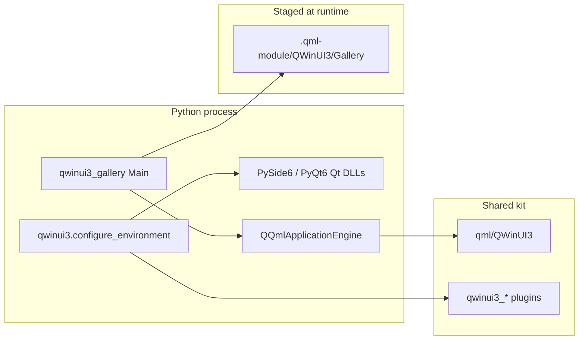

# Python consumer packaging (PySide6 / PyQt6)

**Status:** Shipped on **2.64** (Gallery + bootstrap). **PyPI wheels** ship on **2.72** (`pip install qwinui3`).

Use **PySide6** or **PyQt6** with a **shared QWinUI3 kit** (`qml/` + native plugins). Python loads the **same Gallery** as `src/gallery` — not a subprocess of `qwinui3_gallery.exe`.

Related: [packaging-consumer.md](packaging-consumer.md) **Path E** · [recipes.md](recipes.md) · [friction-log.md](planning/friction-log.md) **FL-011**.

---

## Install from PyPI (2.72+)

Platform wheels bundle the shared kit for **Windows x64** and **Linux x86_64**. You still install **PySide6** or **PyQt6** separately (Qt is not vendored).

```bat
pip install qwinui3[pyside6]
qwinui3-gallery
```

```bash
pip install qwinui3[pyside6]
qwinui3-gallery --smoke
```

| Wheel | Contents |
|-------|----------|
| `qwinui3` | `qwinui3/`, `qwinui3_gallery/`, bundled `_kit/` + Gallery QML |
| Your env | PySide6 or PyQt6 — **match Qt major.minor** to the kit Qt used at wheel build time (CI uses Qt **6.8.3**) |

**Library use** (no Gallery window):

```bat
pip install qwinui3[pyside6]
```

```python
from qwinui3 import configure_environment, configure_application, setup_engine, QtGui, QtQml

configure_environment()  # uses bundled _kit after pip install
app = QtGui.QGuiApplication([])
configure_application("org.example.app")
engine = QtQml.QQmlApplicationEngine()
setup_engine(engine)
```

Kit discovery order: explicit `kit=` → `QWINUI3_ROOT` → **bundled `_kit`** (wheel) → repo `dist/qwinui3-*-shared` (checkout).

**Maintainers:** build wheels locally with `python scripts/build_pypi_wheel.py` (requires Qt + compiler once), then run `python -m twine check dist/qwinui3-*.whl`. CI: [.github/workflows/pypi.yml](../.github/workflows/pypi.yml).

---

## What you get

| Piece | Source |
|-------|--------|
| **Controls** (Theme, Style, Platform, Extras) | Shared kit QML + `qwinui3_*.dll` / `.so` |
| **Gallery UI** | `src/gallery/**/*.qml` copied at launch |
| **Gallery helpers** | Python ports of `GraphicsBackend`, `GalleryLanguage`, `DemoTreeModel` |
| **Bootstrap** | `python/qwinui3/` — mirrors C++ `Bootstrap.h` |



**Critical rule:** import **PySide6/PyQt6 first**, then expose kit DLL directories. `configure_environment()` does this in the right order. Do **not** prepend kit `bin/` before the binding import — mixed Qt ABIs break QML types (for example `ElevatedChrome` load failures).

---

## Prerequisites

| Requirement | Notes |
|-------------|--------|
| **Python** | 3.10+ (3.11+ tested locally) |
| **PySide6** or **PyQt6** | Qt **6.5+**; **match kit major.minor** to `qVersion()` |
| **Shared kit** | `python scripts/package_release_libs.py --shared --archive` |
| **MSVC runtime** (Windows) | Same as your Qt kit (e.g. VS 2022 for official Qt 6.11) |

### Qt version matrix (Windows)

| Binding | Example `qVersion()` | Package kit with |
|---------|----------------------|------------------|
| PySide6 6.11 | `6.11.0` | Official Qt **6.11** (`--qt-prefix D:/Qt/6.11.0/msvc2022_64`) |
| PySide6 6.8 | `6.8.x` | Qt **6.8** LTS kit |
| PyQt6 6.11 | `6.11.0` | Same as PySide6 row |

Mismatch (e.g. PySide6 **6.11** + kit built with Qt **6.8**) causes subtle QML/plugin failures. Always verify:

```python
from PySide6.QtCore import qVersion
print(qVersion())  # must match kit Qt major.minor
```

---

## Quick start — Gallery

**Recommended (one command after `pip install PySide6`):**

```bat
python scripts/qwinui3.py python
```

Windows: double-click **`python-gallery.cmd`**. First run auto-packages the shared kit into `dist/` if missing (needs Qt + compiler once). **`QWINUI3_ROOT` is not required** when `dist/qwinui3-*-shared` exists.

```bat
python scripts/qwinui3.py doctor           :: check bindings + kit
python scripts/qwinui3.py python --smoke   :: CI smoke
```

### Manual steps (advanced)

<details>
<summary>Expand if you prefer explicit control</summary>

**Windows (cmd):**

```bat
pip install PySide6
python scripts/package_release_libs.py --shared --archive
python examples/python-gallery/main.py
```

**Linux:**

```bash
pip install PySide6
python scripts/package_release_libs.py --shared --archive
python examples/python-gallery/main.py
```

</details>

### Smoke / CI gate

Same critical page list as C++ `qwinui3_gallery --smoke`:

```bat
python scripts/qwinui3.py python --smoke
```

### PyQt6

```bat
pip install PyQt6
python scripts/qwinui3.py python --binding pyqt6
```

Binding detection order: **PySide6 first**, then PyQt6, unless `QWINUI3_QT_BINDING` or `--binding` overrides.

---

## Quick start — your own QML app

Minimal window (not Gallery):

```python
import sys
from pathlib import Path

ROOT = Path(__file__).resolve().parents[1]  # repo root if under examples/myapp/
sys.path.insert(0, str(ROOT / "python"))

from qwinui3 import QtCore, QtGui, configure_environment, configure_application, create_engine

def main() -> int:
    kit = configure_environment()  # before QGuiApplication
    app = QtGui.QGuiApplication(sys.argv)
    configure_application("org.example.myapp")
    engine, _ = create_engine(kit=kit)
    engine.load(QtCore.QUrl.fromLocalFile(str(Path(__file__).with_name("Main.qml"))))
    if not engine.rootObjects():
        return 1
    return app.exec()

if __name__ == "__main__":
    raise SystemExit(main())
```

Optional early self-check:

```python
from qwinui3 import runtime_report, validate_runtime

print(runtime_report())
validate_runtime()
```

`Main.qml` uses normal QWinUI3 imports:

```qml
import QtQuick
import QWinUI3.Theme
import QWinUI3.Platform
import QWinUI3.Extras

StandardWindow {
    visible: true
    title: qsTr("My app")
    backdrop: WindowHelper.BackdropSolid
    // …
}
```

Copy patterns from [`examples/gallery-shell/`](../examples/gallery-shell/) or [`examples/first-app/`](../examples/first-app/) — wire Python bootstrap instead of C++ `main.cpp`.

---

## Repository layout

| Path | Role |
|------|------|
| [`python/qwinui3/`](../python/qwinui3/) | Consumer bootstrap (`configure_environment`, `setup_engine`, kit finder) |
| [`python/qwinui3_gallery/`](../python/qwinui3_gallery/) | Gallery entry, RHI/locale/tree ports, QML staging |
| [`examples/python-gallery/`](../examples/python-gallery/) | Thin launcher (`main.py`, README) |
| `examples/python-gallery/.qml-module/` | Generated `QWinUI3.Gallery` tree (**gitignored**) |
| [`scripts/verify_python.py`](../scripts/verify_python.py) | Import + optional smoke |

In-tree pointer: [`python/README.md`](../python/README.md).

---

## Bootstrap API (`qwinui3`)

Mirrors C++ [`Bootstrap.h`](../src/platform/QWinUI3/Platform/Bootstrap.h).

| Function | When | Purpose |
|----------|------|---------|
| `configure_environment(kit=, binding=)` | **Before** `QGuiApplication` | Pick PySide6/PyQt6, find kit, set style env, high-DPI, DLL paths |
| `configure_application(app_id=)` | **After** `QGuiApplication` | `QQuickStyle.setStyle("QWinUI3")`, optional desktop name |
| `setup_engine(engine, kit=)` | Before `engine.load` | `engine.addImportPath(kit/qml)` |
| `create_engine(kit=, extra_import_paths=)` | After `QGuiApplication` | Build `QQmlApplicationEngine` already wired to the QWinUI3 import root |
| `find_kit(explicit=)` | Anytime | Resolve shared kit path |
| `runtime_report(kit=)` | Anytime after init | Structured diagnostics: binding / Qt / kit / qml root / style / QPA |
| `validate_runtime(kit=)` | After `configure_environment()` | Fail early if the located package is missing `qml/QWinUI3` |
| `binding_name()` | After init | `"pyside6"` or `"pyqt6"` |
| `qt_version()` | After init | Binding Qt version string |

Lazy Qt imports: `from qwinui3 import QtCore, QtGui, QtQml, QtQuickControls2`.

### Kit discovery order

1. `kit=` argument to `configure_environment`
2. `QWINUI3_ROOT` environment variable
3. Newest valid `dist/qwinui3-*-shared/` under repo root

### Environment variables

| Variable | Purpose |
|----------|---------|
| `QWINUI3_ROOT` | Shared kit root (`qml/` + `bin/` or `lib/`) |
| `QWINUI3_QT_BINDING` | `pyside6` / `pyqt6` (aliases: `pyside`, `pyqt`) |
| `QWINUI3_ALLOW_FOREIGN_QPA` | Set to keep non-Windows `QT_QPA_PLATFORM` on Windows |
| `QWINUI3_GALLERY_TRANSLATIONS` | Extra `.qm` search directory |
| `QSG_RHI_BACKEND` | RHI backend (Gallery also accepts `--rhi`) |
| `QT_QUICK_CONTROLS_STYLE` | Set to `QWinUI3` by bootstrap (do not override) |

---

## Gallery specifics

### QML staging

`stage_gallery_qml()` copies `src/gallery/**/*.qml` → `.qml-module/QWinUI3/Gallery/`, writes `qmldir`, copies `translations/*.qm`.

For on-demand page compiles (NavigationView lazy load + smoke), each `pages/*.qml` gets:

```qml
import QWinUI3.Gallery 1.0
```

injected after existing imports (not in source tree — staging only).

### Python QML types

| QML type | Python module | Notes |
|----------|---------------|-------|
| `GalleryLanguage` | `gallery_language.py` | `@QmlSingleton` — locale + translator |
| `GraphicsBackend` | `graphics_backend.py` | `@QmlSingleton` — RHI prefs |
| `DemoTreeModel` | `demo_tree_model.py` | `@QmlElement` — TreeView demo model |

Register via `register_types(engine)` which imports decorated modules.

!!! warning "Do not use raw `qmlRegisterSingletonInstance`"
    Manual singleton registration on URI `QWinUI3.Gallery` breaks kit QML loading (for example `StandardWindow` / `ElevatedChrome` failures). Always use `@QmlElement` / `@QmlSingleton`.

### Gallery CLI flags

| Flag | Purpose |
|------|---------|
| `--smoke` | Load Main + 21 critical pages, exit 0 |
| `--lang <locale>` | Startup translator (`zh_CN`, `de_DE`, …) |
| `--rhi opengl\|vulkan\|d3d11\|d3d12` | RHI before app (same as C++ Gallery) |
| `--startup-log` | Print startup timing |
| `--kit <path>` | Shared kit root |
| `--binding pyside6\|pyqt6` | Force binding |

`FrameStatsMonitor` lives in the **Platform** plugin — use from QML as in C++ Gallery; no Python port required.

---

## Packaging the shared kit

Same script as C++ consumers ([Path B](packaging-consumer.md#path-b--package-from-this-repo)):

```bat
python scripts/package_release_libs.py --shared --archive
```

Presets: `--preset all|core|shell|extras`. Gallery needs at least **shell** (theme + style + platform). Full Gallery demos need **extras**.

Point Python at the unpacked folder:

```bat
set QWINUI3_ROOT=dist\qwinui3-2.64-windows-x64-shared
```

---

## Troubleshooting

| Symptom | Likely cause | Fix |
|---------|--------------|-----|
| `No QWinUI3 shared kit found` | Missing `dist/` package | Run `package_release_libs.py --shared --archive` or set `QWINUI3_ROOT` |
| `Type StandardWindow unavailable` / `ElevatedChrome` errors | Qt ABI mismatch or wrong registration | Match kit Qt to binding; use `@QmlElement`, not manual singleton register |
| `Failed to load QWinUI3.Gallery/Main` | Import path / kit | Check `QWINUI3_ROOT`, `engine.importPathList()` |
| New property exists in source, but packaged kit says it does not | Shared kit copied old plugin-preferred QML | Rebuild the shared kit with current scripts; packaged `qmldir` now strips `prefer :/qt/qml/...` so on-disk QML wins |
| Plugin load / DLL errors (Windows) | Kit `bin/` not visible | Use `configure_environment()`; kit DLLs load **after** PySide6 |
| Gallery Settings RHI restart | Expected | Same as C++ — saved backend applies on restart |
| Linux Wayland issues | Platform QPA | See [platform-linux-wayland.md](platform-linux-wayland.md); prefer `BackdropSolid` |

Enable QML warnings in your entry (Gallery already connects `engine.warnings`).

---

## Verification

```bat
python scripts/qwinui3.py doctor
python scripts/qwinui3.py python --smoke
```

C++ Gallery smoke:

```bat
python scripts/qwinui3.py gallery --smoke
```

---

## Out of scope

| Item | Notes |
|------|--------|
| Vendoring full Qt in the wheel | Install PySide6/PyQt6; kit Qt major.minor must match |
| Shiboken wrappers for every C++ helper | — |
| Subprocess / embed `qwinui3_gallery.exe` | — |
| Conda-forge official port | TBD |
| macOS wheels | Not in **2.72** matrix |

---

## Related docs

- [Consumer packaging — Path E](packaging-consumer.md#path-e--python-pyside6--pyqt6--shared-kit)
- [packaging-pyside6.md](packaging-pyside6.md) — redirect stub
- [examples/python-gallery/README.md](../examples/python-gallery/README.md)
- [upgrade-notes.md](upgrade-notes.md) — **2.64** Python Gallery note
- [roadmap.md](roadmap.md) — **2.71…2.73** Python tranche
