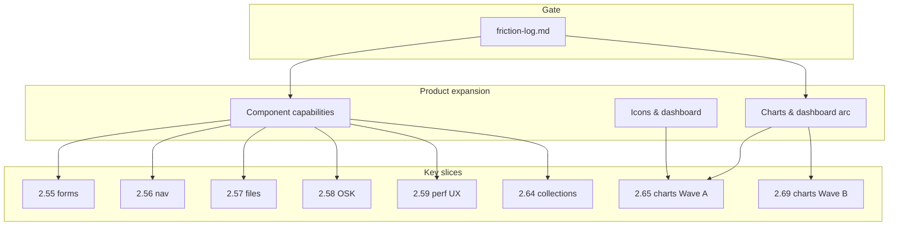

# Planning hub (2.51 → 3.00)

Roadmap planning, friction gate, and **product expansion** tracks — charts/dashboard **and** existing control deepen.

**Shipped line:** **2.50** · **Next implementation:** friction-only **2.51+** · **Line end:** **3.00**

| Doc | Purpose |
|-----|---------|
| [Roadmap](../roadmap.md) | Full version plan (site + repo `ROADMAP.md`) |
| [Friction log](friction-log.md) | P0/P1 pains — **no row → no tag** (**2.51+**) |
| [Roadmap strategy](roadmap-strategy.md) | Phases, friction queue, 3.00 gate |
| [Charts & dashboard arc](expansion/charts-dashboard-arc.md) | New analytics types + stable six deepen |
| [Component capabilities](expansion/component-capabilities-expansion.md) | **All modules** — existing control API deepen |
| [Icons & dashboard](expansion/icons-dashboard-expansion.md) | FluentIcons + KPI/ChartCard recipes |

---

## Expansion tracks (parallel)

---

## MkDocs navigation

- **Planning** (this section) — friction, strategy, expansion matrices
- **Recipes** — LoB how-tos and checkpoints
- **Stable API** / **Component API** — shipped contracts

Validation: `python scripts/check_planning_ia.py` · `python scripts/check_component_capabilities_expansion.py` · `python scripts/check_charts_dashboard_arc.py`

**Related:** [docs-ia-v2.md](../docs-ia-v2.md) · [recipes.md](../recipes.md)
