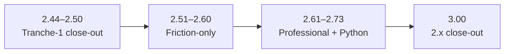

# Roadmap strategy (post-2.43)

How to extend QWinUI3 **after tranche 1** without returning to “every minor adds a control.”

**Current line:** **2.50** shipped · **Tranche 1 done** · **Next:** friction-only **2.51…2.60** · **Line end:** **3.00** after **2.73**

Related: [Planning hub](index.md) · [roadmap.md](../roadmap.md) · [friction-log.md](friction-log.md) · [charts-dashboard-arc.md](expansion/charts-dashboard-arc.md) · [component-capabilities-expansion.md](expansion/component-capabilities-expansion.md) · [icons-dashboard-expansion.md](expansion/icons-dashboard-expansion.md)

---

## Three phases

| Phase | Versions | Rule | Success metric |
|-------|----------|------|----------------|
| **Close-out** | **2.44 → 2.50** | Ship planned audit slices; **no** new conditional controls without friction | [checkpoint-250.md](../checkpoint-250.md) green |
| **Friction** | **2.51 → 2.60** | **No open P0/P1 in [friction-log.md](friction-log.md) → skip tag** | Real app pains closed |
| **Professional** | **2.61 → 2.70** | LoB recipes + conditional types **only** with named friction | [checkpoint-270.md](../checkpoint-270.md) |
| **Python** | **2.71 → 2.73** | PySide6 + PyPI after **2.02** packaging | [checkpoint-273.md](../checkpoint-273.md) |
| **2.x close-out** | **3.00** | One breaking major — **not** a parking-lot dump | [checkpoint-300.md](../checkpoint-300.md) |
| **3.xx** | **3.01+** | Same friction gate as **2.51+** | friction-log row required |

---

## Phase A — finish tranche 1 (2.44…2.50)

| Slice | Why it matters | Do not |
|-------|----------------|--------|
| **2.44** Diagnostics productize | Dev vs retail FPS/RHI story (FL-001 class) | Always-on FPS in shipping apps |
| **2.45** Experimental → stable sweep | FL-004 — teams ship OSK/charts/experimental grids as stable | Pretend everything is stable |
| **2.46** Docs IA v2 | Find docs faster than write docs (after 2.39 Gallery findability) | Full site redesign |
| **2.47** Field harden buffer | P0/P1 from 2.30 / 2.45 audits only | Feature creep |
| **2.48** Friction-only slot | Top friction-log row — one fix | Catalog shopping |
| **2.49** Performance wave 8 | 2.x perf sign-off; **animations stay** | GPU chart rewrite |
| **2.50** Tranche-1 checkpoint | Drop unproven conditional rows; queue 2.51 | Ship 3.00 here |

---

## Phase B — recommended friction queue (2.51…2.60)

**Priority order** when multiple P0/P1 rows are open:

| Rank | Slice | Theme | Typical friction |
|------|-------|--------|------------------|
| 1 | **2.52** | First app in an hour | CMake/import/shell choice stall |
| 2 | **2.51** | Stable vs experimental clarity | FL-004 production mistakes |
| 3 | **2.53** + **2.57** | Linux top-3 + files | Portal pick/drop/reveal |
| 4 | **2.55** + **2.56** | Forms + navigation mental model | Validation / Back vs pane |
| 5 | **2.54** | Window chrome footguns | DPI / maximize / geometry |
| 6 | **2.58** | Keyboard / OSK in apps | FL-017 outside Gallery dock |
| 7 | **2.59** | App-level sluggishness | Named slow flows only |
| 8 | **2.60** | Friction checkpoint | 3.00 prep draft |

**Skip rule:** If [friction-log.md](friction-log.md) has **zero** open P0/P1 at tag time, **do not ship** a friction slice — jump to checkpoint or rebuild same `X.YY`.

---

## Phase C — charts, dashboard & component deepen (2.51 → 3.00)

Parallel product tracks — **not** recipe-only. New chart/dashboard **types** and **API deepens** require friction rows.

| Track | Doc | Key slices |
|-------|-----|------------|
| **Charts & dashboard arc** | [charts-dashboard-arc.md](expansion/charts-dashboard-arc.md) | **2.65** Wave A + **DashboardShell** · **2.67** Sparkline · **2.69** Wave B · **3.01+** Wave C |
| **Component capabilities** | [component-capabilities-expansion.md](expansion/component-capabilities-expansion.md) | **2.54…2.59** · **2.64** collection wave 9 · all control modules |
| **Icons & recipes** | [icons-dashboard-expansion.md](expansion/icons-dashboard-expansion.md) | Gallery parity · **FL-009** · KPI/ChartCard symbols |

| When | Focus | Gate |
|------|--------|------|
| **2.44–2.50** (shipped) | Pitfalls: icon-only a11y; dashboard stable-six only | — |
| **2.52** | Minimal **DashboardShell** in “first app in an hour” | Adoption |
| **2.54–2.59** | Module deepen per [component capabilities](expansion/component-capabilities-expansion.md) | **FL-017** / **FL-018** |
| **2.65** | **Wave A** — stable six APIs + **DashboardShell** + example v2 | **FL-009** · **FL-014** partial |
| **2.67** | **Sparkline** promote vs permanent defer | **FL-009** |
| **2.69** | **BulletChart** / **HistogramChart** conditional | **FL-014** / **FL-015** |
| **2.64** | **DataTable** pin/group · **ListDetailsView** toolbar | **FL-016** |
| **3.01+** | Live metrics, export, linked crosshair | friction-only |

**Rule:** Prefer **deepen** stable six APIs before new stable chart names. Unconditional new types without a [friction-log.md](friction-log.md) row → **skip tag**.

---

## Phase D — conditional controls (2.61+)

Only after **named app** rows in friction-log:

| Control | Slice | Gate |
|---------|-------|------|
| **RichEdit** | 2.61 | FL-005 |
| **SemanticZoom** | 2.62 | FL-006 |
| **Notification center** productize | 2.63 | FL-007 residual (2.27 experimental shipped) |

---

## Phase E — 2.x close-out (3.00)

**Gate:** **2.73** shipped + [checkpoint-300.md](../checkpoint-300.md) green. **Do not** open 3.00 PRs before **2.73**.

| Area | 3.00 intent | Do not |
|------|-------------|--------|
| **Qt 6.10 floor** | Drop 6.8 compat shims | Bundle Qt inside the kit |
| **Experimental cleanup** | Permanent defer types out of default imports | Delete types still used without migration notes |
| **Theme / shell** | Final alias removal from **2.00** defer | Fluent 2 redesign |
| **Stable contract** | [compatibility-3xx.md](../compatibility-3xx.md) | Silent renames |
| **Packaging** | `find_package` + PyPI **3.00** semver | Force PyPI-only consumers |

Draft consumer steps: [upgrade-notes.md](../upgrade-notes.md) **Upgrade 2.73 → 3.00 (draft)**.

**After 3.00:** **3.01+** uses the same friction gate as **2.51+** — no pre-scheduled control slots.

---

## Process checklist (maintainers)

1. **Every 2–3 slices:** add or update [friction-log.md](friction-log.md) rows (P0/P1, source, named app).
2. **Before 2.50:** run checkpoint-250; delete roadmap rows that never earned friction.
3. **Prefer recipe/docs slices** over API changes when pain is “how do I compose this?” — **except** when friction rows demand API deepen (charts arc, collection wave 9).
4. **Charts + dashboard:** [charts-dashboard-arc.md](expansion/charts-dashboard-arc.md) — deepen stable six first; new types friction-gated (**FL-014** / **FL-015**).
5. **Component deepen:** [component-capabilities-expansion.md](expansion/component-capabilities-expansion.md) — expand existing controls before sibling types.
6. **3.00 prep** starts at **2.60** (draft) · finalized at **2.73** + [checkpoint-300.md](../checkpoint-300.md) — do not break stable-api early.
7. **Open 3.00 only after 2.73** — one breaking major; **3.01+** is friction-gated like **2.51+**.

---

## Out of scope (unchanged)

macOS first-class, Fluent 2 fork, screenshot-every-page CI, WebGL charts, cloud onboarding SaaS, WinUI parity shopping — see [roadmap.md](../roadmap.md) parking lot.
